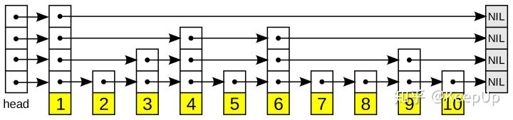

跳表全称为跳跃列表，它允许快速查询，插入和删除一个有序连续元素的数据链表。跳跃列表的平均查找和插入时间复杂度都是O(logn)。快速查询是通过维护一个多层次的链表，且每一层链表中的元素是前一层链表元素的子集（见右边的示意图）。一开始时，算法在最稀疏的层次进行搜索，直至需要查找的元素在该层两个相邻的元素中间。这时，算法将跳转到下一个层次，重复刚才的搜索，直到找到需要查找的元素为止。

如果一个链表有 n 个结点，如果每两个结点抽取出一个结点建立索引的话，那么第一级索引的结点数大约就是 n/2，第二级索引的结点数大约为 n/4，以此类推第 m 级索引的节点数大约为 n/(2^m)。

假如一共有 m 级索引，第 m 级的结点数为两个，通过上边我们找到的规律，那么得出 n/(2^m)=2，从而求得 m=log(n)-1。如果加上原始链表，那么整个跳表的高度就是 log(n)。我们在查询跳表的时候，如果每一层都需要遍历 k 个结点，那么最终的时间复杂度就为 O(k*log(n))。

那这个 k 值为多少呢，按照我们每两个结点提取一个基点建立索引的情况，我们每一级最多需要遍历两个个结点，所以 k=2。为什么每一层最多遍历两个结点呢？

因为我们是每两个结点提取一个结点建立索引，最高一级索引只有两个结点，然后下一层索引比上一层索引两个结点之间增加了一个结点，也就是上一层索引两结点的中值，看到这里是不是想起来我们前边讲过的二分查找，每次我们只需要判断要找的值在不在当前结点和下一个结点之间即可。

所以跳表的查询任意数据的时间复杂度为 O(2*log(n))

跳表的空间复杂度分析并不难，如果一个链表有 n 个结点，如果每两个结点抽取出一个结点建立索引的话，那么第一级索引的结点数大约就是 n/2，第二级索引的结点数大约为 n/4，以此类推第 m 级索引的节点数大约为 n/(2^m)，我们可以看出来这是一个等比数列。

这几级索引的结点总和就是 n/2+n/4+n/8…+8+4+2=n-2，所以跳表的空间复杂度为 o(n)。

## 插入和删除

我们想要为跳表插入或者删除数据，我们首先需要找到插入或者删除的位置，然后执行插入或删除操作，前边我们已经知道了，跳表的查询的时间复杂度为 O(logn），因为找到位置之后插入和删除的时间复杂度很低，为 O(1)，所以最终插入和删除的时间复杂度也为 O(longn)。

删除操作的话，如果这个结点在索引中也有出现，我们除了要删除原始链表中的结点，还要删除索引中的。因为单链表中的删除操作需要拿到要删除结点的前驱结点，然后通过指针操作完成删除。所以在查找要删除的结点的时候，一定要获取前驱结点。当然，如果我们用的是双向链表，就不需要考虑这个问题了。

如果我们不停的向跳表中插入元素，就可能会造成两个索引点之间的结点过多的情况。结点过多的话，我们建立索引的优势也就没有了。所以我们需要维护索引与原始链表的大小平衡，也就是结点增多了，索引也相应增加，避免出现两个索引之间结点过多的情况，查找效率降低。

跳表是通过一个随机函数来维护这个平衡的，当我们向跳表中插入数据的的时候，我们可以选择同时把这个数据插入到索引里，那我们插入到哪一级的索引呢，这就需要随机函数，来决定我们插入到哪一级的索引中。

这样可以很有效的防止跳表退化，而造成效率变低。

