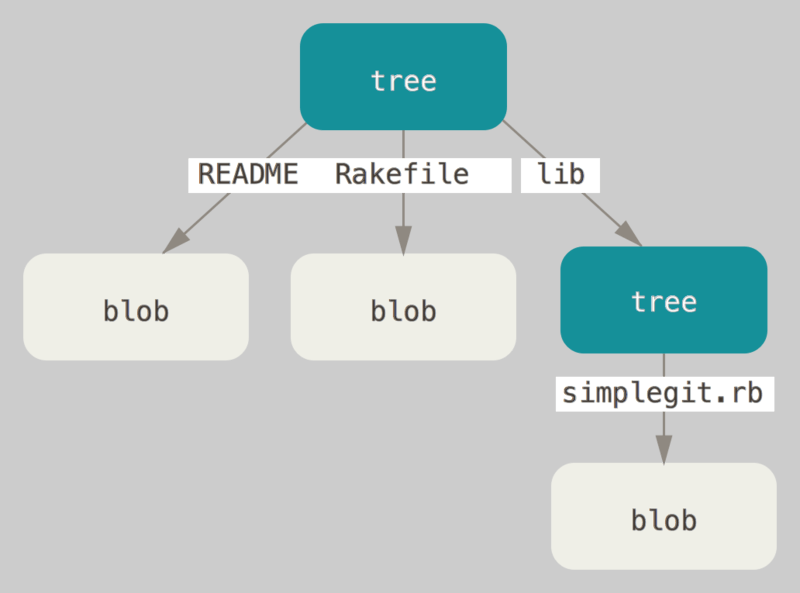
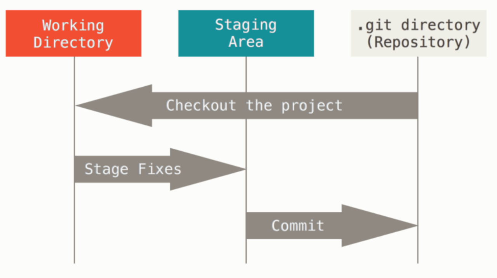
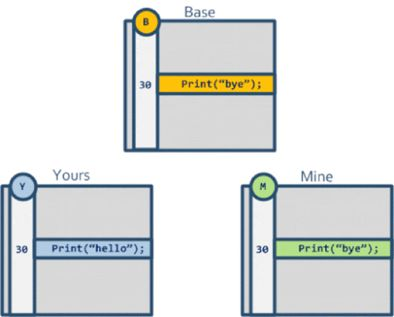
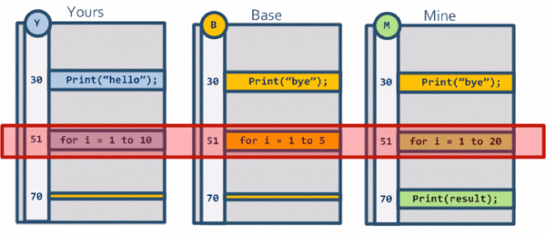

## 设计
在git中只有两种对象抽象：
1) 对象数据库(“object database”)； 2) 
2) 当前目录缓存(“current directory cache”)

Git 的本质就是一系列的文件对象集合，代码文件是对象、文件目录树是对象、commit 也是对象。这些文件对象的名称即内容的 SHA1 值，SHA1 哈希算法的值为40位。Linus 将前二位作为文件夹、后38位作为文件名。

在 .git 目录里的 objects 里看到有很多两位字母/数字名称的目录，里面存储了很多38位hash值名称的文件，这就是 Git 的所有信息。Linus 在设计对象的数据结构时按照 <标签ascii码表示>(blob/tree/commit) + <空格> + <长度ascii码表示> + <\0> + <二进制数据内容> 来定义，大家可以用 xxd 命令看下 objects 目录里的对象文件(需 zlib 解压)，比如一个 tree 对象文件内容如下：
```
00000000: 7472 6565 2033 3700 3130 3036 3434 2068  tree 37.100644 h
00000010: 656c 6c6f 2e74 7874 0027 0c61 1ee7 2c56  ello.txt.'.a..,V
00000020: 7bc1 b2ab ec4c bc34 5bab 9f15 ba         {....L.4[....
```
对象有三种：BLOB、TREE、CHANGESET。

BLOB: 即二进制对象，这就是 Git 存储的文件，Git 不像某些 VCS （如 SVN）那样存储变更 delta 信息，而是存储文件在每一个版本的完全信息。比如先提交了一份 hello.c 进入了 Git 库，会生成一个 BLOB 文件完整记录 hello.c 的内容；对 hello.c 修改后，再提交 commit，会再生成一个新的 BLOB 文件记录修改后的 hello.c 全部内容。Linus 在设计时，BLOB 中仅记录文件的内容，而不包含文件名、文件属性等元数据信息，这些信息被记录在第二种对象 TREE 里。

TREE: 目录树对象。在 Linus 的设计里 TREE 对象就是一个时间切片中的目录树信息抽象，包含了文件名、文件属性及BLOB对象的SHA1值信息，但没有历史信息。这样的设计好处是可以快速比较两个历史记录的 TREE 对象，不能读取内容，而根据 SHA1 值显示一致和差异的文件。另外，由于 TREE 上记录文件名及属性信息，对于修改文件属性或修改文件名、移动目录而不修改文件内容的情况，可以复用 BLOB 对象，节省存储资源。而 Git 在后来的开发演进中又优化了 TREE 的设计，变成了某一时间点文件夹信息的抽象，TREE 包含其子目录的 TREE 的对象信息（SHA1）。这样，对于目录结构很复杂或层级较深的 Git库 可以节约存储资源。历史信息被记录在第三种对象 CHANGESET 里。


CHANGESET: 即 Commit 对象。一个 CHANGESET 对象中记录了该次提交的 TREE 对象信息（SHA1），以及提交者(committer)、提交备注(commit message)等信息。跟其他SCM（软件配置管理）工具所不同的是，Git 的 CHANGESET 对象不记录文件重命名和属性修改操作，也不会记录文件修改的 Delta 信息等，CHANGESET 中会记录父节点 CHANGESET 对象的 SHA1 值，通过比较本节点和父节点的 TREE 信息来获取差异。Linus 在设计 CHANGESET 父节点时允许一个节点最多有 16 个父节点，虽然超过两个父节点的合并是很奇怪的事情，但实际上，Git 是支持超过两个分支的多头合并的。

虽然 Git 在设计上没有涉及可信的范畴，但 Git 作为配置管理工具是可以做到可信的。原因是所有的对象都以SHA1编码（Google 实现 SHA1 碰撞攻击是后话，且 Git 社区也准备使用更高可靠性的 SHA256 编码来代替），而签入对象的过程可信靠签名工具保证，如 GPG 工具等。

理解了Git 的三种基本对象，那么对于 Linus 对于 Git 初始设计的“对象数据库”和“当前目录缓存”这两层抽象就很好理解了。加上原本的工作目录，Git 有三层抽象，如下图示：一个是当前工作区(Working Directory)，也就是我们查看/编写代码的地方，一个是 Git 仓库(Repository),即 Linus 说的对象数据库，我们在 Git 仓看到的 .git 文件夹中存储的内容，Linus 在第一版设计时命名为 .dircache，在这两个存储抽象中还有一层中间的缓存区（Staging Area），即 .git/index 里存储的信息，我们在执行 git add 命令时，便是将当前修改加入到了缓存区。

Linus 解释了“当前目录缓存”的设计，该缓存就是一个二进制文件，内容结构很像 TREE 对象，与 TREE 对象不同的是 index 不会再包含嵌套 index 对象，即当前修改目录树内容都在一个 index 文件里。这样设计有两个好处：1. 能够快速的复原缓存的完整内容，即使不小心把当前工作区的文件删除了，也可以从缓存中恢复所有文件；2. 能够快速找出缓存中和当前工作区内容不一致的文件。


参考：

1) [改变世界的一次代码提交](https://hutusi.com/the-greatest-git-commit)

## 使用
**git合并**
两个文件的合并需要三向合并，所谓三向合并，就是找到两个文件的一个合并 base，如下图，这样子 Git 就可以很清楚的知道说，对方修改了这一行代码，而我们没有修改，自动帮我们合并这两个文件为 Print("hello")。


冲突简单的来说就是三向合并中的三方都互不相同，即参考合并 base，我们的分支和别人的分支都对同个地方做了修改。

Git 会有很多合并策略，其中常见的是 Fast-forward、Recursive 、Ours、Theirs、Octopus。下面分别介绍不同合并策略的原理以及应用场景。默认 Git 会帮你自动挑选合适的合并策略，如果你需要强制指定，使用git merge -s <策略名字>

参考：
1) [这才是真正的 Git——分支合并](https://zhuanlan.zhihu.com/p/192972614)

**防止pull代码时的用户登录验证**

`git config --global url."git@gitlab.ushareit.me:".insteadOf "https://gitlab.ushareit.me"`
