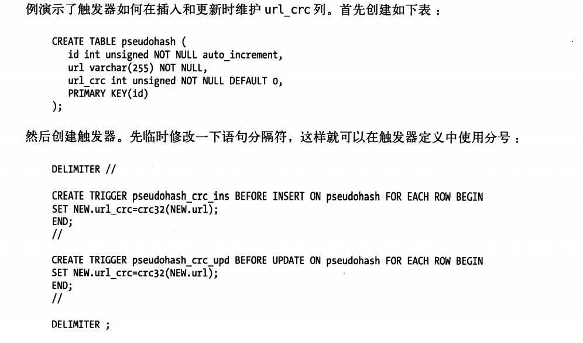
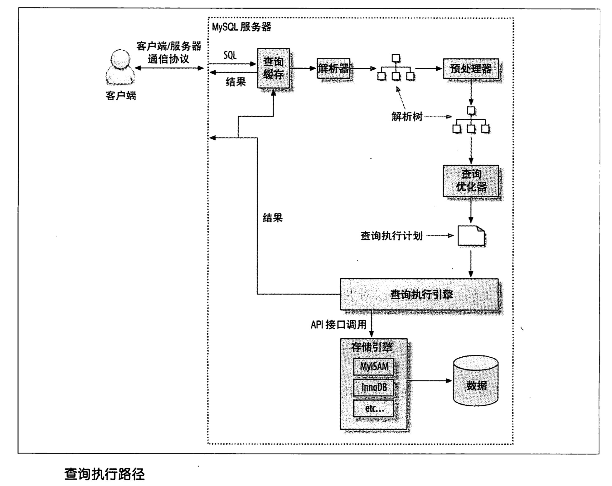

### mysql 架构
连接线程处理 - 查询缓存、解析器 - 优化器 - 存储引擎

**事务**

事务的标准特征：ACID
1. 原子性（atomicity）
  一个事务必须被视为一个不可分割的最小单元，不可能只执行其中的一部分操作。
2. 一致性（consistency）
  数据库总是从一个一致性的状态转换到另一个一致性的状态。
3. 隔离性（isolation）
 一个事务所做的修改在最终提交以前，对其他事务时不可见的。
4. 持久性（durability）
   一旦事务提交，则其所做的修改就会永久保存到数据库中，即使系统现在崩溃。

**隔离级别**
* read uncmmitted（未提交读）
称为脏读。（很少使用）
* read committed（提交读）
大多数数据库默认的隔离级别（mysql除外）。一个事务开始时，只能看见已经提交的事务所作的修改。称为不可重复读。（两次读取的数不一样）
* repeatable read（可重复读）
解决了脏读的问题。保证了在同一个事务中多次读取同样的结果是一致的。无法解决幻读的问题。（MySQL默认）。（第一次读没有，第二次读就有）
* serializable （可串行化）
最高的隔离级别。强制事务串行处理，避免了幻读。在读取的每一行数据上都加锁。（很少用）

**事务日志**

使用事务日志，存储引擎在修改表时，只需要修改其内存拷贝，再把改行为记录到持久在硬盘上的事务日志中，而不用每次都将修改的数据本身持久到硬盘。写日志操作是磁盘顺序io，采用事务日志的方式会快的多。

**多版本并发控制（MVCC）**

InnoDb的MVCC，是通过每行记录后面保存两个隐藏的列来实现的。
这两个列一个保存了行的创建版本号，一个保存了行的过期版本号。每开始一个新的事务，版本号就会自动递增。事务开始时刻的版本号会做为事务的版本号。
* select
   * innodb只查找版本早于当前事务版本的数据行，可以确保事务读取的行，要么是在事务开始前存在的，要么是事务自身修改的。
   * 行的删除版本要么未定义，要么大于当前事务版本号。这样确保事务读取到的行，在事务开始前未被删除。
  
  （意思是选择在本事务开始前就存在的，并且在本事务后才删除的的记录）
* insert
innodb为新插入的每一行保存当前版本号，作为行版本号。
* delete
为删除的每一行保存当前版本号作为删除标志。
* update
为插入一行新纪录，保存当前版本号作为行版本号，同时保存当前系统版本号到原来的行作为行删除标志。

保存这两个额外的版本号，使大多数读操作都可以不用加锁。
MVCC只在repeatable read和read commit两个隔离级别下工作。

[幻读详解1](https://blog.csdn.net/qq_33330687/article/details/89004462)
[幻读详解2](https://blog.csdn.net/qq_33330687/article/details/89004462)

innodb 采用mvcc来支持高并发，并是实现了四个标准的隔离级别。默认级别是可重复读，并通过间隙锁（next-key locking）策略防止幻读的出现。

### schema与数据类型优化
**优化数据类型**

1. 更小的通常好
2. 简单就好
3. 避免null

varchar适合存储字符串的最大长度比平均长度大很多；
在更新时，如果一个字符串过长，在页内没有足够的空间，则会产生碎片保存。
 char适合存储很短的字符串，或者所有值接近一个长度，比如密码md5。

blob和text都是为存储很大的数据而设计的字符串类型。分别采用二进制和字符方式存储。

使用枚举值（enum）代替字符串类型。

避免使用bit类型。

整数通常是标识列最好的选择，快且可以使用auto_increment。避免使用enum、set和字符串类型作为标识列。

对于随机的字符串md5、sha1、uuid等，这些函数生成的值会任意的分布在很大的空间内，会导致insert和select会很慢。

避免：

* 太多的列
* 太多的关联
* 过度使用枚举（单个查询最好在12个表以下）
* 避免使用null，可以使用特殊的字符代替空值。

范式的优缺点：

* 范式更新操作快
* 当数据较好的范式化后，就只有很少的重复数据，所以只需要修改更少的数据
* 范式化的表通常更小，可以更好的放在内存里，操作快
* 很少多余的数据意味着检索时更少需要distinct或者group by 语句。

缺点是通常需要关联。

### 创建高性能索引

索引，也叫做key，是存储引擎用于快速找到记录的一种数据结构。

在mysql中索引是在存储引擎中实现的，而不是服务器层。
存储引擎首先在索引中找到对应的值，然后根据匹配的索引记录找到对应的数据行。

索引可以包含一个或对各列的值。如果索引包含多个列，那么列的顺序也十分重要，mysql只能高效的使用索引的最左列。

在mysql中索引是在存储引擎层而不是服务器层实现的。

**B-Tree索引**

B-Tree索引适用于全键值、键值范围、键前缀查找。

- 全值匹配
- 匹配最左前缀
- 匹配列前缀
- 匹配范围值
- 精确匹配某一列并范围匹配另外一列（即第一列全匹配，第二列范围匹配）
- 只访问索引的查询

索引树中的节点是有序的，所以除了按值查找外，还可以用于查询中的order by操作。（如果b-tree可以按照某种方式查找到值，那么也可以按照这种方式用于排序）。

限制：

  - 如果不是按照索引最左列查找，则无法使用。
  - 不能跳过索引中的列
  - 如果查询中有某个列的范围查询，则其右边所有的列都无法使用索引优化查找。（如果范围查询的列值的数量有限，可以通过使用多个等于条件来代替范围查询。

**哈希索引**

哈希索引基于哈希表实现，只有精确匹配索引所有列的查询才有效。

对于每一行数据，存储引擎都会对所有的索引列计算一个哈希码，哈希表将所有的哈希码存储在索引中，同时在哈希表中保持指向没改数据行的指针。

索引只需存储对应的哈希值，所以索引的结构十分紧凑，这也让哈希索引查找的速度非常快。

限制：

- 哈希索引只包含哈希值和行指针，而不存储字段值，所以不能使用索引中的值避免读取行。
- 哈希索引不是顺序的， 无法用于排序。
- 哈希索引不支持部分索引列的匹配查找。
- 哈希索引只支持等值的比较。不支持任何范围的查询。
- 访问哈希索引的数据非常快，除非有很多哈希冲突。
- 如果哈希冲突很多的话，一些索引维护的操作的代价也会很高
  
因为这些限制，哈希索引只适用于某些特定场合，一旦适合哈希索引，带来的提升十分显著。

innodb支持”自适应哈希索引“，当某些索引值被使用的非常频繁时，会在内存中基于b-tree索引之上再创建一个哈希索引。

创建自定义哈希索引

可以在b-tree上创建一个伪哈希索引。即在原来基础上增加一个哈希列作为索引：
```sql
select id from url where url= "http//xxxx.com"
-->
select id from url where url= "http//xxxx.com" and url_crc=CRC32("http//xxxx.com")
```
这样使用的缺陷是需要手动维护哈希值。可以手动维护，也可以触发器实现。


如果使用这种方式，不要使用sha1和md5作为哈希函数，因为这两个函数计算的哈希值非常长，强加密函数。

如果数据表非常大，可以自己实现64位哈希函数。

处理哈希冲突。当使用哈希索引时，必须在where中包含常量值。如果不是查询具体值（统计计数），可以不带入。

**索引的优点**

主键索引就是名为PRIMARY的唯一非空索引，和其他索引没有区别

- 索引大大减少了服务器需要扫描的数据量
- 索引帮助服务器避免了排序和临时表
- 索引可以将随机io变为顺序io
  
**高性能索引策略**
- 独立的列：如果查询中的列不是独立的，则mysql不会使用索引，（where actor_id +1 = 5）
- 前缀索引：索引较长的字符列会让索引变的大且慢，通常可以索引开始的部分字符（选择合适的长度，使前缀索引接近索引整个列）
  
  `alter table sakila.city_demo add key (city(7))`
- 多列索引：在多个列上建立独立的单列索引大部分情况下不能提高mysql的性能。
- 选择合适的索引列顺序：将选择性最高的列放到索引的最前列。
- 聚簇索引：聚簇索引的叶子节点就是数据节点，而非聚簇索引的叶子节点仍然是索引节点，只不过有指向对应数据块的指针。
  
  聚簇索引：将数据存储与索引放到了一块，找到索引也就找到了数据

  非聚簇索引：将数据存储于索引分开结构，索引结构的叶子节点指向了数据的对应行

  聚簇索引具有唯一性。由于聚簇索引是将数据跟索引结构放到一块，因此一个表仅有一个聚簇索引

  实例：
  1. InnoDB使用的是聚簇索引，将主键组织到一棵B+树中，而行数据就储存在叶子节点上，若使用"where id = 14"这样的条件查找主键，则按照B+树的检索算法即可查找到对应的叶节点，之后获得行数据。
  2. 若对Name列进行条件搜索，则需要两个步骤：第一步在辅助索引B+树中检索Name，到达其叶子节点获取对应的主键。第二步使用主键在主索引B+树种再执行一次B+树检索操作，最终到达叶子节点即可获取整行数据。（重点在于通过其他键需要建立辅助索引）
  3. MyISM使用的是非聚簇索引，非聚簇索引的两棵B+树看上去没什么不同，节点的结构完全一致只是存储的内容不同而已，主键索引B+树的节点存储了主键，辅助键索引B+树存储了辅助键。表数据存储在独立的地方，这两颗B+树的叶子节点都使用一个地址指向真正的表数据，对于表数据来说，这两个键没有任何差别。由于索引树是独立的，通过辅助键检索无需访问主键的索引树。
  
  优势：
  1. 聚簇索引将索引和数据行保存在同一个B-Tree中，查询通过聚簇索引可以直接获取数据，相比非聚簇索引需要第二次查询（非覆盖索引的情况下）效率要高。
  2. 聚簇索引适合用在排序的场合，非聚簇索引不适合
  3. 聚簇索引对于范围查询的效率很高，因为其数据是按照大小排列的
  4. 二级索引需要两次索引查找，而不是一次才能取到数据，因为存储引擎第一次需要通过二级索引找到索引的叶子节点，从而找到数据的主键，然后在聚簇索引中用主键再次查找索引，再找到数据
  5. 可以把相关数据保存在一起。例如实现电子邮箱时，可以根据用户 ID 来聚集数据，这样只需要从磁盘读取少数的数据页就能获取某个用户的全部邮件。如果没有使用聚簇索引，则每封邮件都可能导致一次磁盘 I/O。

  劣势：
  1. 维护索引很昂贵，特别是插入新行或者主键被更新导至要分页(page split)的时候。建议在大量插入新行后，选在负载较低的时间段，通过OPTIMIZE TABLE优化表，因为必须被移动的行数据可能造成碎片。使用独享表空间可以弱化碎片
  2. 表因为使用UUId（随机ID）作为主键，使数据存储稀疏，这就会出现聚簇索引有可能有比全表扫面更慢，所以建议使用int的auto_increment作为主键
  3. 如果主键比较大的话，那辅助索引将会变的更大，因为辅助索引的叶子存储的是主键值；过长的主键值，会导致非叶子节点占用占用更多的物理空间
   


- 覆盖索引：如果一个索引包含（或者说覆盖）所有需要查询的字段的值，我们就称为“覆盖索引”
  
  优势：
  1. 索引的条目通常远小于数据行大小，如果只需要读取索引，那mysql就会极大的减少数据访问量。这对换成的负载非常重要，对io密集型应用也很有帮助。
  2. 索引是按照列值顺序存储的，所以对io密集型范围查询会比随机磁盘读取每一行数据的io少的多。
  3. 由于innodb的聚簇索引，索引覆盖对innodb表特别有用。innodb的二级索引在叶子节点中保存了行的主键值，如果二级索引能覆盖查询，则可以避免对主键索引的二次查询。
  
  不是所有的索引都可以称为覆盖索引，覆盖索引必须存储索引列的值（哈希索引等）

- 使用索引扫描来做排序
  
  MySQL有两种方式可以生成有序的结果：通过排序或者按索引顺序扫描。

  索引扫描本身是很快的，只需从一条索引记录移动到紧接着的下一条记录。如果索引不能覆盖查询所需的全部列，那就不得不每扫描一条索引记录就回表查询一次对应的行，基本就是随机IO，因此按索引顺序读取数据的速度要比顺序的全表扫描慢，尤其是IO密集型工作负载时。

  mysql可以使用同一个索引既满足排序，又用于查找行。因此，设计索引时应尽可能的同时满足这两种任务。

  只有当索引列顺序和order by 子句的顺序完全一致，且所有列的排序方向都一样时，MySQL才能使用索引对结果排序。如果关联多表，则只有当order by 子句引用的字段全部为第一表时，才能使用索引排序。
  
  [实例]高性能mysql 176页
- 压缩索引
  myISAM使用前缀压缩来减少索引的大小，从而使得更多的索引放到内存中。

  先保存索引块中的第一个值，然后将其他值和第一个值进行比较得到相同前缀的字节数和剩余不同后缀的部分。例：第一个值是”perform“， 第二个值是”performance“， 第二个值压缩后就是”7，ance“。所有MyISAM查找时无法在索引块中使用二分查找。

- 冗余和重复索引
  mysql允许在相同列上创建多个索引。

  重复索引应该删除。

  大多数情况下都不需要冗余索引，而是尽量扩展已有的索引。有时候出于性能考虑需要冗余索引。例：创建索引（A，B）而不是扩展已有的索引（A）。

- 索引和锁

  索引可以让查询锁定更少的行。

在mysql中，大多数情况下都会使用b-tree索引。在选择索引和利用索引查询时：

1) 单行访问很慢。最好读取的块中能尽可能包含所需要的行。使用索引可以创建位置引用以提升效率。
2) 按顺序访问范围数据很快（顺序IO、无需额外排序）
3) 索引覆盖查询很快。
  
### 查询优化

- 使用索引覆盖，把所有用的列都放到索引中，这样存储引擎就不需要回表获取对应行。
- 改变库表结构。例如使用单独的汇总表。
- 重写复杂的查询，让MySQL优化器可以更优的查询。
  
**重构查询的方式**
- 一个复杂的查询还是多个简单查询。
- 切分查询。（例如删除旧的数据）
- 分解关联查询。
  
  可以对每一个表进行一次单表查询，然后将结果在应用程序中进行关联。

    用分解关联查询的方式重构查询有如下的优势：

    让缓存的效率更高。

    将查询分解后，执行单个查询可以减少锁的竞争。

    在应用层做关联，可以更容易对数据库进行拆分，更容易做到高性能和可扩展。

    查询本身效率也可能会有所提升。

    可以减少冗余记录的查询。

    这样做相当于在应用中实现了哈希关联，而不是使用 MySQL 的嵌套循环关联。某些场景哈希关联的效率要高很多。

**查询执行的基础**

  
- 查询状态

  对于一个 MySQL 连接，或者说一个线程，任何时刻都有一个状态，该状态表示了 MySQL 当前正在做什么。有很多方式查看当前的状态，最简单的是使用 SHOW FULL PROCESSLIST 命令。

  Sleep

  线程正在等待客户端发送新的请求。

  Query

  线程正在执行查询或者正在将结果发送给客户端。

  Locked

  在 MySQL 服务器层，该线程正在等待表锁。在存储引擎级别实现的锁，例如 InnoDB 的行锁，并不会体现在线程状态中。

  Analyzing and statistics

  线程正在收集存储引擎的统计信息，并生成查询的执行计划。
  Copying to tmp table [on disk]

  线程正在执行查询，并且将结果集都复制到一个临时表中，这种状态一般要么是在做 GROUP BY 操作，要么是文件排序操作，或者是 UNION 操作。如果这个状态后面还有 on disk 标记，那表示 MySQL 正在将一个内存临时表放到磁盘上。

  Sorting result

  线程正在对结果集进行排序。

  Sending data

  这表示多种情况：线程可能在多个状态之间传送数据，或者在生成结果集，或者在向客户端返回数据。
- 查询缓存
  
  在解析一个查询语句之前，如果查询缓存是打开的，那么 MySQL 会优先检查这个查询是否命中查询缓存中的数据。检查是通过对大小写敏感的哈希查找实现的。不匹配则进行下一阶段处理。
- 查询优化处理

  查询的生命周期的下一步是将一个 SQL 转换成一个执行计划，MySQL 再按照这个执行计划和存储引擎进行交互。这包含多个子阶段： 解析 SQL、预处理、优化 SQL 执行计划。

