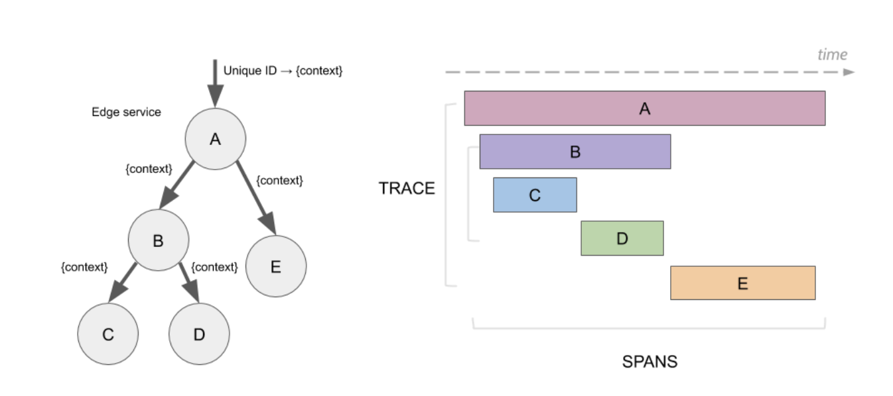

# CAP

分布式系统的最大难点，就是各个节点的状态如何同步。CAP 定理是这方面的基本定理，也是理解分布式系统的起点。

三个指标：
- Consistency
- Availability
- Partition tolerance

## Partition tolerance
大多数分布式系统都分布在多个子网络。每个子网络就叫做一个区（partition）。分区容错的意思是，区间通信可能失败。比如，一台服务器放在中国，另一台服务器放在美国，这就是两个区，它们之间可能无法通信。

一般来说，分区容错无法避免，因此可以认为 CAP 的 P 总是成立。CAP 定理告诉我们，剩下的 C 和 A 无法同时做到。

## Consistency
Consistency 中文叫做"一致性"。意思是，写操作之后的读操作，必须返回该值。

## Abiailability
Availability 中文叫做"可用性"，意思是只要收到用户的请求，服务器就必须给出回应。

如果保证 G2 的一致性，那么 G1 必须在写操作时，锁定 G2 的读操作和写操作。只有数据同步后，才能重新开放读写。锁定期间，G2 不能读写，没有可用性不。

如果保证 G2 的可用性，那么势必不能锁定 G2，所以一致性不成立。

综上所述，G2 无法同时做到一致性和可用性。系统设计时只能选择一个目标。如果追求一致性，那么无法保证所有节点的可用性；如果追求所有节点的可用性，那就没法做到一致性。

# 分布式锁

在很多场景中，我们为了保证数据的最终一致性，需要很多的技术方案来支持，比如分布式事务、分布式锁等。有的时候，我们需要保证一个方法在同一时间内只能被同一个线程执行。

## 数据库实现

```sql
DROP TABLE IF EXISTS `method_lock`;
CREATE TABLE `method_lock` (
  `id` int(11) unsigned NOT NULL AUTO_INCREMENT COMMENT '主键',
  `method_name` varchar(64) NOT NULL COMMENT '锁定的方法名',
  `desc` varchar(255) NOT NULL COMMENT '备注信息',
  `update_time` timestamp NOT NULL DEFAULT CURRENT_TIMESTAMP ON UPDATE CURRENT_TIMESTAMP,
  PRIMARY KEY (`id`),
  UNIQUE KEY `uidx_method_name` (`method_name`) USING BTREE
) ENGINE=InnoDB AUTO_INCREMENT=3 DEFAULT CHARSET=utf8 COMMENT='锁定中的方法';
```
想要执行某个方法，就使用这个方法名向表中插入数据：
```sql
INSERT INTO method_lock (method_name, desc) VALUES ('methodName', '测试的methodName');
```

成功插入则获取锁，执行完成后删除对应的行数据释放锁：
```sql
delete from method_lock where method_name ='methodName';
```
缺点：
- 可用性 （双机部署、数据同步、主备切换；）
- 不具备可重入的特性
- 没有锁失效机制
- 不具备阻塞锁特性

# redis实现
[redis设计与实现](../redis/redis设计与实现.md)

（1）获取锁的时候，使用setnx加锁，并使用expire命令为锁添加一个超时时间，超过该时间则自动释放锁，锁的value值为一个随机生成的UUID，通过此在释放锁的时候进行判断。

（2）获取锁的时候还设置一个获取的超时时间，若超过这个时间则放弃获取锁。

（3）释放锁的时候，通过UUID判断是不是该锁，若是该锁，则执行delete进行锁释放。

## etcd实现

```go
func Test_TryLock(t *testing.T) {
	cli, err := clientv3.New(clientv3.Config{Endpoints: []string{"http://172.27.122.2:23790"}})
	if err != nil {
		fmt.Println(err)
	}
	defer cli.Close()

	// create two separate sessions for lock competition
	s1, err := concurrency.NewSession(cli)
	if err != nil {
		fmt.Println(err)
	}
	defer s1.Close()
	m1 := concurrency.NewMutex(s1, "/my-lock")

	s2, err := concurrency.NewSession(cli)
	if err != nil {
		fmt.Println(err)
	}
	defer s2.Close()
	m2 := concurrency.NewMutex(s2, "/my-lock")

	// acquire lock for s1
	if err = m1.Lock(context.TODO()); err != nil {
		fmt.Println(err)
	}
	fmt.Println("acquired lock for s1")

	if err = m2.TryLock(context.TODO()); err == nil {
		fmt.Println("should not acquire lock")
	}
	if err == concurrency.ErrLocked {
		fmt.Println("cannot acquire lock for s2, as already locked in another session")
	}

	if err = m1.Unlock(context.TODO()); err != nil {
		fmt.Println(err)
	}
	fmt.Println("released lock for s1")
	if err = m2.TryLock(context.TODO()); err != nil {
		fmt.Println(err)
	}
	fmt.Println("acquired lock for s2")
}

```
# 分布式事务
系统之间的通信可靠性从单一系统中的可靠变成了微服务架构之间的不可靠，分布式事务其实就是在不可靠的通信下实现事务的特性。
BASE 是 Basically Available（基本可用）、Soft state（软状态）和 Eventually consistent （最终一致性）三个短语的缩写。BASE 理论是对 CAP 中 AP 的一个扩展，通过牺牲强一致性来获得可用性，当出现故障允许部分不可用但要保证核心功能可用，允许数据在一段时间内是不一致的，但最终达到一致状态。满足BASE理论的事务，我们称之为“柔性事务”。

## 2PC
2PC 即两阶段提交协议，是将整个事务流程分为两个阶段，准备阶段（Prepare phase）、提交阶段（commit phase），2 是指两个阶段，P 是指准备阶段，C 是指提交阶段。

- 准备阶段（Prepare phase）：事务管理器给每个参与者发送 Prepare 消息，每个数据库参与者在本地执行事务，并写本地的 Undo/Redo 日志，此时事务没有提交。（Undo 日志是记录修改前的数据，用于数据库回滚，Redo 日志是记录修改后的数据，用于提交事务后写入数据文件）

- 提交阶段（commit phase）：如果事务管理器收到了参与者的执行失败或者超时消息时，直接给每个参与者发送回滚（Rollback）消息；否则，发送提交（Commit）消息；参与者根据事务管理器的指令执行提交或者回滚操作，并释放事务处理过程中使用的锁资源。注意：必须在最后阶段释放锁资源。

2PC 是一种尽量保证强一致性的分布式事务，因此它是同步阻塞的，而同步阻塞就导致长久的资源锁定问题，总体而言效率低，并且存在单点故障问题，在极端条件下存在数据不一致的风险。

## 3PC
3PC 包含了三个阶段，分别是准备阶段、预提交阶段和提交阶段，对应的英文就是：CanCommit、PreCommit 和 DoCommit。
准备阶段的变更成不会直接执行事务，而是会先去询问此时的参与者是否有条件接这个事务，因此不会一来就干活直接锁资源，使得在某些资源不可用的情况下所有参与者都阻塞着。

预提交阶段的引入起到了一个统一状态的作用，它像一道栅栏，表明在预提交阶段前所有参与者其实还未都回应，在预处理阶段表明所有参与者都已经回应了。

我们知道 2PC 是同步阻塞的，上面我们已经分析了协调者挂在了提交请求还未发出去的时候是最伤的，所有参与者都已经锁定资源并且阻塞等待着。

那么引入了超时机制，参与者就不会傻等了，如果是等待提交命令超时，那么参与者就会提交事务了，因为都到了这一阶段了大概率是提交的，如果是等待预提交命令超时，那该干啥就干啥了，反正本来啥也没干。

3PC 相对于 2PC 做了一定的改进：引入了参与者超时机制，并且增加了预提交阶段使得故障恢复之后协调者的决策复杂度降低，但整体的交互过程更长了，性能有所下降，并且还是会存在数据不一致问题。。


[参考1](https://www.cnblogs.com/dyzcs/p/13780668.html)
[参考2](https://zhuanlan.zhihu.com/p/183753774)

# 全链路追踪
为了解决不同的分布式追踪系统 API 不兼容的问题，诞生了 OpenTracing 规范。OpenTracing 是一个轻量级的标准化层，它位于应用程序/类库和追踪或日志分析程序之间。

opentracing span和trace

一个 trace 代表了一个事务或者流程在（分布式）系统中的执行过程；是一次调用的统称。可以看作是span的有向无环图。

一个 span 代表在分布式系统中完成的单个工作单元，也包含其他 span 的 “引用”，这允许将多个 spans 组合成一个完整的 Trace。



每个 Span 包含以下对象：

- Operation name：操作名称 （也可以称作 Span name）。
- Start timestamp：起始时间。
- Finish timestamp：结束时间。
- Span tag：一组键值对构成的 Span 标签集合。键值对中，键必须为 String，值可以是字符串、布尔或者数字类型。
- Span log：一组 Span 的日志集合。每次 Log 操作包含一个键值对和一个时间戳。键值对中，键必须为 String，值可以是任意类型。
- SpanContext: span 上下文对象。每个 SpanContext 包含以下状态：
  - 要实现任何一个 OpenTracing，都需要依赖一个独特的 Span 去跨进程边界传输当前调用链的状态（例如：Trace 和 Span 的 ID）。
  - Baggage Items 是 Trace 的随行数据，是一个键值对集合，存在于 Trace 中，也需要跨进程边界传输。
  - References（Span 间关系）：相关的零个或者多个 Span（Span 间通过 SpanContext 建立这种关系）。