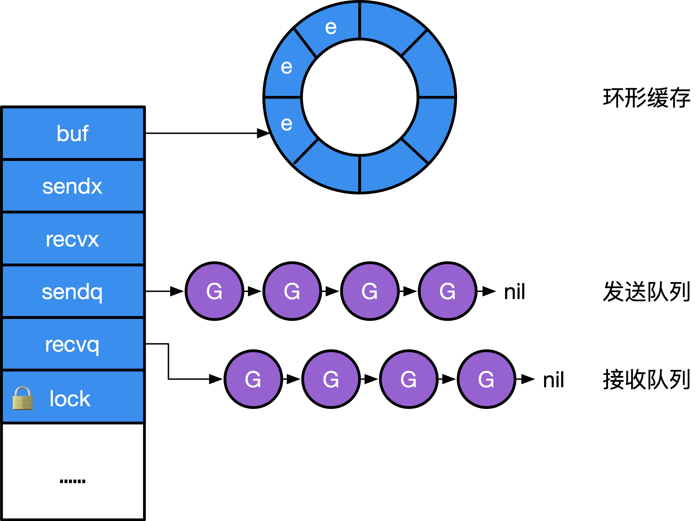
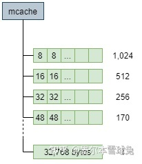
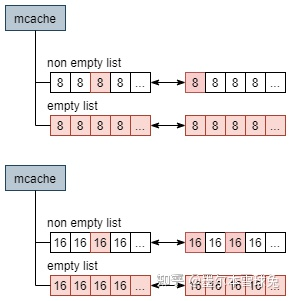
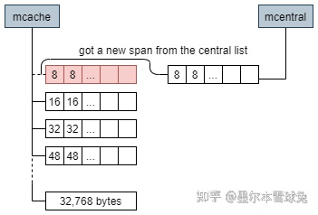
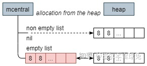

# channel 通道

Go 语言中 Channel 与 Select 语句受到 1978 年 CSP（Communication Sequential Process，是一个专为描述并发系统中通过消息交换进行交互通信实体行为而设计的一种抽象语言） 原始理论的启发。

在语言设计中，Goroutine 就是 CSP 理论中的并发实体， 而 Channel 则对应 CSP 中输入输出指令的消息信道，Select 语句则是 CSP 中守卫和选择指令的组合。 他们的区别在于 CSP 理论中通信是隐式的，而 Go 的通信则是显式的由程序员进行控制； CSP 理论中守卫指令只充当 Select 语句的一个分支，多个分支的 Select 语句由选择指令进行实现。

channel 的本质是一个mutex锁加上一个环形缓存、一个发送队列、一个接收队列：

```go
type hchan struct {
	qcount   uint           // 队列中的所有数据数
	dataqsiz uint           // 环形队列的大小
	buf      unsafe.Pointer // 指向大小为 dataqsiz 的数组
	elemsize uint16         // 元素大小
	closed   uint32         // 是否关闭
	elemtype *_type         // 元素类型
	sendx    uint           // 发送索引
	recvx    uint           // 接收索引
	recvq    waitq          // recv 等待列表，即（ <-ch ）
	sendq    waitq          // send 等待列表，即（ ch<- ）
	lock mutex
}
type waitq struct { // 等待队列 sudog 双向队列
	first *sudog
	last  *sudog
}
```


```go
make(chan type, n) => makechan(type, n)
```
make函数在创建channel的时候会在该进程的heap区申请一块内存，创建一个hchan结构体，返回执行该内存的指针，所以获取的的ch变量本身就是一个指针，在函数之间传递的时候是同一个channel。

makechan 实现的本质是根据需要创建的元素大小， 对 mallocgc 进行封装， 因此，Channel 总是在堆上进行分配，它们会被垃圾回收器进行回收， 这也是为什么 Channel 不一定总是需要调用 close(ch) 进行显式地关闭。

发送数据：
```go
ch <- v => chansend1(ch, v)
func chansend1(c *hchan, elem unsafe.Pointer) {
	chansend(c, elem, true)
}
```
- 如果一个channel为零值，这时候的发送操作会暂止当前的 Goroutine（gopark）。 而 gopark 会将当前的 Goroutine 休眠，从而发生死锁崩溃。`//var c chan int   c <- 6`
- 不允许向已经 close 的 channel 发送数据; channel 上有阻塞的接收方，直接发送, 返回;  否则： 判断 channel 中缓存是否有剩余空间，有剩余空间，存入 c.buf
- 如果既找不到接收方，buf 也已经存满， 这时我们就应该阻塞当前的 Goroutine .

从 Channel 接收数据
接收数据主要是完成以下翻译工作：
```go
v <- ch      =>  chanrecv1(ch, v)
v, ok <- ch  =>  ok := chanrecv2(ch, v)
```
- 如果 Channel 已被关闭，且 Channel 没有数据，立刻返回 (一个close的非空chan，依然可以读到数)
- 如果存在正在阻塞的发送方，说明缓存已满，从缓存队头取一个数据，再复始一个阻塞的发送方
- 否则，检查缓存，如果缓存中仍有数据，则从缓存中读取，读取过程会将队列中的数据拷贝一份到接收方的执行栈中
- 没有能接受的数据，阻塞当前的接收方 Goroutine


到目前为止我们终于明白了为什么无缓冲 Channel 而言 v <- ch happens before ch <- v 了， 因为无缓冲 Channel 的接收方会先从发送方栈拷贝数据后，发送方才会被放回调度队列中，等待重新调度。

channel 关闭

```go
close(ch) => closechan(ch)
```

具体的实现中，首先对 Channel 上锁，而后依次将阻塞在 Channel 的 g 添加到一个 gList 中，当所有的 g 均从 Channel 上移除时，可释放锁，并唤醒 gList 中的所有接收方和发送方.

Select 本身会被编译为 selectgo 调用。这与普通的多个 if 分支不同。 selectgo 则用于随机化每条分支的执行顺序，普通多个 if 分支的执行顺序始终是一致的。

没有配合 for 循环使用 Select 时，需要对发送失败进行处理:
```go
func main() {
	ch := make(chan interface{})
	x := 1
	select {
	case ch <- x:
		println("send success") // 如果初始化为有缓存 channel，则会发送成功
	default:
		println("send failed") // 此时 send failed 会被输出
	}
	return
}
```
## golang 内存分配

go的内存分配器基于 tcmalloc（thread-cache malloc）（tcmalloc 为每个线程实现了一个本地缓存， 区分了小对象（小于 32kb）和大对象分配两种分配类型，其管理的内存单元称为 span。）

Go 的内存分配器与 tcmalloc 存在一定差异。 这个差异来源于 Go 语言被设计为没有显式的内存分配与释放， 完全依靠编译器与运行时的配合来自动处理，因此也就造就了内存分配器、垃圾回收器两大组件。

Go 堆被视为由多个 arena 组成，每个 arena 在 64 位机器上为 64MB

所有的堆对象都通过 span 按照预先设定好的 大小等级分别分配，小于 32KB 的小对象则分配在固定大小等级的 span 上，否则直接从 mheap 上进行分配。

**mspan 是相同大小等级的 span 的双向链表的一个节点，每个节点还记录了自己的起始地址、 指向的 span 中页的数量。**
```go
//go:notinheap
type mspan struct { // 双向链表
	next *mspan     // 链表中的下一个 span，如果为空则为 nil
	prev *mspan     // 链表中的前一个 span，如果为空则为 nil
	...
	startAddr      uintptr // span 的第一个字节的地址，即 s.base()
	npages         uintptr // 一个 span 中的 page 数量
	manualFreeList gclinkptr // mSpanManual span 的释放对象链表
	...
	freeindex  uintptr
	nelems     uintptr // span 中对象的数量
	allocCache uint64
	allocBits  *gcBits
	...
	allocCount  uint16     // 分配对象的数量
	spanclass   spanClass  // 大小等级与 noscan (uint8)
	incache     bool       // 是否被 mcache 使用
	state       mSpanState // mspaninuse 等等信息
	...
}
```
mspan其实就是一个内存分单位的列表（固定大小），span 的列表按所存储 object 的大小分成至多 67 个等级，其容量从 8 字节到 32 KiB（32,768 字节）

mcache
是一个 per-P 的缓存，它是一个包含不同大小等级的 span 链表的数组，其中 mcache.alloc 的每一个数组元素 都是某一个特定大小的 mspan 的链表头指针。
```go
//go:notinheap
type mcache struct {
	...
	tiny             uintptr
	tinyoffset       uintptr
	local_tinyallocs uintptr
	alloc            [numSpanClasses]*mspan // 用来分配的 spans，由 spanClass 索引
	stackcache       [_NumStackOrders]stackfreelist
	...
}
```
mcache中存储着不同大小的span列表（mspan）


**每种 object 大小相同 span 出现两次：其中一次包含指针的 object，另一次不包含。这种分流处理使得垃圾回收器 GC 工作更轻松，因为扫描时可以跳过不包含指针的 object。**所以数组大小numSpanClasses为67x2=134 

当 mcache 中 span 的数量不够使用时，会向 mcentral 的 nonempty 列表中获得新的 span。

```go
//go:notinheap
type mcentral struct {
	lock      mutex
	spanclass spanClass
	nonempty  mSpanList // 带有自由对象的 span 列表，即非空闲列表
	empty     mSpanList // 没有自由对象的 span 列表（或缓存在 mcache 中）
	...
}
```

mcentral 维护 span 为结点的双向链表，非空 span 结点包含至少一个 object 使用的链表，当 GC 扫描内存时，会清空被标记为使用完毕的 span，并将其加入非空链表中。

当本地缓存的 span 用完时，Go 语言会请求从 mcentral 获取一个新的 span，追加至本地链表中：


当 mcentral 中 nonempty 列表中也没有可分配的 span 时，则会向 mheap 提出请求，从而获得 新的 span，并进而交给 mcache。
```go
//go:notinheap
type mheap struct {
	lock           mutex
	pages          pageAlloc
	...
	allspans       []*mspan // 所有 spans 从这里分配出去
	scavengeGoal   uint64
	reclaimIndex   uint64
	reclaimCredit  uintptr
	arenas         [1 << arenaL1Bits]*[1 << arenaL2Bits]*heapArena
	heapArenaAlloc linearAlloc
	arenaHints     *arenaHint
	arena          linearAlloc
	allArenas      []arenaIdx
	curArena       struct {
		base, end uintptr
	}
	central       [numSpanClasses]struct {
		mcentral mcentral
		pad      [cpu.CacheLinePadSize - unsafe.Sizeof(mcentral{})%cpu.CacheLinePadSize]byte
	}
	...

	// 各种分配器
	spanalloc             fixalloc // span* 分配器
	cachealloc            fixalloc // mcache* 分配器
	treapalloc            fixalloc // treapNodes* 分配器，用于大对象
	specialfinalizeralloc fixalloc // specialfinalizer* 分配器
	specialprofilealloc   fixalloc // specialprofile* 分配器
	speciallock           mutex    // 特殊记录分配器的锁
	arenaHintAlloc        fixalloc // arenaHints 分配器
	...
}
```
再当 mcentral 没有可用的内存供 span 分配时，Go 语言再透过 OS 从 heap 中申请新的内存并加入 mcentral 的链表中：


页是向操作系统申请的最小单位，默认8k；

如果向 OS 申请的内存过多，heap 还会分配一块足够大的连续内存 arena，对于 64 位处理器的 OS 而言，起步价为 64 MB。
arena 同时映射每一个 span，其数据结构为：
```go
const (
	pageSize             = 8192                       // 8KB
	heapArenaBytes       = 67108864                   // 64MB
	heapArenaBitmapBytes = heapArenaBytes / 32        // 2097152 （heapArenaBytes / 8 * 2 / 8)(两位表示一个指针对象)
	pagesPerArena        = heapArenaBytes / pageSize  // 8192
)

//go:notinheap
type heapArena struct {
	bitmap     [heapArenaBitmapBytes]byte
	spans      [pagesPerArena]*mspan
	pageInUse  [pagesPerArena / 8]uint8
	pageMarks  [pagesPerArena / 8]uint8
	zeroedBase uintptr
}
```
我们使用 -gcflags "-N -l -m" 编译这段代码能够禁用编译器与内联优化并进行逃逸分析

## 垃圾回收
### 基本原理
Go 实现的垃圾回收器是无分代（对象没有代际之分）、 不整理（回收过程中不对对象进行移动与整理）、并发（与用户代码并发执行）的三色标记清扫算法。

通常， 垃圾回收器的执行过程可根据代码的行为被划分为两个半独立的组件： 赋值器（Mutator）和回收器（Collector）。

三色抽象只是一种描述追踪式回收器的方法，在实践中并没有实际含义， 它的重要作用在于从逻辑上严密推导标记清理这种垃圾回收方法的正确性(指 描述用户态代码必须保障回收器不会将存活的对象进行回收， 而回收器也必须保证赋值器能够正确的访问到已经被重新整理和移动的对象。)。 也就是说，当我们谈及三色标记法时，通常指标记清扫的垃圾回收。

从垃圾回收器的视角来看，三色抽象规定了三种不同类型的对象，并用不同的颜色相称：

- 白色对象（可能死亡）：未被回收器访问到的对象。在回收开始阶段，所有对象均为白色，当回收结束后，白色对象均不可达。
- 灰色对象（波面）：已被回收器访问到的对象，但回收器需要对其中的一个或多个指针进行扫描，因为他们可能还指向白色对象。
- 黑色对象（确定存活）：已被回收器访问到的对象，其中所有字段都已被扫描，黑色对象中任何一个指针都不可能直接指向白色对象。


这样三种不变性所定义的回收过程其实是一个 波面（Wavefront） 不断前进的过程， 这个波面同时也是黑色对象和白色对象的边界，灰色对象就是这个波面。

当垃圾回收开始时，只有白色对象。随着标记过程开始进行时，灰色对象开始出现（着色），这时候波面便开始扩大。当一个对象的所有子节点均完成扫描时，会被着色为黑色。当整个堆遍历完成时，只剩下黑色和白色对象，这时的黑色对象为可达对象，即存活；而白色对象为不可达对象，即死亡。这个过程可以视为以灰色对象为波面，将黑色对象和白色对象分离，使波面不断向前推进，直到所有可达的灰色对象都变为黑色对象为止的过程.

### 写屏障
垃圾回收器的正确性体现在：不应出现对象的丢失，也不应错误的回收还不需要回收的对象。 作为内存屏障的一种，写屏障（Write Barrier）是一个在并发垃圾回收器中才会出现的概念。

可以证明，当以下两个条件同时满足时会破坏垃圾回收器的正确性 [Wilson, 1992]：

- 条件 1: 赋值器修改对象图，导致某一黑色对象引用白色对象；
- 条件 2: 从灰色对象出发，到达白色对象的、未经访问过的路径被赋值器破坏。

强/弱三色不变性

- 强三色不变性：黑色对象永远不会指向白色对象
- 弱三色不变性：黑色对象指向的白色对象至少包含一条由灰色对象经过白色对象的可达路径

我们在谈论垃圾回收器的写屏障时，其实是指赋值器的写屏障，即赋值器屏障。 赋值器屏障作为一种同步机制，使赋值器在进行指针写操作时，能够“通知”回收器，进而不会破坏弱三色不变性。

GC中使用的内存读写屏障技术指的是编译器会在编译期间生成一段代码，该代码在运行期间用户读取、创建或更新对象指针时会拦截内存读写操作，相当于一个hook调用，根据hook时机不同可分为不同的屏障技术。由于读屏障Read barrier技术需要在读操作中插入代码片段从而影响用户程序性能，所以一般使用写屏障技术来保证三色标记的稳健性。

我们讲内存屏障技术解决了三色标记法的STW缺点，并不是指消除了所有的赋值器挂起问题。需要分清楚STW方法是全局性的赋值器挂起而内存屏障技术是局部的赋值器挂起。


在诸多屏障技术中，Go 使用了 Dijkstra 与 Yuasa 屏障的结合， 即混合写屏障（Hybrid write barrier）技术.

**Dijkstra插入写屏障**避免了前面提到的条件1，即防止黑色对象指向白色对象.

```go
// 添加下游对象的函数, 当前下游对象slot, 新下游对象ptr
func DijkstraWritePointer(slot *unsafe.Pointer, ptr unsafe.Pointer) {
    // 1) 将新下游对象标记为灰色
    shade(ptr)
    // 2) 当前下游对象slot = 新下游对象ptr
    *slot = ptr
}
​
// 场景一：A之前没有下游, 新添加一个下游对象B, B被标记为灰色
A.DijkstraWritePointer(nil, B)
// 场景二：A将下游对象C更换为B, B被标记为灰色
A.DijkstraWritePointer(C, B)
```
一个对象可以存储在内存中的“栈”或者“堆”，由于“栈”空间容量小且要求相应速度较高，因此“插入写屏障”不适合用于“栈”空间。

- 第一步：垃圾回收之前将所有的对象标记为白色
- 第二步：遍历GC Root Set，将可达对象标记为灰色
- 第三步：遍历灰色对象列表，将可达的对象从白色标记为灰色；将遍历完的灰色对象标记为黑色
- 第四步：在三色标记过程中用户程序令栈区对象A指向对象H，令堆区对象E指向对象I，由于对象E在堆区从而触发插入写屏障并将黑色对象E指向的白色对象I标记为灰色，栈区对象A不触发
- 第五步：继续三色标记直至灰色对象队列为空
- 第六步：由于栈区对象没有启动插入写屏障，因此栈上可能存在白色对象被引用的情况（上图中对应对象H），因此在回收白色对象前在STW保护下重新扫描一次栈空间(栈空间默认全灰)
- 第七步：在STW保护下对栈空间一次性进行三色标记，直到灰色对象队列为空
- 第八步：结束STW
- 第九步：最后将栈空间和堆空间的白色垃圾对象进行回收
  
尽管Dijkstra插入写屏障可以实现垃圾回收和用户程序的并发执行，但是它存在两个缺点。一方面它是一种比较保守的垃圾回收方法，把有可能存活的对象都标记成灰色了以满足“强三色不变性”。

**Yuasa删除写屏障**避免了前面提到的条件2，防止丢失灰色对象到白色对象的可达路径。当用户程序执行`*slot = ptr时（即令slot指向了ptr），我们会将当前下游对象*slot标记为灰色`。一句话解释就是当删除对象A指向对象B的指针时，那么将被删除的对象标记为灰色。

```go
// 添加下游对象的函数, 当前下游对象slot, 新下游对象ptr
func YuasaWritePointer(slot *unsafe.Pointer, ptr unsafe.Pointer) {
    // 1) 将当前下游对象标记为灰色
    shade(*slot)
    // 2) 当前下游对象slot = 新下游对象ptr
    *slot = ptr
}
​
// 场景一：B被A删除, 将B标记为灰色
A.添加下游对象(B, nil)
// 场景二：B被A删除, 将B标记为灰色
A.添加下游对象(B, C)
```

- 第一步：将所有对象标记为白色
- 第二步：遍历GC Root Set将可达对象设为灰色
- 第三步：如果用户程序令灰色对象A删除了对白色对象D的引用，如果这时候不触发删除写屏障，那么对象D、B和C直到本轮垃圾回收结束都会是白色对象。因此需要触发删除写屏障，将对象D标记为灰色。
- 第四步：遍历灰色对象队列，将可达的白色对象标记为灰色，遍历完的灰色对象标记为黑色
- 第五步：继续进行三色标记，直到灰色对象队列为空
- 第六步：清除所有的白色对象

Yuasa删除写屏障和Dijkstra插入写屏障相比优点在于不需要在一轮三色标记后对栈空间上的对象进行重新扫描，缺点在于Collector会悲观地认为所有被删除的对象都可能被黑色对象引用.

### golang gc四个阶段

Golang的GC属于并发式垃圾回收（意味着不需要长时间的STW，GC大部分执行过程是和用户代码并行的），它可以分为四个阶段：

- 清除终止Sweep Termination：
  - 暂停程序
  - 清扫未被回收的内存管理单元span，当上一轮GC的清扫工作完成后才可以开始新一轮的GC
- 标记Mark：
 - 切换至_GCmark，开启写屏障和用户程序协助Mutator Assiste并将根对象添加到三色标记法队列
 - 恢复程序，标记进程和Mutator Assiste进程会开始并发标记内存中的对象，混合写屏障将被删除的指针和新加入的指针都标记成灰色，新创建的对象标记成黑色
 - 扫描根对象（包括所有goroutine的栈、全局对象以及不在堆中的运行时数据结构），扫描goroutine栈期间会暂停当前处理器
 - 依次处理三色标记法队列，将扫描过的对象标记为黑色并将它们指向的对象标记成灰色
 - 使用分布式终止算法检查剩余的工作，发现标记阶段完成后进入标记终止阶段
- 标记终止Mark Termination
  - 暂停程序，切换至_GCmarktermination并关闭辅助标记的用户程序
  - 清理处理器上的线程缓存
- 清除Sweep
  - 将状态切换至_GCoff，关闭混合写屏障
  - 恢复用户程序，所有新创建的对象标记为白色
  - 后台并发清理所有的内存管理单元span，当goroutine申请新的内存管理单元时就会触发清理

[参考](https://zhuanlan.zhihu.com/p/297177002)