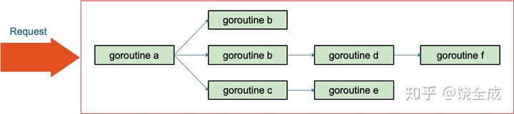
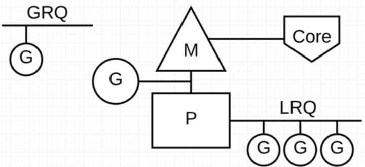
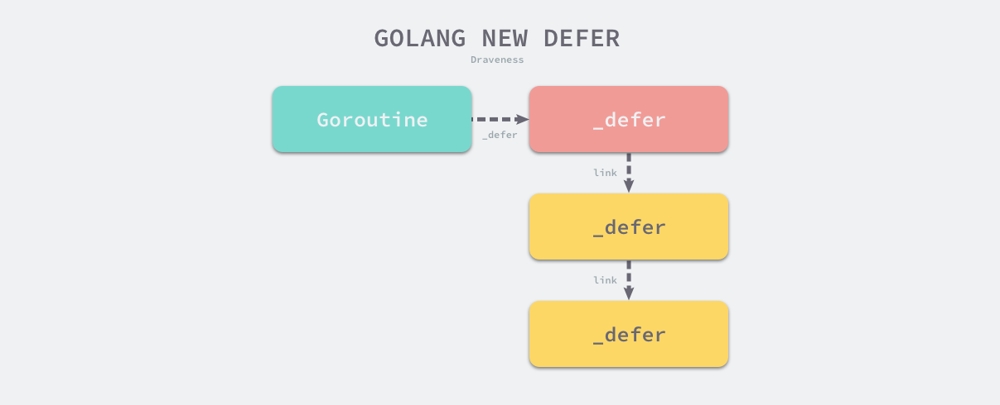

# channel 通道

Go 语言中 Channel 与 Select 语句受到 1978 年 CSP（Communication Sequential Process，是一个专为描述并发系统中通过消息交换进行交互通信实体行为而设计的一种抽象语言） 原始理论的启发。

在语言设计中，Goroutine 就是 CSP 理论中的并发实体， 而 Channel 则对应 CSP 中输入输出指令的消息信道，Select 语句则是 CSP 中守卫和选择指令的组合。 他们的区别在于 CSP 理论中通信是隐式的，而 Go 的通信则是显式的由程序员进行控制； CSP 理论中守卫指令只充当 Select 语句的一个分支，多个分支的 Select 语句由选择指令进行实现。

channel 的本质是一个mutex锁加上一个环形缓存、一个发送队列、一个接收队列：

```go
type hchan struct {
	qcount   uint           // 队列中的所有数据数
	dataqsiz uint           // 环形队列的大小
	buf      unsafe.Pointer // 指向大小为 dataqsiz 的数组
	elemsize uint16         // 元素大小
	closed   uint32         // 是否关闭
	elemtype *_type         // 元素类型
	sendx    uint           // 发送索引
	recvx    uint           // 接收索引
	recvq    waitq          // recv 等待列表，即（ <-ch ）
	sendq    waitq          // send 等待列表，即（ ch<- ）
	lock mutex
}
type waitq struct { // 等待队列 sudog 双向队列
	first *sudog
	last  *sudog
}
```


```go
make(chan type, n) => makechan(type, n)
```

make函数在创建channel的时候会在该进程的heap区申请一块内存，创建一个hchan结构体，返回执行该内存的指针，所以获取的的ch变量本身就是一个指针，在函数之间传递的时候是同一个channel。

makechan 实现的本质是根据需要创建的元素大小， 对 mallocgc 进行封装， 因此，Channel 总是在堆上进行分配，它们会被垃圾回收器进行回收， 这也是为什么 Channel 不一定总是需要调用 close(ch) 进行显式地关闭。

发送数据：

```go
ch <- v => chansend1(ch, v)
func chansend1(c *hchan, elem unsafe.Pointer) {
	chansend(c, elem, true)
}
```

- 如果一个channel为零值，这时候的发送操作会暂止当前的 Goroutine（gopark）。 而 gopark 会将当前的 Goroutine 休眠，从而发生死锁崩溃。`//var c chan int   c <- 6`
- 不允许向已经 close 的 channel 发送数据; channel 上有阻塞的接收方，直接发送, 返回;  否则： 判断 channel 中缓存是否有剩余空间，有剩余空间，存入 c.buf
- 如果既找不到接收方，buf 也已经存满， 这时我们就应该阻塞当前的 Goroutine .

从 Channel 接收数据
接收数据主要是完成以下翻译工作：

```go
v <- ch      =>  chanrecv1(ch, v)
v, ok <- ch  =>  ok := chanrecv2(ch, v)
```

- 如果 Channel 已被关闭，且 Channel 没有数据，立刻返回 (一个close的非空chan，依然可以读到数)
- 如果存在正在阻塞的发送方，说明缓存已满，从缓存队头取一个数据，再复始一个阻塞的发送方
- 否则，检查缓存，如果缓存中仍有数据，则从缓存中读取，读取过程会将队列中的数据拷贝一份到接收方的执行栈中
- 没有能接受的数据，阻塞当前的接收方 Goroutine

到目前为止我们终于明白了为什么无缓冲 Channel 而言 v <- ch happens before ch <- v 了， 因为无缓冲 Channel 的接收方会先从发送方栈拷贝数据后，发送方才会被放回调度队列中，等待重新调度。

channel 关闭

```go
close(ch) => closechan(ch)
```

具体的实现中，首先对 Channel 上锁，而后依次将阻塞在 Channel 的 g 添加到一个 gList 中，当所有的 g 均从 Channel 上移除时，可释放锁，并唤醒 gList 中的所有接收方和发送方.

Select 本身会被编译为 selectgo 调用。这与普通的多个 if 分支不同。 selectgo 则用于随机化每条分支的执行顺序，普通多个 if 分支的执行顺序始终是一致的。

没有配合 for 循环使用 Select 时，需要对发送失败进行处理:

```go
func main() {
	ch := make(chan interface{})
	x := 1
	select {
	case ch <- x:
		println("send success") // 如果初始化为有缓存 channel，则会发送成功
	default:
		println("send failed") // 此时 send failed 会被输出
	}
	return
}
```

## select

Go 语言中的 select 能够让 Goroutine 同时等待多个 Channel 可读或者可写，在多个 Channel状态改变之前，select 会一直阻塞当前Goroutine。

当我们在 Go 语言中使用 select 控制结构时，会遇到两个有趣的现象：

1) select 能在 Channel 上进行非阻塞的收发操作；
   - 当存在可以收发的 Channel 时，直接处理该 Channel 对应的 case；
   - 当不存在可以收发的 Channel 时，执行 default 中的语句；
2) select 在遇到多个 Channel 同时响应时，会随机执行一种情况；

## golang 内存分配

go的内存分配器基于 tcmalloc（thread-cache malloc）（tcmalloc 为每个线程实现了一个本地缓存， 区分了小对象（小于 32kb）和大对象分配两种分配类型，其管理的内存单元称为 span。）

Go 的内存分配器与 tcmalloc 存在一定差异。 这个差异来源于 Go 语言被设计为没有显式的内存分配与释放， 完全依靠编译器与运行时的配合来自动处理，因此也就造就了内存分配器、垃圾回收器两大组件。

Go 堆被视为由多个 arena 组成，每个 arena 在 64 位机器上为 64MB

所有的堆对象都通过 span 按照预先设定好的 大小等级分别分配，小于 32KB 的小对象则分配在固定大小等级的 span 上，否则直接从 mheap 上进行分配。

**mspan 是相同大小等级的 span 的双向链表的一个节点，每个节点还记录了自己的起始地址、 指向的 span 中页的数量。**

```go
//go:notinheap
type mspan struct { // 双向链表
	next *mspan     // 链表中的下一个 span，如果为空则为 nil
	prev *mspan     // 链表中的前一个 span，如果为空则为 nil
	...
	startAddr      uintptr // span 的第一个字节的地址，即 s.base()
	npages         uintptr // 一个 span 中的 page 数量
	manualFreeList gclinkptr // mSpanManual span 的释放对象链表
	...
	freeindex  uintptr
	nelems     uintptr // span 中对象的数量
	allocCache uint64
	allocBits  *gcBits
	...
	allocCount  uint16     // 分配对象的数量
	spanclass   spanClass  // 大小等级与 noscan (uint8)
	incache     bool       // 是否被 mcache 使用
	state       mSpanState // mspaninuse 等等信息
	...
}
```

mspan其实就是一个内存分单位的列表（固定大小），span 的列表按所存储 object 的大小分成至多 67 个等级，其容量从 8 字节到 32 KiB（32,768 字节）

mcache
是一个 per-P 的缓存，它是一个包含不同大小等级的 span 链表的数组，其中 mcache.alloc 的每一个数组元素 都是某一个特定大小的 mspan 的链表头指针。

```go
//go:notinheap
type mcache struct {
	...
	tiny             uintptr
	tinyoffset       uintptr
	local_tinyallocs uintptr
	alloc            [numSpanClasses]*mspan // 用来分配的 spans，由 spanClass 索引
	stackcache       [_NumStackOrders]stackfreelist
	...
}
```

mcache中存储着不同大小的span列表（mspan）


**每种 object 大小相同 span 出现两次：其中一次包含指针的 object，另一次不包含。这种分流处理使得垃圾回收器 GC 工作更轻松，因为扫描时可以跳过不包含指针的 object。**所以数组大小numSpanClasses为67x2=134

当 mcache 中 span 的数量不够使用时，会向 mcentral 的 nonempty 列表中获得新的 span。

```go
//go:notinheap
type mcentral struct {
	lock      mutex
	spanclass spanClass
	nonempty  mSpanList // 带有自由对象的 span 列表，即非空闲列表
	empty     mSpanList // 没有自由对象的 span 列表（或缓存在 mcache 中）
	...
}
```


mcentral 维护 span 为结点的双向链表，非空 span 结点包含至少一个 object 使用的链表，当 GC 扫描内存时，会清空被标记为使用完毕的 span，并将其加入非空链表中。

当本地缓存的 span 用完时，Go 语言会请求从 mcentral 获取一个新的 span，追加至本地链表中：


当 mcentral 中 nonempty 列表中也没有可分配的 span 时，则会向 mheap 提出请求，从而获得 新的 span，并进而交给 mcache。

```go
//go:notinheap
type mheap struct {
	lock           mutex
	pages          pageAlloc
	...
	allspans       []*mspan // 所有 spans 从这里分配出去
	scavengeGoal   uint64
	reclaimIndex   uint64
	reclaimCredit  uintptr
	arenas         [1 << arenaL1Bits]*[1 << arenaL2Bits]*heapArena
	heapArenaAlloc linearAlloc
	arenaHints     *arenaHint
	arena          linearAlloc
	allArenas      []arenaIdx
	curArena       struct {
		base, end uintptr
	}
	central       [numSpanClasses]struct {
		mcentral mcentral
		pad      [cpu.CacheLinePadSize - unsafe.Sizeof(mcentral{})%cpu.CacheLinePadSize]byte
	}
	...

	// 各种分配器
	spanalloc             fixalloc // span* 分配器
	cachealloc            fixalloc // mcache* 分配器
	treapalloc            fixalloc // treapNodes* 分配器，用于大对象
	specialfinalizeralloc fixalloc // specialfinalizer* 分配器
	specialprofilealloc   fixalloc // specialprofile* 分配器
	speciallock           mutex    // 特殊记录分配器的锁
	arenaHintAlloc        fixalloc // arenaHints 分配器
	...
}
```

再当 mcentral 没有可用的内存供 span 分配时，Go 语言再透过 OS 从 heap 中申请新的内存并加入 mcentral 的链表中：


页是向操作系统申请的最小单位，默认8k；

如果向 OS 申请的内存过多，heap 还会分配一块足够大的连续内存 arena，对于 64 位处理器的 OS 而言，起步价为 64 MB。
arena 同时映射每一个 span，其数据结构为：

```go
const (
	pageSize             = 8192                       // 8KB
	heapArenaBytes       = 67108864                   // 64MB
	heapArenaBitmapBytes = heapArenaBytes / 32        // 2097152 （heapArenaBytes / 8 * 2 / 8)(两位表示一个指针对象)
	pagesPerArena        = heapArenaBytes / pageSize  // 8192
)

//go:notinheap
type heapArena struct {
	bitmap     [heapArenaBitmapBytes]byte
	spans      [pagesPerArena]*mspan
	pageInUse  [pagesPerArena / 8]uint8
	pageMarks  [pagesPerArena / 8]uint8
	zeroedBase uintptr
}
```

我们使用 -gcflags "-N -l -m" 编译这段代码能够禁用编译器与内联优化并进行逃逸分析

# 垃圾回收

### 基本原理

Go 实现的垃圾回收器是无分代（对象没有代际之分）、 不整理（回收过程中不对对象进行移动与整理）、并发（与用户代码并发执行）的三色标记清扫算法。

通常， 垃圾回收器的执行过程可根据代码的行为被划分为两个半独立的组件： 赋值器（Mutator）和回收器（Collector）。

三色抽象只是一种描述追踪式回收器的方法，在实践中并没有实际含义， 它的重要作用在于从逻辑上严密推导标记清理这种垃圾回收方法的正确性(指 描述用户态代码必须保障回收器不会将存活的对象进行回收， 而回收器也必须保证赋值器能够正确的访问到已经被重新整理和移动的对象。)。 也就是说，当我们谈及三色标记法时，通常指标记清扫的垃圾回收。

从垃圾回收器的视角来看，三色抽象规定了三种不同类型的对象，并用不同的颜色相称：

- 白色对象（可能死亡）：未被回收器访问到的对象。在回收开始阶段，所有对象均为白色，当回收结束后，白色对象均不可达。
- 灰色对象（波面）：已被回收器访问到的对象，但回收器需要对其中的一个或多个指针进行扫描，因为他们可能还指向白色对象。
- 黑色对象（确定存活）：已被回收器访问到的对象，其中所有字段都已被扫描，黑色对象中任何一个指针都不可能直接指向白色对象。


这样三种不变性所定义的回收过程其实是一个 波面（Wavefront） 不断前进的过程， 这个波面同时也是黑色对象和白色对象的边界，灰色对象就是这个波面。

当垃圾回收开始时，只有白色对象。随着标记过程开始进行时，灰色对象开始出现（着色），这时候波面便开始扩大。当一个对象的所有子节点均完成扫描时，会被着色为黑色。当整个堆遍历完成时，只剩下黑色和白色对象，这时的黑色对象为可达对象，即存活；而白色对象为不可达对象，即死亡。这个过程可以视为以灰色对象为波面，将黑色对象和白色对象分离，使波面不断向前推进，直到所有可达的灰色对象都变为黑色对象为止的过程.

### 写屏障

垃圾回收器的正确性体现在：不应出现对象的丢失，也不应错误的回收还不需要回收的对象。 作为内存屏障的一种，写屏障（Write Barrier）是一个在并发垃圾回收器中才会出现的概念。

可以证明，当以下两个条件同时满足时会破坏垃圾回收器的正确性 [Wilson, 1992]：

- 条件 1: 赋值器修改对象图，导致某一黑色对象引用白色对象；
- 条件 2: 从灰色对象出发，到达白色对象的、未经访问过的路径被赋值器破坏。

强/弱三色不变性

- 强三色不变性：黑色对象永远不会指向白色对象
- 弱三色不变性：黑色对象指向的白色对象至少包含一条由灰色对象经过白色对象的可达路径

我们在谈论垃圾回收器的写屏障时，其实是指赋值器的写屏障，即赋值器屏障。 赋值器屏障作为一种同步机制，使赋值器在进行指针写操作时，能够“通知”回收器，进而不会破坏弱三色不变性。

GC中使用的内存读写屏障技术指的是编译器会在编译期间生成一段代码，该代码在运行期间用户读取、创建或更新对象指针时会拦截内存读写操作，相当于一个hook调用，根据hook时机不同可分为不同的屏障技术。由于读屏障Read barrier技术需要在读操作中插入代码片段从而影响用户程序性能，所以一般使用写屏障技术来保证三色标记的稳健性。

我们讲内存屏障技术解决了三色标记法的STW缺点，并不是指消除了所有的赋值器挂起问题。需要分清楚STW方法是全局性的赋值器挂起而内存屏障技术是局部的赋值器挂起。

在诸多屏障技术中，Go 使用了 Dijkstra 与 Yuasa 屏障的结合， 即混合写屏障（Hybrid write barrier）技术.

**Dijkstra插入写屏障**避免了前面提到的条件1，即防止黑色对象指向白色对象.

```go
// 添加下游对象的函数, 当前下游对象slot, 新下游对象ptr
func DijkstraWritePointer(slot *unsafe.Pointer, ptr unsafe.Pointer) {
    // 1) 将新下游对象标记为灰色
    shade(ptr)
    // 2) 当前下游对象slot = 新下游对象ptr
    *slot = ptr
}

// 场景一：A之前没有下游, 新添加一个下游对象B, B被标记为灰色
A.DijkstraWritePointer(nil, B)
// 场景二：A将下游对象C更换为B, B被标记为灰色
A.DijkstraWritePointer(C, B)
```

一个对象可以存储在内存中的“栈”或者“堆”，由于“栈”空间容量小且要求相应速度较高，因此“插入写屏障”不适合用于“栈”空间。

- 第一步：垃圾回收之前将所有的对象标记为白色
- 第二步：遍历GC Root Set，将可达对象标记为灰色
- 第三步：遍历灰色对象列表，将可达的对象从白色标记为灰色；将遍历完的灰色对象标记为黑色
- 第四步：在三色标记过程中用户程序令栈区对象A指向对象H，令堆区对象E指向对象I，由于对象E在堆区从而触发插入写屏障并将黑色对象E指向的白色对象I标记为灰色，栈区对象A不触发
- 第五步：继续三色标记直至灰色对象队列为空
- 第六步：由于栈区对象没有启动插入写屏障，因此栈上可能存在白色对象被引用的情况（上图中对应对象H），因此在回收白色对象前在STW保护下重新扫描一次栈空间(栈空间默认全灰)
- 第七步：在STW保护下对栈空间一次性进行三色标记，直到灰色对象队列为空
- 第八步：结束STW
- 第九步：最后将栈空间和堆空间的白色垃圾对象进行回收

尽管Dijkstra插入写屏障可以实现垃圾回收和用户程序的并发执行，但是它存在两个缺点。一方面它是一种比较保守的垃圾回收方法，把有可能存活的对象都标记成灰色了以满足“强三色不变性”。

**Yuasa删除写屏障**避免了前面提到的条件2，防止丢失灰色对象到白色对象的可达路径。当用户程序执行`*slot = ptr时（即令slot指向了ptr），我们会将当前下游对象*slot标记为灰色`。一句话解释就是当删除对象A指向对象B的指针时，那么将被删除的对象标记为灰色。

```go
// 添加下游对象的函数, 当前下游对象slot, 新下游对象ptr
func YuasaWritePointer(slot *unsafe.Pointer, ptr unsafe.Pointer) {
    // 1) 将当前下游对象标记为灰色
    shade(*slot)
    // 2) 当前下游对象slot = 新下游对象ptr
    *slot = ptr
}

// 场景一：B被A删除, 将B标记为灰色
A.添加下游对象(B, nil)
// 场景二：B被A删除, 将B标记为灰色
A.添加下游对象(B, C)
```

- 第一步：将所有对象标记为白色
- 第二步：遍历GC Root Set将可达对象设为灰色
- 第三步：如果用户程序令灰色对象A删除了对白色对象D的引用，如果这时候不触发删除写屏障，那么对象D、B和C直到本轮垃圾回收结束都会是白色对象。因此需要触发删除写屏障，将对象D标记为灰色。
- 第四步：遍历灰色对象队列，将可达的白色对象标记为灰色，遍历完的灰色对象标记为黑色
- 第五步：继续进行三色标记，直到灰色对象队列为空
- 第六步：清除所有的白色对象

Yuasa删除写屏障和Dijkstra插入写屏障相比优点在于不需要在一轮三色标记后对栈空间上的对象进行重新扫描，缺点在于Collector会悲观地认为所有被删除的对象都可能被黑色对象引用.

### golang gc四个阶段

Golang的GC属于并发式垃圾回收（意味着不需要长时间的STW，GC大部分执行过程是和用户代码并行的），它可以分为四个阶段：

- 清除终止Sweep Termination：
  - 暂停程序
  - 清扫未被回收的内存管理单元span，当上一轮GC的清扫工作完成后才可以开始新一轮的GC
- 标记Mark：
- 切换至_GCmark，开启写屏障和用户程序协助Mutator Assiste并将根对象添加到三色标记法队列
- 恢复程序，标记进程和Mutator Assiste进程会开始并发标记内存中的对象，混合写屏障将被删除的指针和新加入的指针都标记成灰色，新创建的对象标记成黑色
- 扫描根对象（包括所有goroutine的栈、全局对象以及不在堆中的运行时数据结构），扫描goroutine栈期间会暂停当前处理器
- 依次处理三色标记法队列，将扫描过的对象标记为黑色并将它们指向的对象标记成灰色
- 使用分布式终止算法检查剩余的工作，发现标记阶段完成后进入标记终止阶段
- 标记终止Mark Termination
  - 暂停程序，切换至_GCmarktermination并关闭辅助标记的用户程序
  - 清理处理器上的线程缓存
- 清除Sweep
  - 将状态切换至_GCoff，关闭混合写屏障
  - 恢复用户程序，所有新创建的对象标记为白色
  - 后台并发清理所有的内存管理单元span，当goroutine申请新的内存管理单元时就会触发清理

[参考](https://zhuanlan.zhihu.com/p/297177002)

# golang context

```go
type Context interface {
	// 截止日期返回应取消代表该上下文完成的工作的时间。如果未设置截止日期，则截止日期返回ok == false。连续调用Deadline会返回相同的结果。
	Deadline() (deadline time.Time, ok bool)

	// Done 返回一个 channel，当代表该上下文完成的工作应被取消时，该通道将关闭。
	// 如果此上下文永远无法取消，则可能会返回 nil。
	// 连续调用 Done 将返回相同的值。在取消函数返回之后，完成 channel 的关闭可能会异步发生。
	Done() <-chan struct{}

	// 如果 Done 未被关闭，则 Err 返回 nil；
	// 如果 Done 已被关闭，则 Err 返回一个非空错误。
	Err() error

	// Value 返回了与当前上下文使用 key 相关联的值；
	// 没有关联的 key 时将返回 nil。
	Value(key interface{}) interface{}
}
```

Context 是一个接口，定义了 4 个方法，它们都是幂等的。也就是说连续多次调用同一个方法，得到的结果都是相同的。

context 主要用来在 goroutine 之间传递上下文信息，包括：取消信号、超时时间、截止时间、k-v 等。

context 几乎成为了并发控制和超时控制的标准做法。



这些 goroutine 需要共享这个请求的基本数据，例如登陆的 token，处理请求的最大超时时间（如果超过此值再返回数据，请求方因为超时接收不到）等等。当请求被取消或是处理时间太长，这有可能是使用者关闭了浏览器或是已经超过了请求方规定的超时时间，请求方直接放弃了这次请求结果。这时，所有正在为这个请求工作的 goroutine 需要快速退出，因为它们的“工作成果”不再被需要了。在相关联的 goroutine 都退出后，系统就可以回收相关的资源。

- 不要将 Context 塞到结构体里。直接将 Context 类型作为函数的第一参数，而且一般都命名为 ctx。
- 不要向函数传入一个 nil 的 context，如果你实在不知道传什么，标准库给你准备好了一个 context：todo。
- 不要把本应该作为函数参数的类型塞到 context 中，context 存储的应该是一些共同的数据。例如：登陆的 session、cookie 等。
- 同一个 context 可能会被传递到多个 goroutine，别担心，context 是并发安全的。

## func WithCancel(parent Context) (ctx Context, cancel CancelFunc) 解析：

withcancel会从父context生成一个带cancel的context； 会向上寻找可以“挂靠”的“可取消”的 context，并且“挂靠”上去。这样，调用上层 cancel 方法的时候，就可以层层传递，将那些挂靠的子 context 同时“取消”。

WithCancel 函数返回的 CancelFunc 被调用或者是父节点的 done channel 被关闭（父节点的 CancelFunc 被调用），此 context（子节点） 的 done channel 也会被关闭。

cancel() 方法的功能就是关闭 channel：c.done；递归地取消它的所有子节点；从父节点从删除自己。达到的效果是通过关闭 channel，将取消信号传递给了它的所有子节点。goroutine 接收到取消信号的方式就是 select 语句中的读 c.done 被选中。

当调用返回的 cancelFunc 时，会将这个 context 从它的父节点里“除名”，因为父节点可能有很多子节点，你自己取消了，所以我要和你断绝关系，对其他人没影响。

[参考](https://zhuanlan.zhihu.com/p/68792989)

# 逃逸分析

go 在编译阶段确立逃逸，并不是在运行时。

验证变量是否逃逸的方法：

```
go run -gcflags "-m -l" (-m打印逃逸分析信息，-l禁止内联编译)；
```

- 在某个函数中new或字面量创建出的变量，将其指针作为函数返回值，则该变量一定发生逃逸。
- 被已经逃逸的变量引用的指针，一定发生逃逸。
- 被指针类型的slice、map和chan引用的指针一定发生逃逸

## 函数传递指针真的比传值效率高吗？

我们知道传递指针可以减少底层值的拷贝，可以提高效率，但是如果拷贝的数据量小，由于指针传递会产生逃逸，可能会使用堆，也可能会增加GC的负担，所以传递指针不一定是高效的。

## 逃逸分析的作用是什么呢？

- 1、逃逸分析的好处是为了减少gc的压力，不逃逸的对象分配在栈上，当函数返回时就回收了资源，不需要gc标记清除。
- 2、逃逸分析完后可以确定哪些变量可以分配在栈上，栈的分配比堆快，性能好(逃逸的局部变量会在堆上分配 ,而没有发生逃逸的则有编译器在栈上分配)。
- 3、同步消除，如果你定义的对象的方法上有同步锁，但在运行时，却只有一个线程在访问，此时逃逸分析后的机器码，会去掉同步锁运行。

## 总结

- 1、堆上动态分配内存比栈上静态分配内存，开销大很多。
- 2、变量分配在栈上需要能在编译期确定它的作用域，否则会分配到堆上。
- 3、Go编译器会在编译期对考察变量的作用域，并作一系列检查，如果它的作用域在运行期间对编译器一直是可知的，那么就会分配到栈上。简单来说，编译器会根据变量是否被外部引用来决定是否逃逸。
- 4、对于Go程序员来说，编译器的这些逃逸分析规则不需要掌握，我们只需通过go build -gcflags '-m’命令来观察变量逃逸情况就行了。
- 5、不要盲目使用变量的指针作为函数参数，虽然它会减少复制操作。但其实当参数为变量自身的时候，复制是在栈上完成的操作，开销远比变量逃逸后动态地在堆上分配内存少的多。
- 6、逃逸分析在编译阶段完成的。

# 内存分配之堆和栈

栈 可以简单得理解成一次函数调用内部申请到的内存，它们会随着函数的返回把内存还给系统。

goroutine 初始时只给栈分配很小的空间，然后随着使用过程中的需要自动地增长。这就是为什么Go可以开千千万万个goroutine而不会耗尽内存。
Go 1.4开始使用的是连续栈，而这之前使用的分段栈。

goroutine在栈上运行着，当用光栈空间，它遇到与旧方案中相同的栈溢出检查。但是与旧方案采用的保留一个返 回前一段栈的link不同，新方案创建一个两倍于原stack大小的新stack，并将旧栈拷贝到其中。
这意味着当栈实际使用的空间缩小为原先的 大小时，go运行时不用做任何事情。
栈缩小是一个无任何代价的操作（栈的收缩是垃圾回收的过程中实现的．当检测到栈只使用了不到1/4时，栈缩小为原来的1/2）。
此外，当栈再次增长时，运行时也无需做任何事情，我们只需要重用之前分配的空闲空间即可。

[参考](https://www.cnblogs.com/mafeng/p/10305419.html)

# go并发模型GMP

Go 调度器模型我们通常叫做G-P-M 模型，他包括 4 个重要结构，分别是G、P、M、Sched：

G:Goroutine，每个 Goroutine 对应一个 G 结构体，G 存储 Goroutine 的运行堆栈、状态以及任务函数，可重用。

G 并非执行体，每个 G 需要绑定到 P 才能被调度执行。

P: Processor，表示逻辑处理器，对 G 来说，P 相当于 CPU 核，G 只有绑定到 P 才能被调度。对 M 来说，P 提供了相关的执行环境(Context)，如内存分配状态(mcache)，任务队列(G)等。

P 的数量决定了系统内最大可并行的 G 的数量（前提：物理 CPU 核数  >= P 的数量）。

M: Machine，OS 内核线程抽象，代表着真正执行计算的资源，在绑定有效的 P 后，进入 schedule 循环；而 schedule 循环的机制大致是从 Global 队列、P 的 Local 队列以及 wait 队列中获取。

M 并不保留 G 状态，这是 G 可以跨 M 调度的基础。

Sched：Go 调度器，它维护有存储 M 和 G 的队列以及调度器的一些状态信息等。

调度器循环的机制大致是从各种队列、P 的本地队列中获取 G，切换到 G 的执行栈上并执行 G 的函数，调用 Goexit 做清理工作并回到 M，如此反复。


为了更加充分利用线程的计算资源，Go 调度器采取了以下几种调度策略：

- 任务窃取（work-stealing）
  为了提高 Go 并行处理能力，调高整体处理效率，当每个 P 之间的 G 任务不均衡时，调度器允许从 GRQ，或者其他 P 的 LRQ 中获取 G 执行。
- 减少阻塞
  - 由于原子、互斥量或通道操作调用导致 Goroutine 阻塞，调度器将把当前阻塞的 Goroutine 切换出去，重新调度 LRQ 上的其他 Goroutine；
  - 由于网络请求和 IO 操作导致 Goroutine 阻塞，Go 程序提供了网络轮询器（NetPoller）来处理网络请求和 IO 操作的问题，其后台通过 kqueue（MacOS），epoll（Linux）或 iocp（Windows）来实现 IO 多路复用。通过使用 NetPoller 进行网络系统调用，调度器可以防止 Goroutine 在进行这些系统调用时阻塞 M。这可以让 M 执行 P 的 LRQ 中其他的 Goroutines，而不需要创建新的 M。有助于减少操作系统上的调度负载。
  - 当调用一些系统方法的时候，如果系统方法调用的时候发生阻塞，这种情况下，网络轮询器（NetPoller）无法使用，而进行系统调用的 Goroutine 将阻塞当前 M。调度器介入后：识别出 G1 已导致 M1 阻塞，此时，调度器将 M1 与 P 分离，同时也将 G1 带走。然后调度器引入新的 M2 来服务 P。此时，可以从 LRQ 中选择 G2 并在 M2 上进行上下文切换。阻塞的系统调用完成后：G1 可以移回 LRQ 并再次由 P 执行。如果这种情况再次发生，M1 将被放在旁边以备将来重复使用。
  - 如果在 Goroutine 去执行一个 sleep 操作，导致 M 被阻塞了。Go 程序后台有一个监控线程 sysmon，它监控那些长时间运行的 G 任务然后设置可以强占的标识符，别的 Goroutine 就可以抢先进来执行。只要下次这个 Goroutine 进行函数调用，那么就会被强占，同时也会保护现场，然后重新放入 P 的本地队列里面等待下次执行。

[参考](https://zhuanlan.zhihu.com/p/111346689)

# go build

Go语言提供的build tag 条件编译特性，顾名思义，只有在特定条件下才会构建对应的代码。

比如下面的源文件只有在设置debug构建标志时才会被构建：

```go
// +build debug

package main

var buildMode = "debug"
```

可以用以下命令构建：

```
go build -tags="debug"
```

- 构建约束以一行+build开始的注释。在+build之后列出了一些条件，在这些条件成立时，该文件应包含在编译的包中；
- 约束可以出现在任何源文件中，不限于go文件；
- +build必须出现在package语句之前，+build注释之后应要有一个空行。
- 多个条件之间，空格表示OR；逗号表示AND；叹号(!)表示NOT
- 一个文件可以有多个+build，它们之间的关系是AND。

tags 应用场景：

不同环境下编译不同的文件，实现版本控制 、 环境配置控制等。

go build还支持通过命令行传递编译参数，通过-ldflags参数实现，将main.go修改为

```go
package main

import "fmt"

// HINT: You might need to move this declaration to a different file.
var version string

func main() {
	fmt.Printf("running %s version", version)
}
```

```
 go build -ldflags '-X main.version="dev"' -o dev_version
```

# sync.Map

Map 类型针对两种常见的用例进行优化：

- 1. 给定 key 只会产生写一次但是却会多次读，类似乎只增的缓存
- 2. 多个 goroutine 读、写以及覆盖不同的 key

这两种情况下，与单独使用 Mutex 或 RWMutex 的 map 相比，会显著降低竞争情况

```go
type Map struct {
    // 加锁作用，保护 dirty 字段
    mu Mutex
    // 只读的数据，实际数据类型为 readOnly
    read atomic.Value
    // 最新写入的数据
    dirty map[interface{}]*entry
    // 计数器，每次需要读 dirty 则 +1
    misses int
}
```

```go
type readOnly struct {
    // 内建 map
    m  map[interface{}]*entry
    // 表示 dirty 里存在 read 里没有的 key，通过该字段决定是否加锁读 dirty
    amended bool
}
```

```go
type entry struct {
    p unsafe.Pointer  // 等同于 *interface{}
}
```

- 当 p == nil 时，说明这个键值对已被删除，并且 m.dirty == nil，或 m.dirty[k] 指向该 entry。
- 当 p == expunged 时，说明这条键值对已被删除，并且 m.dirty != nil，且 m.dirty 中没有这个 key。
- 其他情况，p 指向一个正常的值，表示实际 interface{} 的地址，并且被记录在 m.read.m[key] 中。如果这时 m.dirty 不为 nil，那么它也被记录在 m.dirty[key] 中。两者实际上指向的是同一个值。
- 通过 read 和 dirty 两个字段将读写分离，读的数据存在只读字段 read 上，将最新写入的数据则存在 dirty 字段上
- 读取时会先查询 read，不存在再查询 dirty，写入时则只写入 dirty
- 读取 read 并不需要加锁，而读或写 dirty 都需要加锁
- 另外有 misses 字段来统计 read 被穿透的次数（被穿透指需要读 dirty 的情况），超过一定次数则将 dirty 数据同步到 read 上
- 对于删除数据则直接通过标记来延迟删除

[参考](https://zhuanlan.zhihu.com/p/44585993)

# make 和 new

- make 的作用是初始化内置的数据结构，也就是我们在前面提到的切片、哈希表和 Channel
- new 的作用是根据传入的类型分配一片内存空间并返回指向这片内存空间的指针

# slice

编译期间的切片是 [`cmd/compile/internal/types.Slice`](https://draveness.me/golang/tree/cmd/compile/internal/types.Slice) 类型的，但是在运行时切片可以由如下的 [`reflect.SliceHeader`](https://draveness.me/golang/tree/reflect.SliceHeader) 结构体表示:

```go
type SliceHeader struct {
	Data uintptr
	Len  int
	Cap  int
}
```

## 初始化

Go 语言中包含三种初始化切片的方式：

1. 通过下标的方式获得数组或者切片的一部分；使用下标初始化切片不会拷贝原数组或者原切片中的数据，它只会创建一个指向原数组的切片结构体，所以修改新切片的数据也会修改原切片。
2. 使用字面量初始化新的切片；
3. 使用关键字 `make` 创建切片；

当切片发生逃逸或者非常大时，运行时需要 [`runtime.makeslice`](https://draveness.me/golang/tree/runtime.makeslice) 在堆上初始化切片，如果当前的切片不会发生逃逸并且切片非常小的时候，`make([]int, 3, 4)` 会被直接转换成如下所示的代码：

```go
var arr [4]int
n := arr[:3]
```

切片的操作基本都是在编译期间完成的，除了访问切片的长度、容量或者其中的元素之外，编译期间也会将包含 `range` 关键字的遍历转换成形式更简单的循环

## 追加和扩容

使用 `append` 关键字向切片中追加元素也是常见的切片操作，中间代码生成阶段的 [`cmd/compile/internal/gc.state.append`](https://draveness.me/golang/tree/cmd/compile/internal/gc.state.append) 方法会根据返回值是否会覆盖原变量，选择进入两种流程，如果 `append` 返回的新切片不需要赋值回原有的变量，就会进入如下的处理流程：

```go
// append(slice, 1, 2, 3)
ptr, len, cap := slice
newlen := len + 3
if newlen > cap {
    ptr, len, cap = growslice(slice, newlen)
    newlen = len + 3
}
*(ptr+len) = 1
*(ptr+len+1) = 2
*(ptr+len+2) = 3
return makeslice(ptr, newlen, cap)
```

如果使用 `slice = append(slice, 1, 2, 3)` 语句，那么 `append` 后的切片会覆盖原切片，这时 [`cmd/compile/internal/gc.state.append`](https://draveness.me/golang/tree/cmd/compile/internal/gc.state.append) 方法会使用另一种方式展开关键字：

```go
// slice = append(slice, 1, 2, 3)
a := &slice
ptr, len, cap := slice
newlen := len + 3
if uint(newlen) > uint(cap) {
   newptr, len, newcap = growslice(slice, newlen)
   vardef(a)
   *a.cap = newcap
   *a.ptr = newptr
}
newlen = len + 3
*a.len = newlen
*(ptr+len) = 1
*(ptr+len+1) = 2
*(ptr+len+2) = 3
```

```go
func growslice(et *_type, old slice, cap int) slice {
	newcap := old.cap
	doublecap := newcap + newcap
	if cap > doublecap {
		newcap = cap
	} else {
		if old.len < 1024 {
			newcap = doublecap
		} else {
			for 0 < newcap && newcap < cap {
				newcap += newcap / 4
			}
			if newcap <= 0 {
				newcap = cap
			}
		}
	}
```

在分配内存空间之前需要先确定新的切片容量，运行时根据切片的当前容量选择不同的策略进行扩容：

1. 如果期望容量大于当前容量的两倍就会使用期望容量；
2. 如果当前切片的长度小于 1024 就会将容量翻倍；
3. 如果当前切片的长度大于 1024 就会每次增加 25% 的容量，直到新容量大于期望容量；

copy(a, b)

```go
n := len(a)
if n > len(b) {
    n = len(b)
}
if a.ptr != b.ptr {
    memmove(a.ptr, b.ptr, n*sizeof(elem(a))) 
}
```

# map

golang的map是hashmap，是使用数组+链表的形式实现的，使用拉链法消除hash冲突。

golang的map由两种重要的结构，hmap和bmap，主要就是hmap中包含一个指向bmap数组的指针，key经过hash函数之后得到一个数，这个数低位用于选择bmap(当作bmap数组指针的下表)，高位用于放在bmap的[8]uint8数组中，用于快速试错。然后一个bmap可以指向下一个bmap(拉链)。

Go 语言运行时同时使用了多个数据结构组合表示哈希表，其中 [`runtime.hmap`](https://draveness.me/golang/tree/runtime.hmap) 是最核心的结构体，我们先来了解一下该结构体的内部字段：

```go
type hmap struct {
	count     int //元素数量
	flags     uint8
	B         uint8//桶数量
	noverflow uint16
	hash0     uint32//哈希种子，引入随机性

	buckets    unsafe.Pointer
	oldbuckets unsafe.Pointer//oldbuckets 是哈希在扩容时用于保存之前 buckets 的字段，它的大小是当前 buckets 的一半；
	nevacuate  uintptr

	extra *mapextra
}

type mapextra struct {
	overflow    *[]*bmap
	oldoverflow *[]*bmap
	nextOverflow *bmap
}

type bmap struct {
    topbits  [8]uint8
    keys     [8]keytype
    values   [8]valuetype
    pad      uintptr
    overflow uintptr
}
```


哈希表 [`runtime.hmap`](https://draveness.me/golang/tree/runtime.hmap) 的桶是 [`runtime.bmap`](https://draveness.me/golang/tree/runtime.bmap)。每一个 [`runtime.bmap`](https://draveness.me/golang/tree/runtime.bmap) 都能存储 8 个键值对，当哈希表中存储的数据过多，单个桶已经装满时就会使用 `extra.nextOverflow` 中桶存储溢出的数据。

buckets 字段中是存储桶数据的地方。正常会一次申请至少2^N长度的数组，数组中每个元素就是一个桶。N 就是结构体中的B。
**为啥是2的幂次方** 为了做完hash后，通过掩码的方式取到数组的偏移量, 省掉了不必要的计算（即求余操作可以转换成位移操作）hash map中很常见  X % 2^n  = X & (2^n - 1)。
**bucket 的偏移是怎么计算的** hash 方法有多个，在 runtime/alg.go 里面定义了。不同的类型用不同的hash算法。算出来是一个uint32的一个hash 码，通过和B取掩码，就找到了bucket的偏移了。
```go
// 根据key的类型取相应的hash算法
alg := t.key.alg
hash := alg.hash(key, uintptr(h.hash0))
// 根据B拿到一个掩码
m := bucketMask(h.B)
// 通过掩码以及hash指，计算偏移得到一个bucket
b := (*bmap)(add(h.buckets, (hash&m)*uintptr(t.bucketsize)))
```
随着哈希表存储的数据逐渐增多，我们会扩容哈希表或者使用额外的桶存储溢出的数据，不会让单个桶中的数据超过 8 个，不过溢出桶只是临时的解决方案，创建过多的溢出桶最终也会导致哈希的扩容。

## 初始化
```go
// hint 就是 make 初始化map 的第二个参数
func makemap(t *maptype, hint int, h *hmap) *hmap
func makemap64(t *maptype, hint int64, h *hmap) *hmap
func makemap_small() *hmap
```
区别在于：
如果不指定 hint，就调用makemap_small；
如果make 第二个参数为int64, 则调用makemap64；
其他情况调用makemap方法
runtime.makemap:
```go
func makemap(t *maptype, hint int, h *hmap) *hmap {
	mem, overflow := math.MulUintptr(uintptr(hint), t.bucket.size)
	if overflow || mem > maxAlloc {
		hint = 0
	}

	if h == nil {
		h = new(hmap)
	}
	h.hash0 = fastrand()

	B := uint8(0)
	for overLoadFactor(hint, B) {
		B++
	}
	h.B = B

	if h.B != 0 {
		var nextOverflow *bmap
		h.buckets, nextOverflow = makeBucketArray(t, h.B, nil)
		if nextOverflow != nil {
			h.extra = new(mapextra)
			h.extra.nextOverflow = nextOverflow
		}
	}
	return h
}
```

1. 计算哈希占用的内存是否溢出或者超出能分配的最大值；
2. 调用 [`runtime.fastrand`](https://draveness.me/golang/tree/runtime.fastrand) 获取一个随机的哈希种子；
3. 根据传入的 `hint` 计算出需要的最小需要的桶的数量；
4. 使用 [`runtime.makeBucketArray`](https://draveness.me/golang/tree/runtime.makeBucketArray) 创建用于保存桶的数组；

## 读写操作

```go
v     := hash[key] // => v     := *mapaccess1(maptype, hash, &key)
v, ok := hash[key] // => v, ok := mapaccess2(maptype, hash, &key)
```
[`runtime.mapaccess1`](https://draveness.me/golang/tree/runtime.mapaccess1) 会先通过哈希表设置的哈希函数、种子获取当前键对应的哈希，再通过 [`runtime.bucketMask`](https://draveness.me/golang/tree/runtime.bucketMask) 和 [`runtime.add`](https://draveness.me/golang/tree/runtime.add) 拿到该键值对所在的桶序号和哈希高位的 8 位数字。

```go
func mapaccess1(t *maptype, h *hmap, key unsafe.Pointer) unsafe.Pointer {
	alg := t.key.alg
	hash := alg.hash(key, uintptr(h.hash0))
	m := bucketMask(h.B)
	b := (*bmap)(add(h.buckets, (hash&m)*uintptr(t.bucketsize)))
	top := tophash(hash)
bucketloop:
	for ; b != nil; b = b.overflow(t) {
		for i := uintptr(0); i < bucketCnt; i++ {
			if b.tophash[i] != top {
				if b.tophash[i] == emptyRest {
					break bucketloop
				}
				continue
			}
			k := add(unsafe.Pointer(b), dataOffset+i*uintptr(t.keysize))
			if alg.equal(key, k) {
				v := add(unsafe.Pointer(b), dataOffset+bucketCnt*uintptr(t.keysize)+i*uintptr(t.valuesize))
				return v
			}
		}
	}
	return unsafe.Pointer(&zeroVal[0])
}
```
在 `bucketloop` 循环中，哈希会依次遍历正常桶和溢出桶中的数据，它会先比较哈希的高 8 位和桶中存储的 `tophash`，后比较传入的和桶中的值以加速数据的读写。用于选择桶序号的是哈希的最低几位，而用于加速访问的是哈希的高 8 位，这种设计能够减少同一个桶中有大量相等 `tophash` 的概率影响性能。


当形如 `hash[k]` 的表达式出现在赋值符号左侧时，该表达式也会在编译期间转换成 [`runtime.mapassign`](https://draveness.me/golang/tree/runtime.mapassign) 函数的调用

在查找key之前，会做异常检测，校验map是否未初始化，或正在并发写操作，如果存在，则抛出异常：（这就是为什么map 并发写回panic的原因）
```go
if h == nil {
  panic(plainError("assignment to entry in nil map"))
}
// 竟态检查 和 内存扫描

if h.flags&hashWriting != 0 {
  throw("concurrent map writes")
}
```

首先是函数会根据传入的键拿到对应的哈希和桶：

```go
func mapassign(t *maptype, h *hmap, key unsafe.Pointer) unsafe.Pointer {
	alg := t.key.alg
	hash := alg.hash(key, uintptr(h.hash0))
	//标记正在写
	h.flags ^= hashWriting

again:
	bucket := hash & bucketMask(h.B)
	b := (*bmap)(unsafe.Pointer(uintptr(h.buckets) + bucket*uintptr(t.bucketsize)))
	top := tophash(hash)
```
然后通过遍历比较桶中存储的 `tophash` 和键的哈希，如果找到了相同结果就会返回目标位置的地址。其中 `inserti` 表示目标元素的在桶中的索引，`insertk` 和 `val` 分别表示键值对的地址，获得目标地址之后会通过算术计算寻址获得键值对 `k` 和 `val`

如果当前桶已经满了，哈希会调用 [`runtime.hmap.newoverflow`](https://draveness.me/golang/tree/runtime.hmap.newoverflow) 创建新桶或者使用 [`runtime.hmap`](https://draveness.me/golang/tree/runtime.hmap) 预先在 `noverflow` 中创建好的桶来保存数据，新创建的桶不仅会被追加到已有桶的末尾，还会增加哈希表的 `noverflow` 计数器。

随着哈希表中元素的逐渐增加，哈希的性能会逐渐恶化，所以我们需要更多的桶和更大的内存保证哈希的读写性能，
插入数据前，会先检查数据太多了，需要扩容：
```go
func mapassign(t *maptype, h *hmap, key unsafe.Pointer) unsafe.Pointer {
	...
	if !h.growing() && (overLoadFactor(h.count+1, h.B) || tooManyOverflowBuckets(h.noverflow, h.B)) {
		hashGrow(t, h)
		goto again
	}
	...
}
```

[`runtime.mapassign`](https://draveness.me/golang/tree/runtime.mapassign) 函数会在以下两种情况发生时触发哈希的扩容：

1. 装载因子(元素数量/桶数量)已经超过 6.5；（翻倍扩容）
2. 哈希使用了太多溢出桶；(等量扩容)

不过因为 Go 语言哈希的扩容不是一个原子的过程，所以 [`runtime.mapassign`](https://draveness.me/golang/tree/runtime.mapassign) 还需要判断当前哈希是否已经处于扩容状态，避免二次扩容造成混乱。

只使用哈希函数是不能定位到具体某一个桶的，哈希函数只会返回很长的哈希，例如：`b72bfae3f3285244c4732ce457cca823bc189e0b`，我们还需一些方法将哈希映射到具体的桶上。我们一般都会使用取模或者位操作来获取桶的编号，假如当前哈希中包含 4 个桶，那么它的桶掩码就是 0b11(3)，使用位操作就会得到 3， 我们就会在 3 号桶中存储该数据：

```ruby
0xb72bfae3f3285244c4732ce457cca823bc189e0b & 0b11 #=> 0
```
如果新的哈希表有 8 个桶，在大多数情况下，原来经过桶掩码 `0b11` 结果为 3 的数据会因为桶掩码增加了一位变成 `0b111` 而分流到新的 3 号和 7 号桶，所有数据也都会被 [`runtime.typedmemmove`](https://draveness.me/golang/tree/runtime.typedmemmove) 拷贝到目标桶中

哈希在存储元素过多时会触发扩容操作，每次都会将桶的数量翻倍，扩容过程不是原子的，而是通过 [`runtime.growWork`](https://draveness.me/golang/tree/runtime.growWork) 增量触发的，在扩容期间访问哈希表时会使用旧桶，向哈希表写入数据时会触发旧桶元素的分流。除了这种正常的扩容之外，为了解决大量写入、删除造成的内存泄漏问题，哈希引入了 `sameSizeGrow` 这一机制，在出现较多溢出桶时会整理哈希的内存减少空间的占用。

[参考1](https://draveness.me/golang/docs/part2-foundation/ch03-datastructure/golang-hashmap/)
[参考2](https://www.cnblogs.com/maji233/p/11070853.html)
[参考3](https://www.cnblogs.com/-lee/p/12777241.html)
[参考4](https://my.oschina.net/renhc/blog/2208417?nocache=1539143037904)

# defer
作为一个编程语言中的关键字，defer 的实现一定是由编译器和运行时共同完成的

defer的两个问题：
- defer 关键字的调用时机以及多次调用 defer 时执行顺序是如何确定的；
- defer 关键字使用传值的方式传递参数时会进行预计算，导致不符合预期的结果；
  
## defer作用域
```go
func main() {
    {
        defer fmt.Println("defer runs")
        fmt.Println("block ends")
    }
    
    fmt.Println("main ends")
}
```
```sh
$ go run main.go
block ends
main ends
defer runs
```
从上述代码的输出我们会发现，defer 传入的函数不是在退出代码块的作用域时执行的，它只会在当前函数和方法返回之前被调用。

## 预计算参数
```go
func main() {
	startedAt := time.Now()
	defer fmt.Println(time.Since(startedAt))
	
	time.Sleep(time.Second)
}
```
```sh
$ go run main.go
0s
```
调用 defer 关键字会立刻拷贝函数中引用的外部参数，所以 time.Since(startedAt) 的结果不是在 main 函数退出之前计算的，而是在 defer 关键字调用时计算的，最终导致上述代码输出 0s。

解决：使用匿名函数
```go
func main() {
	startedAt := time.Now()
	defer func() { fmt.Println(time.Since(startedAt)) }()
	
	time.Sleep(time.Second)
}
```
## 数据结构
```go
type _defer struct {
	siz       int32
	started   bool
	openDefer bool
	sp        uintptr
	pc        uintptr
	fn        *funcval
	_panic    *_panic
	link      *_defer
}
```
runtime._defer 结构体是延迟调用链表上的一个元素，所有的结构体都会通过 link 字段串联成链表。

- siz 是参数和结果的内存大小；
- sp 和 pc 分别代表栈指针和调用方的程序计数器；
- fn 是 defer 关键字中传入的函数；
- _panic 是触发延迟调用的结构体，可能为空；
- openDefer 表示当前 defer 是否经过开放编码的优化；

## 执行机制
```go
func (s *state) stmt(n *Node) {
	...
	switch n.Op {
	case ODEFER:
		if s.hasOpenDefers {
			s.openDeferRecord(n.Left) // 开放编码
		} else {
			d := callDefer // 堆分配
			if n.Esc == EscNever {
				d = callDeferStack // 栈分配
			}
			s.callResult(n.Left, d)
		}
	}
}
```
### 堆上分配
当运行时将 runtime._defer 分配到堆上时，Go 语言的编译器不仅将 defer 转换成了 runtime.deferproc，还在所有调用 defer 的函数结尾插入了 runtime.deferreturn。上述两个运行时函数是 defer 关键字运行时机制的入口，它们分别承担了不同的工作：

- runtime.deferproc 负责创建新的延迟调用；
- runtime.deferreturn 负责在函数调用结束时执行所有的延迟调用；


defer 关键字的插入顺序是从后向前的，而 defer 关键字执行是从前向后的，这也是为什么后调用的 defer 会优先执行。

runtime.deferreturn 会多次判断当前 Goroutine 的 _defer 链表中是否有未执行的结构体，该函数只有在所有延迟函数都执行后才会返回。

## 栈上分配
当该关键字在函数体中最多执行一次时，编译期间的 cmd/compile/internal/gc.state.call 会将结构体分配到栈上并调用 runtime.deferprocStack：（go1.13）

除了分配位置的不同，栈上分配和堆上分配的 runtime._defer 并没有本质的不同，而该方法可以适用于绝大多数的场景，与堆上分配的 runtime._defer 相比，该方法可以将 defer 关键字的额外开销降低 ~30%。

## 开放编码
Go 语言在 1.14 中通过开放编码（Open Coded）实现 defer 关键字，该设计使用代码内联优化 defer 关键的额外开销并引入函数数据 funcdata 管理 panic 的调用3，该优化可以将 defer 的调用开销从 1.13 版本的 ~35ns 降低至 ~6ns 左右。
开放编码只会在满足以下的条件时启用：

- 函数的 defer 数量少于或者等于 8 个；
- 函数的 defer 关键字不能在循环中执行；
- 函数的 return 语句与 defer 语句的乘积小于或者等于 15 个；

Go 语言会在编译期间就确定是否启用开放编码，一旦确定使用开放编码，就会在编译期间初始化延迟比特和延迟记录。

延迟比特和延迟记录是使用开放编码实现 defer 的两个最重要结构，一旦决定使用开放编码，cmd/compile/internal/gc.buildssa 会在编译期间在栈上初始化大小为 8 个比特的 deferBits 变量。
因为不是函数中所有的 defer 语句都会在函数返回前执行，例如只会在 if 语句的条件为真时，其中的 defer 语句才会在结尾被执行。

两个问题的结论：
- 后调用的 defer 函数会先执行：
  - 后调用的 defer 函数会被追加到 Goroutine _defer 链表的最前面；
  - 运行 runtime._defer 时是从前到后依次执行；
- 函数的参数会被预先计算；
  - 调用 runtime.deferproc 函数创建新的延迟调用时就会立刻拷贝函数的参数，函数的参数不会等到真正执行时计算；
