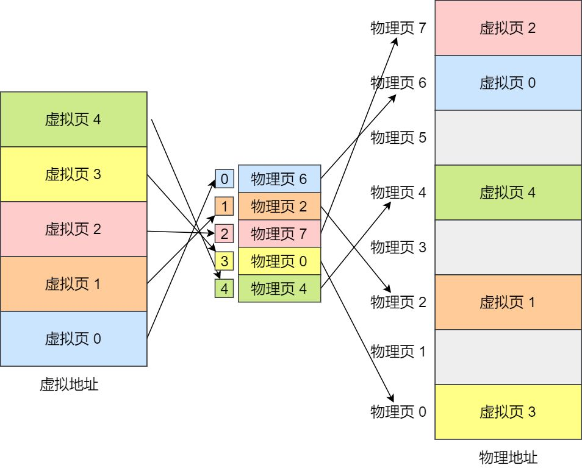

# 进程和线程、协程

根本区别：进程是操作系统资源分配的基本单位，而线程是任务调度和执行的基本单位

在开销方面：每个进程都有独立的代码和数据空间（程序上下文），程序之间的切换会有较大的开销；线程可以看做轻量级的进程，同一类线程共享代码和数据空间，每个线程都有自己独立的运行栈和程序计数器（PC），线程之间切换的开销小。

所处环境：在操作系统中能同时运行多个进程（程序）；而在同一个进程（程序）中有多个线程同时执行（通过CPU调度，在每个时间片中只有一个线程执行）

内存分配方面：系统在运行的时候会为每个进程分配不同的内存空间；而对线程而言，除了CPU外，系统不会为线程分配内存（线程所使用的资源来自其所属进程的资源），线程组之间只能共享资源。

包含关系：没有线程的进程可以看做是单线程的，如果一个进程内有多个线程，则执行过程不是一条线的，而是多条线（线程）共同完成的；线程是进程的一部分，所以线程也被称为轻权进程或者轻量级进程。


Linux中进程和线程的开销基本一样， 两个模型的差异在于， 进程更安全，一个进程完全不会影响另外的进程。所以这也是 unix 哲学里推荐的编程方法；但是进程间通信比线程间通信的性能差很多，尤其是，如果这个是系统的关键部分，而又有大量数据的时候，所有的进程间通信方法都比线程间的通信慢很多。

孤儿进程：一个父进程退出，而它的一个或多个子进程还在运行，那么那些子进程将成为孤儿进程。孤儿进程将被init进程(进程号为1)所收养，并由init进程对它们完成状态收集工作。孤儿进程不会浪费资源。

僵尸进程：一个进程使用fork创建子进程，如果子进程退出，而父进程并没有调用wait或waitpid获取子进程的状态信息，那么子进程的进程描述符仍然保存在系统中。这种进程称之为僵尸进程。僵尸进程浪费系统资源（进程描述符task_struct存在，进程占用的资源被回收，不存在内存泄漏，实际上基本不浪费系统资源）。

操作系统线程，在目前的主流实现中，特别是Linux实现中，具备如下特点：

1) 线程的创建、切换发生在内核态
2) 线程的调度不由应用决定（抢占式调度），而是内核决定

X86 CPU存在特权等级区分，用户态应用运行在Ring3上，而内核则运行在Ring0上。一次线程创建，甚至切换，都需要进入到内核态，切换到内核栈，完成相应的计算和资源分配后，再次回到用户态，切换线程栈，进而切换到新的线程，这一进一出就需要进行两次栈切换；操作系统切换线程，除了替换掉栈帧寄存器，还需要保存其他一系列用于调度和检查的资源，这使得单次进入内核的调用将会产生百ns甚至数us级别的开销；另外，内核并不确切知道当前线程在做什么，正在忙碌中的线程被换出，却切换到某个线程却发现线程还在等待IO这样的情况无法避免，于是多了很多无意义的切换。

协程并非这样, 协程是一种任务调度机制，它可以让你用逻辑流的顺序去写控制流，而且还不会导致操作系统级的线程阻塞。

1) 协程的创建、切换发生在用户态
2) 协程的调度由应用自身决定（协作式调度），协程让出执行机会时才会换出；协程确认已经准备好时才会换入

协程的存在对于操作系统而言是不可知的，所以协程也没必要通知内核，协程的切换无需进入内核态进行调度，也无需保留系统线程必须的其他资源，只需要调整上下文即可，切换几个寄存器和少量状态量的开销仅仅是数ns而已；协程是应用自身实现的，协程换出是程序确认需要换出时才会发生，换入也可以到应用确实结束等待时再换入，可以减少无意义的切换。换而言之，使用协程（或者叫用户态线程）的线程创建、调度的开销会远低于操作系统线程。

从实现上看，与线程相比，这种主动让出型的调度方式更为高效。一方面，它让调用者自己来决定什么时候让出，比操作系统的抢占式调度所需要的时间代价要小很多。后者为了能恢复现场会在切换线程时保存相当多的状态，并且会非常频繁地进行切换。另一方面，协程本身可以做在用户态，每个协程的体积比线程要小得多，因此一个进程可以容纳数量相当可观的逻辑流。

**让原来要使用异步+回调方式写的非人类代码,可以用看似同步的方式写出来...**
[参考](https://www.zhihu.com/question/50185085)
[参考2](https://zhuanlan.zhihu.com/p/172471249)
[参考3](https://www.liaoxuefeng.com/wiki/1016959663602400/1017959540289152)

# linux 虚拟内存

物理内存是有限的（即使支持了热插拔）、非连续的，不同的CPU架构对物理内存的组织都不同。这使得直接使用物理内存非常复杂，为了降低使用内存的复杂度，引入了虚拟内存机制。

虚拟内存是操作系统物理内存和进程之间的中间层，它为进程隐藏了物理内存这一概念，为进程提供了更加简洁和易用的接口以及更加复杂的功能。

操作系统以页为单位管理内存，当进程发现需要访问的数据不在内存时，操作系统可能会将数据以页的方式加载到内存中，这个过程是由上图中的内存管理单元（MMU）完成的。操作系统的虚拟内存作为一个抽象层，起到了以下三个非常关键的作用：

- 虚拟内存可以利用内存起到缓存的作用，提高进程访问磁盘的速度；
- 虚拟内存可以为进程提供独立的内存空间，简化程序的链接、加载过程并通过动态库共享内存；
- 虚拟内存可以控制进程对物理内存的访问，隔离不同进程的访问权限，提高系统的安全性；

虚拟内存空间只是操作系统中的逻辑结构，就像我们上面说的，应用程序最终还是需要访问物理内存或者磁盘上的内容。因为操作系统加了一个虚拟内存的中间层，所以我们也需要为进程实现地址翻译器，实现从虚拟地址到物理地址的转换，页表是虚拟内存系统中的重要数据结构，每一个进程的页表中都存储了从虚拟内存到物理内存页的映射关系，为了存储 64 位操作系统中 128 TiB 虚拟内存的映射数据，Linux 在 2.6.10 中引入了四层的页表辅助虚拟地址的转换，在 4.11 中引入了五层的页表结构8，在未来还可能会引入更多层的页表结构以支持 64 位的虚拟地址。


在如上图所示的四层页表结构中，操作系统会使用最低的 12 位作为页面的偏移量，剩下的 36 位会分四组分别表示当前层级在上一层中的索引，所有的虚拟地址都可以用上述的多层页表查找到对应的物理地址。
## 分页机制下，虚拟地址和物理地址是如何映射的？
在分页机制下，虚拟地址分为两部分，页号和页内偏移。页号作为页表的索引，页表包含物理页每页所在物理内存的基地址，这个基地址与页内偏移的组合就形成了物理内存地址.

对于一个内存地址转换，其实就是这样三个步骤：
- 把虚拟内存地址，切分成页号和偏移量；
- 根据页号，从页表里面，查询对应的物理页号；
- 直接拿物理页号，加上前面的偏移量，就得到了物理内存地址。


## 为什么Linux需要多级页表
页表是一种数据结构，它用于计算机操作系统中的虚拟内存系统，其存储了虚拟地址到物理地址间的映射。

4G/4KB=1M ，所以就会有1M个条目，而每个条目4个字节(32位系统一个指针的大小)，所以这就需要4M个字节存储这个页表。

这意味着什么？ 无论我们进程实际使用多大的虚拟内存，都要有着4M的页表存储在内存中。这是比较浪费的。当系统变成64位的时候，就变得极其恐怖。

最后一级才是指向虚拟内存的地址，前面的全是索引。访问k个PTE,第一眼看上去昂贵而不切实际。然而，这里TLB能够起作用，正是通过将不同层次上页表的PTE缓存起来。实际上，带多级页表的地址翻译并不比单级页表慢很多。但是，多级页表减少了内存的压力。

因为有多层的页表结构可以用来转换虚拟地址，所以多个进程可以通过虚拟内存共享物理内存 Redis 快照使用子进程的写时复制就利用了虚拟内存的这个特性，当我们在 Linux 中调用 fork 创建子进程时，实际上只复制了父进程的页表.

fork()之后，kernel把父进程中所有的内存页的权限都设为read-only，然后子进程的地址空间指向父进程。当父子进程都只读内存时，相安无事。当其中某个进程写内存时，CPU硬件检测到内存页是read-only的，于是触发页异常中断（page-fault），陷入kernel的一个中断例程。中断例程中，kernel就会 把触发的异常的页复制一份，于是父子进程各自持有独立的一份。


在多级页表下，一级页表就可以覆盖整个虚拟空间；如果某个一级页表的页表项没有被用到，也就不需要创建这个页表项对应的二级页表了，即可以在需要时才创建二级页表。

在64位系统下，指针地址为8字节，x 9位页表，正好是4096，一个页的大小

多级页表虽然解决了空间上的问题，但是虚拟地址到物理地址的转换就多了几道转换的工序，这显然就降低了这俩地址转换的速度，也就是带来了时间上的开销。
[参考](https://zhuanlan.zhihu.com/p/152119007)
## 缺页异常
虚拟地址可通过每个进程上页表与物理地址进行映射，获得真正物理地址

如果虚拟地址对应物理地址不在物理内存中，则产生缺页中断，真正分配物理地址，同时更新进程的页表；如果此时物理内存已耗尽，则根据内存替换算法淘汰部分页面至物理磁盘中。

## TLB
多级页表虽然解决了空间上的问题，但是虚拟地址到物理地址的转换就多了几道转换的工序，这显然就降低了这俩地址转换的速度，也就是带来了时间上的开销。

程序是有局部性的，即在一段时间内，整个程序的执行仅限于程序中的某一部分。相应地，执行所访问的存储空间也局限于某个内存区域。

我们就可以利用这一特性，把最常访问的几个页表项存储到访问速度更快的硬件，于是计算机科学家们，就在 CPU 芯片中，加入了一个专门存放程序最常访问的页表项的 Cache，这个 Cache 就是 TLB（Translation Lookaside Buffer） ，通常称为页表缓存、转址旁路缓存、快表等。

# linux 内核空间

对 32 位操作系统而言，它的寻址空间（虚拟地址空间，或叫线性地址空间）为 4G（2的32次方）。也就是说一个进程的最大地址空间为 4G。

操作系统的核心是内核(kernel)，它独立于普通的应用程序，可以访问受保护的内存空间，也有访问底层硬件设备的所有权限。为了保证内核的安全，现在的操作系统一般都强制用户进程不能直接操作内核。

具体的实现方式基本都是由操作系统将虚拟地址空间划分为两部分，一部分为内核空间，另一部分为用户空间。针对 Linux 操作系统而言，最高的 1G 字节(从虚拟地址 0xC0000000 到 0xFFFFFFFF)由内核使用，称为内核空间。而较低的 3G 字节(从虚拟地址 0x00000000 到 0xBFFFFFFF)由各个进程使用，称为用户空间。

## 为什么需要区分内核空间与用户空间
在 CPU 的所有指令中，有些指令是非常危险的，如果错用，将导致系统崩溃，比如清内存、设置时钟等。如果允许所有的程序都可以使用这些指令，那么系统崩溃的概率将大大增加。

**区分内核空间和用户空间本质上是要提高操作系统的稳定性及可用性。**
## 内核态与用户态
「当进程运行在内核空间时就处于内核态，而进程运行在用户空间时则处于用户态。」

在内核态下，进程运行在内核地址空间中，此时 CPU 可以执行任何指令。运行的代码也不受任何的限制，可以自由地访问任何有效地址，也可以直接进行端口的访问。

在用户态下，进程运行在用户地址空间中，被执行的代码要受到 CPU 的诸多检查，它们只能访问映射其地址空间的页表项中规定的在用户态下可访问页面的虚拟地址，且只能对任务状态段(TSS)中 I/O 许可位图(I/O Permission Bitmap)中规定的可访问端口进行直接访问。

其实所有的系统资源管理都是在内核空间中完成的。比如读写磁盘文件，分配回收内存，从网络接口读写数据等等。

我们的应用程序是无法直接进行这样的操作的。但是我们可以通过内核提供的接口来完成这样的任务。

在内核空间中，CPU 可以执行任何的指令，当然也包括从磁盘上读取数据。具体过程是先把数据读取到内核空间中，然后再把数据拷贝到用户空间并从内核态切换到用户态。

进程一共有3种方式可以从用户态进入到内核态：系统调用、软中断和硬件中断。

用户内存空间，每个用户进程都有各自独立的内存空间，保持彼此独立透明，互不干扰。

内核内存空间，内核线程间无需切换页表，**共享内存空间。**

# 同步

- 核心矛盾是“竞态条件”，即多个线程同时读写某个字段。
- 竞态条件下多线程争抢的是“竞态资源”。
- 涉及读写竟态资源的代码片段叫“临界区”。
- 保证竟态资源安全的最朴素的一个思路就是让临界区代码“互斥”，即同一时刻最多只能有一个线程进入临界区。
- 最朴素的互斥手段：在进入临界区之前，用if检查一个bool值，条件不满足就“忙等”。这叫“锁变量”。
- 但锁变量不是线程安全的。因为“检查-占锁”这个动作不具备“原子性”。
- “TSL指令”就是原子性地完成“检查-占锁”的动作。
- 就算不用TSL指令，也可以设计出线程安全的代码，有一种既巧妙又简洁的结构叫“自旋锁”。当然还有其他更复杂的锁比如“Peterson锁”。
- 但自旋锁的缺点是条件不满足时会“忙等待”，需要后台调度器重新分配时间片，效率低。
- 解决忙等待问题的是：“sleep”和“wakeup”两个原语。sleep阻塞当前线程的同时会让出它占用的锁。wakeup可以唤醒在目标锁上睡眠的线程。
- 使用sleep和wakeup原语，保证同一时刻只有一个线程进入临界区代码片段的锁叫“互斥量”。
- 把互斥锁推广到"N"的空间，同时允许有N个线程进入临界区的锁叫“信号量”。
- 互斥量和信号量的实现都依赖TSL指令保证“检查-占锁”动作的原子性。
- 把互斥量交给程序员使用太危险，有些编程语言实现了“管程”的特性，从编译器的层面保证了临界区的互斥，比如Java的synchronized关键字。
- 并没有“同步锁”这个名词，Java的synchronized正确的叫法应该是“互斥锁”，“独占锁”或者“内置锁”。但有的人“顾名思义”叫它同步锁。

## mutex（互斥量）
mutex（mutual exclusive）即互斥量（互斥体）。也便是常说的互斥锁。尽管名称不含lock，但是称之为锁，也是没有太大问题的。mutex无疑是最常见的多线程同步方式。其思想简单粗暴，多线程共享一个互斥量，然后线程之间去竞争。得到锁的线程可以进入临界区执行代码。

```c
// 声明一个互斥量    
pthread_mutex_t mtx;
// 初始化 
pthread_mutex_init(&mtx, NULL);
// 加锁  
pthread_mutex_lock(&mtx);
// 解锁 
pthread_mutex_unlock(&mtx);
// 销毁
pthread_mutex_destroy(&mtx);
```
mutex是睡眠等待（sleep waiting）类型的锁，当线程抢互斥锁失败的时候，线程会陷入休眠。优点就是节省CPU资源，缺点就是休眠唤醒会消耗一点时间。

```c
ret = pthread_mutex_trylock(&mtx);
if (0 == ret) { // 加锁成功
    ... 
    pthread_mutex_unlock(&mtx);
} else if(EBUSY == ret){ // 锁正在被使用;
    ... 
}
```
pthread_mutex_trylock用于以非阻塞的模式来请求互斥量。就好比各种IO函数都有一个noblock的模式一样，对于加锁这件事也有类似的非阻塞模式。

## condition variable（条件变量）

条件变量不是锁，它是一种线程间的通讯机制，并且几乎总是和互斥量一起使用的。所以互斥量和条件变量二者一般是成套出现的。

```c
// 声明一个互斥量     
pthread_mutex_t mtx;
// 声明一个条件变量
pthread_cond_t cond;
...

// 初始化 
pthread_mutex_init(&mtx, NULL);
pthread_cond_init(&cond, NULL);

// 加锁  
pthread_mutex_lock(&mtx);
// 加锁成功，等待条件变量触发
pthread_cond_wait(&cond, &mtx);

...
// 加锁  
pthread_mutex_lock(&mtx);
pthread_cond_signal(&cond);
...

// 解锁 
pthread_mutex_unlock(&mtx);
// 销毁
pthread_mutex_destroy(&mtx);
```
pthread_cond_wait函数会把条件变量和互斥量都传入。并且多线程调用的时候条件变量和互斥量一定要一一对应，不能一个条件变量在不同线程中wait的时候传入不同的互斥量。否则是未定义结果。

另外在使用条件变量的过程中有个稍微违反直觉的写法：那就是使用while而不是if来做判断状态是否满足。这样做的原因有二：
- 避免惊群；
- 避免某些情况下线程被虚假唤醒（即没有pthread_cond_signal就解除了阻塞）。

```c++
while (1) {
    if (pthread_mutex_lock(&mtx) != 0) { // 加锁
        ... // 异常逻辑
    }
    while (!queue.empty()) {
        if (pthread_cond_wait(&cond, &mtx) != 0) {
            ... // 异常逻辑
        }
    }
    auto data = queue.pop();
    if (pthread_mutex_unlock(&mtx) != 0) { // 解锁
        ... // 异常逻辑
    }
    process(data); // 处理流程，业务逻辑
}
```

## read-write lock（读写锁）
顾名思义『读写锁』就是对于临界区区分读和写。在读多写少的场景下，不加区分的使用互斥量显然是有点浪费的。

```c
// 声明一个读写锁
pthread_rwlock_t rwlock;
...
// 在读之前加读锁
pthread_rwlock_rdlock(&rwlock);

... 共享资源的读操作

// 读完释放锁
pthread_rwlock_unlock(&rwlock);

// 在写之前加写锁
pthread_rwlock_wrlock(&rwlock); 

... 共享资源的写操作

// 写完释放锁
pthread_rwlock_unlock(&rwlock);

// 销毁读写锁
pthread_rwlock_destroy(&rwlock);
```
## spinlock（自旋锁）
什么是自旋（spin）呢？更为通俗的一个词是『忙等待』（busy waiting）。最最通俗的一个理解，其实就是死循环.
单看使用方法和使用互斥量的代码是差不多的。只不过自旋锁不会引起线程休眠。当共享资源的状态不满足的时候，自旋锁会不停地循环检测状态。因为不会陷入休眠，而是忙等待的方式也就不需要条件变量。

```c
// 声明一个自旋锁变量
pthread_spinlock_t spinlock;

// 初始化   
pthread_spin_init(&spinlock, 0);

// 加锁  
pthread_spin_lock(&spinlock);

// 解锁 
pthread_spin_unlock(&spinlock);

// 销毁  
pthread_spin_destroy(&spinlock);
```
## 信号量
信号量（英语：Semaphore）又称为信号量、旗语，是一个同步对象，用于保持在0至指定最大值之间的一个计数值。当线程完成一次对该semaphore对象的等待（wait）时，该计数值减一；当线程完成一次对semaphore对象的释放（release）时，计数值加一。当计数值为0，则线程等待该semaphore对象不再能成功直至该semaphore对象变成signaled状态。semaphore对象的计数值大于0，为signaled状态；计数值等于0，为nonsignaled状态.

其中，信号量又存在着两种操作，分别为V操作与P操作，V操作会增加信号量 S的数值，P操作会减少它。

- 初始化，给与它一个非负数的整数值。
- 运行 P（wait()），信号量S的值将被减少。企图进入临界区块的进程，需要先运行 P（wait()）。当信号量S减为负值时，进程会被挡住，不能继续；当信号量S不为负值时，进程可以获准进入临界区块。
- 运行 V（又称signal()），信号量S的值会被增加。结束离开临界区块的进程，将会运行 V（又称signal()）。当信号量S不为负值时，先前被挡住的其他进程，将可获准进入临界区块。

信号量（semaphore[ˈseməfɔ:(r)]）用在多线程多任务同步的，一个线程完成了某一个动作就通过信号量告诉别的线程，别的线程再进行某些动作。而互斥锁（Mutual exclusion，缩写 Mutex）是用在多线程多任务互斥的，一个线程占用了某一个资源，那么别的线程就无法访问，直到这个线程unlock，其他的线程才开始可以利用这个资源。
示例：
>信号量就是在一个叫做互斥区的门口放一个盒子，盒子里面装着固定数量的小球，每个线程过来的时候，都从盒子里面摸走一个小球，然后去互斥区里面浪（？），浪开心了出来的时候，再把小球放回盒子里。如果一个线程走过来一摸盒子，得，一个球都没了，不拿球不让进啊，那就只能站在门口等一个线程出来放回来一个球，再进去。这样由于小球的数量是固定的，那么互斥区里面的最大线程数量就是固定的，不会出现一下进去太多线程把互斥区给挤爆了的情况。这是用信号量做并发量限制。

>另外一些情况下，小球是一次性的，线程拿走一个进了门，就把小球扔掉了，这样用着用着小球就没了，不过有另外一些线程（一般叫做生产者）会时不时过来往盒子里再放几个球，这样就可以有新的线程（一般叫做消费者）进去了，放一个球进一个线程，这是信号量做同步功能。你截图里的例子就是这个情况，主线程是生产者，通过sem_post往盒子里放小球（信号量加一），而其他线程是消费者，通过sem_wait从盒子里拿小球（信号量减一），如果遇到盒子里一个小球都没有（信号量为0），就会开始等待信号量不为0，然后拿走一个小球（信号量减一）再继续。

[参考](https://www.zhihu.com/question/66733477/answer/1267625567)

# mmap
除了传统的read()和write()系统调用，Linux还提供了另一种读写文件数据的方式，那就是mmap()。

mmap是一种内存映射文件的方法，即将一个文件或者其它对象映射到进程的地址空间，实现文件磁盘地址和进程虚拟地址空间中一段虚拟地址的一一对映关系。实现这样的映射关系后，进程就可以采用指针的方式读写操作这一段内存，而系统会自动回写脏页面到对应的文件磁盘上，即完成了对文件的操作而不必再调用read,write等系统调用函数。相反，内核空间对这段区域的修改也直接反映用户空间，从而可以实现不同进程间的文件共享。

mmap()其实只是将一个文件的一部分内容映射到了进程虚拟地址空间中的一个VMA区域，并没有真正分配物理内存，只有等到进程真正访问这个VMA的时候，才会触发page fault，将这部分文件内容从磁盘拷贝到内存中。
