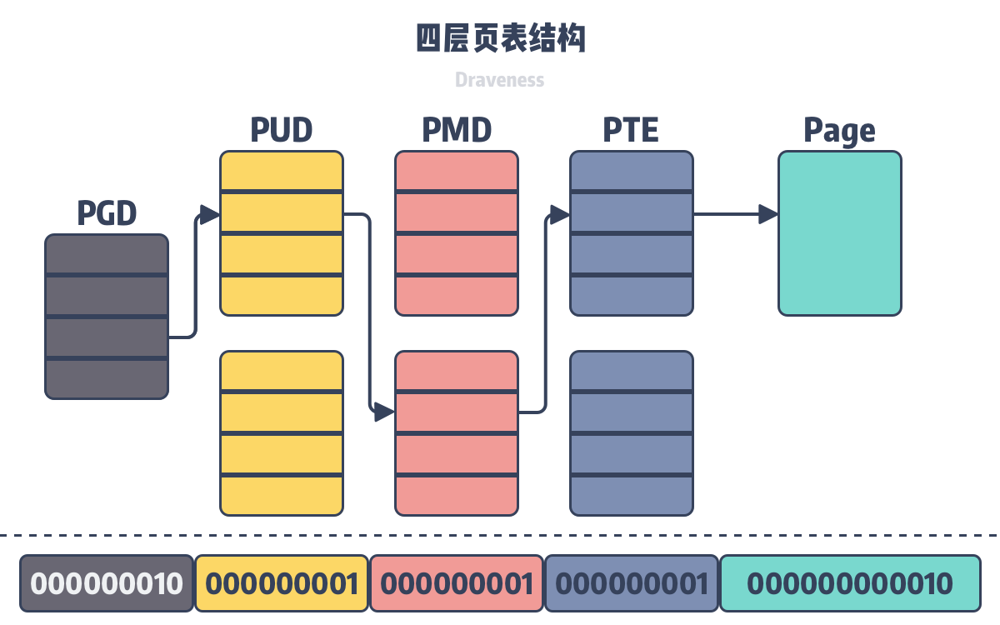

# 进程和线程

根本区别：进程是操作系统资源分配的基本单位，而线程是任务调度和执行的基本单位

在开销方面：每个进程都有独立的代码和数据空间（程序上下文），程序之间的切换会有较大的开销；线程可以看做轻量级的进程，同一类线程共享代码和数据空间，每个线程都有自己独立的运行栈和程序计数器（PC），线程之间切换的开销小。

所处环境：在操作系统中能同时运行多个进程（程序）；而在同一个进程（程序）中有多个线程同时执行（通过CPU调度，在每个时间片中只有一个线程执行）

内存分配方面：系统在运行的时候会为每个进程分配不同的内存空间；而对线程而言，除了CPU外，系统不会为线程分配内存（线程所使用的资源来自其所属进程的资源），线程组之间只能共享资源。

包含关系：没有线程的进程可以看做是单线程的，如果一个进程内有多个线程，则执行过程不是一条线的，而是多条线（线程）共同完成的；线程是进程的一部分，所以线程也被称为轻权进程或者轻量级进程。

Linux中进程和线程的开销基本一样， 两个模型的差异在于， 进程更安全，一个进程完全不会影响另外的进程。所以这也是 unix 哲学里推荐的编程方法；但是进程间通信比线程间通信的性能差很多，尤其是，如果这个是系统的关键部分，而又有大量数据的时候，所有的进程间通信方法都比线程间的通信慢很多。

孤儿进程：一个父进程退出，而它的一个或多个子进程还在运行，那么那些子进程将成为孤儿进程。孤儿进程将被init进程(进程号为1)所收养，并由init进程对它们完成状态收集工作。孤儿进程不会浪费资源。

僵尸进程：一个进程使用fork创建子进程，如果子进程退出，而父进程并没有调用wait或waitpid获取子进程的状态信息，那么子进程的进程描述符仍然保存在系统中。这种进程称之为僵尸进程。僵尸进程浪费系统资源（进程描述符task_struct存在，进程占用的资源被回收，不存在内存泄漏，实际上基本不浪费系统资源）。

# linux 虚拟内存
虚拟内存是操作系统物理内存和进程之间的中间层，它为进程隐藏了物理内存这一概念，为进程提供了更加简洁和易用的接口以及更加复杂的功能。

操作系统以页为单位管理内存，当进程发现需要访问的数据不在内存时，操作系统可能会将数据以页的方式加载到内存中，这个过程是由上图中的内存管理单元（MMU）完成的。操作系统的虚拟内存作为一个抽象层，起到了以下三个非常关键的作用：

- 虚拟内存可以利用内存起到缓存的作用，提高进程访问磁盘的速度；
- 虚拟内存可以为进程提供独立的内存空间，简化程序的链接、加载过程并通过动态库共享内存；
- 虚拟内存可以控制进程对物理内存的访问，隔离不同进程的访问权限，提高系统的安全性；

虚拟内存空间只是操作系统中的逻辑结构，就像我们上面说的，应用程序最终还是需要访问物理内存或者磁盘上的内容。因为操作系统加了一个虚拟内存的中间层，所以我们也需要为进程实现地址翻译器，实现从虚拟地址到物理地址的转换，页表是虚拟内存系统中的重要数据结构，每一个进程的页表中都存储了从虚拟内存到物理内存页的映射关系，为了存储 64 位操作系统中 128 TiB 虚拟内存的映射数据，Linux 在 2.6.10 中引入了四层的页表辅助虚拟地址的转换7，在 4.11 中引入了五层的页表结构8，在未来还可能会引入更多层的页表结构以支持 64 位的虚拟地址。

在如上图所示的四层页表结构中，操作系统会使用最低的 12 位作为页面的偏移量，剩下的 36 位会分四组分别表示当前层级在上一层中的索引，所有的虚拟地址都可以用上述的多层页表查找到对应的物理地址。

## 为什么Linux需要多级页表
4G/4KB=1M ，所以就会有1M个条目，而每个条目4个字节，所以这就需要4M个字节存储这个页表。

这意味着什么？ 无论我们进程实际使用多大的虚拟内存，都要有着4M的页表存储在内存中。这是比较浪费的。当系统变成64位的时候，就变得极其恐怖。

最后一级才是指向虚拟内存的地址，前面的全是索引。访问k个PTE,第一眼看上去昂贵而不切实际。然而，这里TLB能够起作用，正是通过将不同层次上页表的PTE缓存起来。实际上，带多级页表的地址翻译并不比单级页表慢很多。但是，多级页表减少了内存的压力。

因为有多层的页表结构可以用来转换虚拟地址，所以多个进程可以通过虚拟内存共享物理内存 Redis 快照使用子进程的写时复制就利用了虚拟内存的这个特性，当我们在 Linux 中调用 fork 创建子进程时，实际上只复制了父进程的页表.

