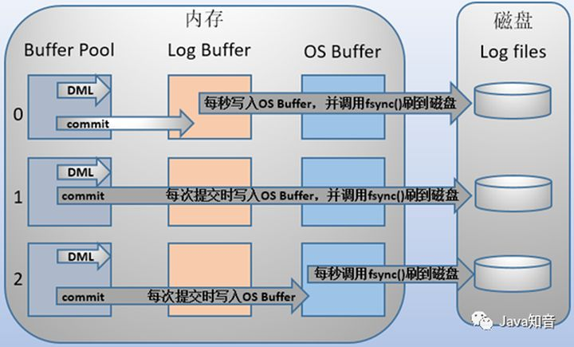

# 主从复制

MySQL 主从复制是指数据可以从一个MySQL数据库服务器主节点复制到一个或多个从节点。MySQL 默认采用异步复制方式，这样从节点不用一直访问主服务器来更新自己的数据，数据的更新可以在远程连接上进行，从节点可以复制主数据库中的所有数据库或者特定的数据库，或者特定的表。

## 作用：

- 读写分离；
- 数据实时备份，当系统中某个节点发生故障时，可以方便的故障切换
- 高可用HA
- 架构扩展

## 原理

MySQL主从复制涉及到三个线程，一个运行在主节点（log dump thread），其余两个(I/O thread, SQL thread)运行在从节点，如下图所示:

- mysql 按事务提交的顺序而非sql执行顺序来记录binlog，记录binlog后，主库会告诉存储引擎提交事务。
- 主节点 binary log dump 线程当从节点连接主节点时，主节点会创建一个log dump 线程，用于发送bin-log的内容。在读取bin-log中的操作时，此线程会对主节点上的bin-log加锁，当读取完成，甚至在发动给从节点之前，锁会被释放。
- 从节点I/O线程当从节点上执行`start slave`命令之后，从节点会创建一个I/O线程用来连接主节点，请求主库中更新的bin-log。I/O线程接收到主节点binlog dump 进程发来的更新之后，保存在本地relay-log中。
- 从节点SQL线程SQL线程负责读取relay log中的内容，解析成具体的操作并执行，最终保证主从数据的一致性。

MySQL 主从复制默认是异步的模式。

异步复制（Asynchronous replication）

MySQL默认的复制即是异步的，主库在执行完客户端提交的事务后会立即将结果返给给客户端，并不关心从库是否已经接收并处理，这样就会有一个问题，主如果crash掉了，此时主上已经提交的事务可能并没有传到从上，如果此时，强行将从提升为主，可能导致新主上的数据不完整。

全同步复制（Fully synchronous replication）

指当主库执行完一个事务，所有的从库都执行了该事务才返回给客户端。因为需要等待所有从库执行完该事务才能返回，所以全同步复制的性能必然会收到严重的影响。

半同步复制（Semisynchronous replication）

介于异步复制和全同步复制之间，主库在执行完客户端提交的事务后不是立刻返回给客户端，而是等待至少一个从库接收到并写到relay log中才返回给客户端。相对于异步复制，半同步复制提高了数据的安全性，同时它也造成了一定程度的延迟，这个延迟最少是一个TCP/IP往返的时间。所以，半同步复制最好在低延时的网络中使用。

## mysql 主从同步延时问题

- 分库，将一个主库拆分为多个主库，每个主库的写并发就减少了几倍，此时主从延迟可以忽略不计。
- 打开 MySQL 支持的并行复制，多个库并行复制。如果说某个库的写入并发就是特别高，单库写并发达到了 2000/s，并行复制还是没意义。
- 重写代码，写代码的同学，要慎重，插入数据时立马查询可能查不到。
- 如果确实是存在必须先插入，立马要求就查询到，然后立马就要反过来执行一些操作，对这个查询设置直连主库。不推荐这种方法，你这么搞导致读写分离的意义就丧失了。

## Insert On duplicate key update

```sql
INSERT INTO `campaign_infos_copy2` (`created_at`,`updated_at`,`deleted_at`,`create_by`,`update_by`,`campaign_id`,`campaign_name`,`daily_cap`,`target_type`,`promotion_brand`,`geo`,`stdt`,`eddt`,`campaign_status`,`gp_link`,`price_data`,`responsible_am`,`responsible_sales`,`status`) VALUES ("2021-03-05 00:15:00.184","2021-03-05 00:15:00.184",NULL,0,0,"CA00000002184","FarmHeroesSaga_Global_CPI_20210302","59","Purchase","com.king.farmheroessaga","Global","2021-03-02","2025-03-31","Closed","https://play.google.com/store/apps/details?id=com.king.farmheroessaga","https://www.baidu.com","Sean Meng","John Pryor",1),

("2021-03-05 00:15:00.184","2021-03-05 00:15:00.184",NULL,0,0,"CA00000002173","EASYJOY-InstaMoney_IN_CPA_20210126","50","Install_Gaid","com.innofinsolutions.instamoney","IN","2021-01-27","2022-01-27","Launch","https://play.google.com/store/apps/details?id=com.innofinsolutions.instamoney","https://www.baidu.com","Matt Ma","Cynthia Chen",1)

ON DUPLICATE KEY UPDATE 

`updated_at`=VALUES(`updated_at`),

`deleted_at`=VALUES(`deleted_at`),

`create_by`=VALUES(`create_by`),

`update_by`=VALUES(`update_by`),

`campaign_id`=VALUES(`campaign_id`),

`campaign_name`=VALUES(`campaign_name`),

`daily_cap`=VALUES(`daily_cap`),

`target_type`=VALUES(`target_type`),

`promotion_brand`=VALUES(`promotion_brand`),

`geo`=VALUES(`geo`),

`stdt`=VALUES(`stdt`),

`eddt`=VALUES(`eddt`),

`campaign_status`=VALUES(`campaign_status`),

`gp_link`=VALUES(`gp_link`),

`price_data`=VALUES(`price_data`),

`responsible_am`=VALUES(`responsible_am`),

`responsible_sales`=VALUES(`responsible_sales`),

`status`=VALUES(`status`)  
```

- 更新的内容中unique key或者primary key最好保证一个，不然不能保证语句执行正确(有任意一个unique key重复就会走更新,当然如果更新的语句中在表中也有重复校验的字段，那么也不会更新成功而导致报错,只有当该条语句没有任何一个unique key重复才会插入新记录)；尽量不对存在多个唯一键的table使用该语句，避免可能导致数据错乱。
- 在有可能有并发事务执行的insert 语句情况下不使用该语句，可能导致产生death lock。

  insert ... on duplicate key 在执行时，innodb引擎会先判断插入的行是否产生重复key错误，如果存在，在对该现有的行加上S（共享锁）锁，如果返回该行数据给mysql,然后mysql执行完duplicate后的update操作，然后对该记录加上X（排他锁），最后进行update写入。

  如果有两个事务并发的执行同样的语句，那么就会产生death lock，如：
  
- 如果数据表id是自动递增的不建议使用该语句；id不连续，如果前面更新的比较多，新增的下一条会相应跳跃的更大。
  [解决办法](https://blog.csdn.net/eleanoryss/article/details/82997899)
- 该语句是mysql独有的语法，如果可能会设计到其他数据库语言跨库要谨慎使用。

# myISAM 和innodb的区别

- 1. InnoDB 支持事务，MyISAM 不支持事务。这是 MySQL 将默认存储引擎从 MyISAM 变成 InnoDB 的重要原因之一；
- 2. InnoDB 支持外键，而 MyISAM 不支持。对一个包含外键的 InnoDB 表转为 MYISAM 会失败；
- 3. InnoDB 是聚集索引，MyISAM 是非聚集索引。聚簇索引的文件存放在主键索引的叶子节点上，因此 InnoDB 必须要有主键，通过主键索引效率很高。但是辅助索引需要两次查询，先查询到主键，然后再通过主键查询到数据。因此，主键不应该过大，因为主键太大，其他索引也都会很大。而 MyISAM 是非聚集索引，数据文件是分离的，索引保存的是数据文件的指针。主键索引和辅助索引是独立的。
- 4. InnoDB 不保存表的具体行数，执行 select count(*) from table 时需要全表扫描。而MyISAM 用一个变量保存了整个表的行数，执行上述语句时只需要读出该变量即可，速度很快；
- 5. InnoDB 最小的锁粒度是行锁，MyISAM 最小的锁粒度是表锁。一个更新语句会锁住整张表，导致其他查询和更新都会被阻塞，因此并发访问受限。这也是 MySQL 将默认存储引擎从 MyISAM 变成 InnoDB 的重要原因之一；

# mysql事务

在Mysql中事务的四大特性主要包含：原子性（Atomicity）、一致性（Consistent）、隔离性（Isalotion）、持久性(Durable)，简称为ACID。

1. 原子性（aimicity）
   一个事务必须被视为一个不可分割的最小单元，不可能只执行其中的一部分操作。实现事务的原子性，是基于日志的Redo/Undo机制。
2. 一致性（consistency）
   一致性是指执行事务前后的状态要一致，可以理解为数据一致性。数据库总是从一个一致性的状态转换到另一个一致性的状态。
3. 隔离性（isolation）
   一个事务所做的修改在最终提交以前，对其他事务时不可见的。
4. 持久性（durability）
   一旦事务提交，则其所做的修改就会永久保存到数据库中，即使系统现在崩溃。

事务的隔离性由锁机制实现，原子性、一致性和持久性由事务的redo 日志和undo 日志来保证。

Redo log用来记录某数据块被修改后的值，可以用来恢复未写入 data file 的已成功事务更新的数据；
redo log记录了数据操作在物理层面的修改，mysql中使用了大量缓存，缓存存在于内存中，修改操作时会直接修改内存，而不是立刻修改磁盘，当内存和磁盘的数据不一致时，称内存中的数据为脏页(dirty page)。为了保证数据的安全性，事务进行中时会不断的产生redo log，在事务提交时进行一次flush操作，保存到磁盘中, redo log是按照顺序写入的，磁盘的顺序读写的速度远大于随机读写。当数据库或主机失效重启时，会根据redo log进行数据的恢复，如果redo log中有事务提交，则进行事务提交修改数据。这样实现了事务的原子性、一致性和持久性。

Undo log是用来记录数据更新前的值，保证数据更新失败能够回滚。
undo log用于数据的撤回操作，它记录了修改的反向操作，比如，插入对应删除，修改对应修改为原来的数据，通过undo log可以实现事务回滚，并且可以根据undo log回溯到某个特定的版本的数据，实现MVCC。

binlog是mysql服务层产生的日志，常用来进行数据恢复、数据库复制，常见的mysql主从架构，就是采用slave同步master的binlog实现的, 另外通过解析binlog能够实现mysql到其他数据源（如ElasticSearch)的数据复制。

## 事务隔离级别

* read uncommitted（未提交读）
  称为脏读。事务的修改即使没有提交，对其他事务也是可见的。（很少使用）
* read committed（提交读）
  大多数数据库默认的隔离级别（mysql除外）。一个事务开始时，只能看见已经提交的事务所作的修改。称为不可重复读。读提交则解决了脏读的，出现了不可重复读，即在一个事务任意时刻读到的数据可能不一样，（一般指更新，两次读取的数不一样）
* repeatable read（可重复读）
  解决了脏读的问题。保证了在同一个事务中多次读取同样的结果是一致的。无法解决幻读的问题。（MySQL默认）。（一般是指插入，第一次读没有，第二次读就有）
* serializable （可串行化）
  最高的隔离级别。强制事务串行处理，避免了幻读。在读取的每一行数据上都加锁。（很少用）

幻读指的是在一个事务内，同一SELECT语句在不同时间执行，得到不同的结果集时，就会发生所谓的幻读问题。


mysql查看当前事务隔离级别：`SELECT @@tx_isolation;`

更改隔离级别：`set session transaction isolation level read uncommitted;`

mysql 默认采用了自动提交模式（autocommit），如果不显示的开始一个事务，则每个查询都会当成一个事务执行提交操作。

有一些命令在执行前，会强制执行commit，提交当前的活动事务。比如alter table。
## 锁
Mysql中的锁可以分为分享锁/读锁（Shared Locks）、排他锁/写锁（Exclusive Locks） 、间隙锁、行锁（Record Locks）、表锁。

共享锁是针对同一份数据，多个读操作可以同时进行，简单来说即读加锁，不能写并且可并行读；排他锁针对写操作，假如当前写操作没有完成，那么它会阻断其它的写锁和读锁，即写加锁，其它读写都阻塞。

行锁和表锁，是从锁的粒度上进行划分的，行锁锁定当前数据行，锁的粒度小，加锁慢，发生锁冲突的概率小，并发度高，行锁也是MyISAM和InnoDB的区别之一，InnoDB支持行锁并且支持事务 。

表锁则锁的粒度大，加锁快，开销小，但是锁冲突的概率大，并发度低。

在数据库的增、删、改、查中，只有增、删、改才会加上排它锁，而只是查询并不会加锁，只能通过在select语句后显式加lock in share mode或者for update来加共享锁或者排它锁。

**在RR的隔离级别下，Innodb使用MVCC和next-key locks解决幻读，MVCC解决的是普通读（快照读）的幻读，next-key locks解决的是当前读情况下的幻读。**

### 行锁（Record Locks）
```sql
-- id 列为主键列或唯一索引列
SELECT * FROM table WHERE id = 1 FOR UPDATE;　
```
id 为 1 的记录行会被锁住。
需要注意的是：id 列必须为唯一索引列或主键列，否则上述语句加的锁就会变成临键锁。
同时查询语句必须为精准匹配（=），不能为 >、<、like等，否则也会退化成临键锁。

### 间隙锁（Gap Locks）
间隙锁基于非唯一索引，它锁定一段范围内的索引记录。间隙锁基于下面将会提到的Next-Key Locking 算法，请务必牢记：使用间隙锁锁住的是一个区间，而不仅仅是这个区间中的每一条数据。
```sql
SELECT * FROM table WHERE id BETWEN 1 AND 10 FOR UPDATE;
```
如果 id = 49 这条记录不存在，还会加锁吗？答案是可能有，这取决于数据库的隔离级别。这种情况下，在 RC 隔离级别不会加任何锁，在 RR 隔离级别会在 id = 49 前后两个索引之间加上间隙锁。
### 临键锁（Next-Key Locks）
Next-Key 可以理解为一种特殊的间隙锁，也可以理解为一种特殊的算法。通过临建锁可以解决幻读的问题。 每个数据行上的非唯一索引列上都会存在一把临键锁，当某个事务持有该数据行的临键锁时，会锁住一段左开右闭区间的数据。需要强调的一点是，InnoDB 中行级锁是基于索引实现的，临键锁只与非唯一索引列有关，在唯一索引列（包括主键列）上不存在临键锁。

Next-key锁是记录锁和间隙锁的组合，它指的是加在某条记录以及这条记录前面间隙上的锁。假设一个索引包含 15、18、20 ，30，49，50 这几个值，可能的 Next-key 锁如下：
```
(-∞, 15]，(15, 18]，(18, 20]，(20, 30]，(30, 49]，(49, 50]，(50, +∞)
```
通常我们都用这种左开右闭区间来表示 Next-key 锁，其中，圆括号表示不包含该记录，方括号表示包含该记录。前面四个都是 Next-key 锁，最后一个为间隙锁。


[参考](https://www.toutiao.com/i6838563153626792451/)
## mvcc

多版本并发控制。MVCC 是一种并发控制的方法，一般在数据库管理系统中，实现对数据库的并发访问。

**为什么需要MVCC呢？**

数据库通常使用锁来实现隔离性。最原生的锁，锁住一个资源后会禁止其他任何线程访问同一个资源。但是很多应用的一个特点都是读多写少的场景，很多数据的读取次数远大于修改的次数，而读取数据间互相排斥显得不是很必要。所以就使用了一种读写锁的方法，读锁和读锁之间不互斥，而写锁和写锁、读锁都互斥。这样就很大提升了系统的并发能力。之后人们发现并发读还是不够，又提出了能不能让读写之间也不冲突的方法，就是读取数据时通过一种类似快照的方式将数据保存下来，这样读锁就和写锁不冲突了，不同的事务session会看到自己特定版本的数据。当然快照是一种概念模型，不同的数据库可能用不同的方式来实现这种功能。

InnoDB中通过undo log实现了数据的多版本，而并发控制通过锁来实现。

在InnoDB中MVCC的实现通过两个重要的字段进行连接：DB_TRX_ID和DB_ROLL_PT，在多个事务并行操作某行数据的情况下，不同事务对该行数据的UPDATE会产生多个版本，数据库通过DB_TRX_ID来标记版本，然后用DB_ROLL_PT回滚指针将这些版本以先后顺序连接成一条 Undo Log 链。

事务开始之前，会记录当前 active 的所有事务 id => ids(一致性视图），读取数据的时候从版本链中选择比 min(ids) 小的版本号；由于版本号递增，也就是当前正在执行的事务产生的修改对其它事务是不可见的。

ReadView中主要包含4个比较重要的内容：

m_ids：表示在生成ReadView时当前系统中活跃的读写事务的事务id列表。

min_trx_id：表示在生成ReadView时当前系统中活跃的读写事务中最小的事务id，也就是m_ids中的最小值。

max_trx_id：表示生成ReadView时系统中应该分配给下一个事务的id值。

creator_trx_id：表示生成该ReadView的事务的事务id。


**innodb自动使用间隙锁的条件：**
（1）必须在RR级别下
（2）检索条件必须有索引（没有索引的话，mysql会全表扫描，那样会锁定整张表所有的记录，包括不存在的记录，此时其他事务不能修改不能删除不能添加）

next-key锁其实包含了记录锁和间隙锁，即锁定一个范围，并且锁定记录本身，InnoDB默认加锁方式是next-key 锁。

# 日志

MySQL数据库可以实现主从复制，实现持久化，实现回滚，其实关键在于MySQL里的三种`log`，分别是：

* binlog
* redo log
* undo log

## binlog

binlog是用于**记录数据库表结构和表数据变更的二进制日志**，比如insert、update、delete、create、truncate等等操作，不会记录select、show操作，因为没有对数据本身发生变更。

binlog是mysql的逻辑日志，并且由Server层进行记录，使用任何存储引擎的mysql数据库都会记录binlog日志。

* 逻辑日志：可以简单理解为记录的就是sql语句。
* 物理日志：因为mysql数据最终是保存在数据页中的，物理日志记录的就是数据页变更。

使用`mysqlbinlog`命令可以查看。

### binlog作用：

- 用于主从复制。一般在公司中做一主二从的结构时，就需要master节点打开binlog日志，从机订阅binlog日志的信息，因为binlog日志记录了数据库数据的变更，所以当master发生数据变更时，从机也能随着master节点的数据变更而变更，做到主从复制的效果。
- 用于数据恢复。因为binlog记录了数据库的变更，所以可以用于数据恢复。当我们需要恢复数据时，只要指定--start-position和--stop-position，或者指定--start-datetime和--stop-datetime，那么就可以恢复指定区间的数据。

### binlog刷盘时机

对于InnoDB存储引擎而言，只有在事务提交时才会记录biglog，此时记录还在内存中，那么biglog是什么时候刷到磁盘中的呢？mysql通过sync_binlog参数控制biglog的刷盘时机，取值范围是0-N：

* 0：不去强制要求，由系统自行判断何时写入磁盘；
* 1：每次commit的时候都要将binlog写入磁盘；
* N：每N个事务，才会将binlog写入磁盘。

binlog日志有三种格式，分别为STATMENT、ROW和MIXED。

**STATMENT**

基于SQL语句的复制(statement-based replication, SBR)，每一条会修改数据的sql语句会记录到binlog中。

* 优点：不需要记录每一行的变化，减少了binlog日志量，节约了IO, 从而提高了性能；
* 缺点：在某些情况下会导致主从数据不一致，比如执行sysdate()、slepp()等。

**ROW**

基于行的复制(row-based replication, RBR)，不记录每条sql语句的上下文信息，仅需记录哪条数据被修改了。

* 优点：不会出现某些特定情况下的存储过程、或function、或trigger的调用和触发无法被正确复制的问题；
* 缺点：会产生大量的日志，尤其是alter table的时候会让日志暴涨

**MIXED**

基于STATMENT和ROW两种模式的混合复制(mixed-based replication, MBR)，一般的复制使用STATEMENT模式保存binlog，对于STATEMENT模式无法复制的操作使用ROW模式保存binlog

## redolog
### 为什么需要redo log

我们都知道，事务的四大特性里面有一个是持久性，具体来说就是只要事务提交成功，那么对数据库做的修改就被永久保存下来了。那么mysql是如何保证一致性的呢？最简单的做法是在每次事务提交的时候，将该事务涉及修改的数据页全部刷新到磁盘中。但是这么做会有严重的性能问题，主要体现在两个方面：

* 因为Innodb是以页为单位进行磁盘交互的，而一个事务很可能只修改一个数据页里面的几个字节，这个时候将完整的数据页刷到磁盘的话，太浪费资源了！
* 一个事务可能涉及修改多个数据页，并且这些数据页在物理上并不连续，使用随机IO写入性能太差！

因此mysql设计了redo log，具体来说就是只记录事务对数据页做了哪些修改，这样就能完美地解决性能问题了(相对而言文件更小并且是顺序IO)

redo log包括两部分：一个是内存中的日志缓冲(redo log buffer)，另一个是磁盘上的日志文件(redo log file)。mysql每执行一条DML（Data Manipulation Language）语句，先将记录写入redo log buffer，后续某个时间点再一次性将多个操作记录写到redo log file。这种先写日志，再写磁盘的技术就是MySQL里经常说到的WAL(Write-Ahead Logging) 技术。

mysql支持三种将redo log buffer写入redo log file的时机，可以通过innodb_flush_log_at_trx_commit参数配置：



在innodb中，既有redo log需要刷盘，还有数据页也需要刷盘，redo log存在的意义主要就是降低对数据页刷盘的要求。


## **undo log**

数据库事务四大特性中有一个是原子性，具体来说就是 原子性是指对数据库的一系列操作，要么全部成功，要么全部失败，不可能出现部分成功的情况。

原子性底层就是通过undo log实现的。undo log主要记录了数据的逻辑变化，比如一条INSERT语句，对应一条DELETE的undo log，对于每个UPDATE语句，对应一条相反的UPDATE的undo log，这样在发生错误时，就能回滚到事务之前的数据状态。具体见mvcc。

另外，**undo log****也会产生redo log****，因为undo log****也要实现持久性保护。**

[ref](https://zhuanlan.zhihu.com/p/190886874)

[详细分析MySQL事务日志(redo log和undo log)](https://www.cnblogs.com/f-ck-need-u/archive/2018/05/08/9010872.html)

# mysql 为什么使用B+树

无论是表中的数据（主键索引）还是辅助索引最终都会使用 B+ 树来存储数据，其中前者在表中会以 <id, row> 的方式存储，而后者会以 <index, id> 的方式进行存储

- 在主键索引中，id 是主键，我们能够通过 id 找到该行的全部列；
- 在辅助索引中，索引中的几个列构成了键，我们能够通过索引中的列找到 id，如果有需要的话，可以再通过 id 找到当前数据行的全部内容；

为什么 MySQL 的 InnoDB 存储引擎会选择 B+ 树作为底层的数据结构，而不选择 B 树或者哈希？

- InnoDB 需要支持的场景和功能需要在特定查询上拥有较强的性能；
- CPU 将磁盘上的数据加载到内存中需要花费大量的时间，这使得 B+ 树成为了非常好的选择；

B 树和 B+ 树在数据结构上其实有一些类似，它们都可以按照某些顺序对索引中的内容进行遍历，对于排序和范围查询等操作，B 树和 B+ 树相比于哈希会带来更好的性能，当然如果索引建立不够好或者 SQL 查询非常复杂，依然会导致全表扫描。

与 B 树和 B+ 树相比，哈希作为底层的数据结构的表能够以 O(1) 的速度处理单个数据行的增删改查，但是面对范围查询或者排序时就会导致全表扫描的结果，而 B 树和 B+ 树虽然在单数据行的增删查改上需要 O(log n) 的时间，但是它会将索引列相近的数据按顺序存储，所以能够避免全表扫描。

而 B 树和 B+ 树都可以相对高效地执行这些查询，那么为什么我们不选择 B 树呢？这个原因其实非常简单 —— 计算机在读写文件时会以页为单位将数据加载到内存中。页的大小可能会根据操作系统的不同而发生变化，不过在大多数的操作系统中，页的大小都是 4KB，你可以通过如下的命令获取操作系统上的页大小:`getconf PAGE_SIZE`

B 树与 B+ 树的最大区别就是，B 树可以在非叶结点中存储数据，但是 B+ 树的所有数据其实都存储在叶子节点中

由于所有的节点都可能包含目标数据，我们总是要从根节点向下遍历子树查找满足条件的数据行，这个特点带来了大量的随机 I/O，也是 B 树最大的性能问题。

B+ 树中就不存在这个问题了，因为所有的数据行都存储在叶节点中，而这些叶节点可以通过『指针』依次按顺序连接，当我们在B+ 树遍历数据时可以直接在多个子节点之间进行跳转，这样能够节省大量的磁盘 I/O 时间，也不需要在不同层级的节点之间对数据进行拼接和排序；通过一个 B+ 树最左侧的叶子节点，我们可以像链表一样遍历整个树中的全部数据，我们也可以引入双向链表保证倒序遍历时的性能。

1. B+树的层级更少：相较于B树B+每个非叶子节点存储的关键字数更多，树的层级更少所以查询数据更快；
2. B+树查询速度更稳定：B+所有关键字数据地址都存在叶子节点上，所以每次查找的次数都相同所以查询速度要比B树更稳定;
3. B+树天然具备排序功能：B+树所有的叶子节点数据构成了一个有序链表，在查询大小区间的数据时候更方便，数据紧密性很高，缓存的命中率也会比B树高。
4. B+树全节点遍历更快：B+树遍历整棵树只需要遍历所有的叶子节点即可，，而不需要像B树一样需要对每一层进行遍历，这有利于数据库做全表扫描。

B树相对于B+树的优点是，如果经常访问的数据离根节点很近，而B树的非叶子节点本身存有关键字其数据的地址，所以这种数据检索的时候会要比B+树快。

[参考](https://draveness.me/whys-the-design-mysql-b-plus-tree/)
[参考](https://www.jianshu.com/p/9bd572b0a0d4)

# mysql 主键和索引的区别

主键是为了标识数据库记录唯一性，不允许记录重复，且键值不能为空，主键也是一个特殊索引。

数据表中只允许有一个主键，但是可以有多个索引。

使用主键会数据库会自动创建主索引，也可以在非主键上创建索引，方便查询效率。

索引可以提高查询速度，它就相当于字典的目录，可以通过它很快查询到想要的结果，而不需要进行全表扫描。

主键也可以由多个字段组成，组成复合主键，同时主键肯定也是唯一索引。

唯一索引则表示该索引值唯一，可以由一个或几个字段组成，一个表可以有多个唯一索引。

# innodb
在 InnoDB 存储引擎中，所有的数据都被逻辑地存放在表空间中，表空间（tablespace）是存储引擎中最高的存储逻辑单位，在表空间的下面又包括段（segment）、区（extent）、页（page）：


同一个数据库实例的所有表空间都有相同的页大小；默认情况下，表空间中的页大小都为 16KB

MySQL 使用 InnoDB 存储表时，会将**表的定义**和**数据索引**等信息分开存储，其中前者存储在 .frm 文件中，后者存储在 .ibd 文件中.

无论在 MySQL 中选择了哪个存储引擎，所有的 MySQL 表都会在硬盘上创建一个 .frm 文件用来描述表的格式或者说定义；

页是 InnoDB 存储引擎管理数据的最小磁盘单位，而 B-Tree 节点就是实际存放表中数据的页面,每一个页中包含了两对 header/trailer：内部的 Page Header/Page Directory 关心的是页的状态信息，而 Fil Header/Fil Trailer 关心的是记录页的头信息。

User Records 就是整个页面中真正用于存放行记录的部分，而 Free Space 就是空余空间了，它是一个链表的数据结构，为了保证插入和删除的效率，整个页面并不会按照主键顺序对所有记录进行排序，它会自动从左侧向右寻找空白节点进行插入，行记录在物理存储上并不是按照顺序的，它们之间的顺序是由 next_record 这一指针控制的。
## 索引
B+ 树在查找对应的记录时，并不会直接从树中找出对应的行记录，它只能获取记录所在的页，将整个页加载到内存中，再通过 Page Directory 中存储的稀疏索引和 n_owned、next_record 属性取出对应的记录，不过因为这一操作是在内存中进行的，所以通常会忽略这部分查找的耗时。


B+ 树是平衡树，它查找任意节点所耗费的时间都是完全相同的，比较的次数就是 B+ 树的高度；

数据库中的 B+ 树索引可以分为聚集索引（clustered index）和辅助索引（secondary index），它们之间的最大区别就是，聚集索引中存放着一条行记录的全部信息，而辅助索引中只包含索引列和一个用于查找对应行记录的『书签』。

### 聚簇索引

聚集索引与表的物理存储方式有着非常密切的关系，所有正常的表应该有且仅有一个聚集索引（绝大多数情况下都是主键），表中的所有行记录数据都是按照聚集索引的顺序存放的。

当我们使用聚集索引对表中的数据进行检索时，可以直接获得聚集索引所对应的整条行记录数据所在的页，不需要进行第二次操作。
### 辅助索引
辅助索引也是通过 B+ 树实现的，但是它的叶节点并不包含行记录的全部数据，仅包含索引中的所有键和一个用于查找对应行记录的『书签』，在 InnoDB 中这个书签就是当前记录的主键。

# explain 

**select_type**
表示select查询的类型
- SIMPLLE：简单查询，该查询不包含 UNION 或子查询
- PRIMARY：如果查询包含UNION 或子查询，则最外层的查询被标识为PRIMARY
- SUBQUERY：子查询中的第一个select语句(该子查询不在from子句中)
- DERIVED：包含在from子句中子查询(也称为派生表)

**type**
该列称为关联类型或者访问类型，它指明了MySQL决定如何查找表中符合条件的行，同时是我们判断查询是否高效的重要依据。

- ALL：全表扫描，这个类型是性能最差的查询之一。通常来说，我们的查询不应该出现 ALL 类型，因为这样的查询，在数据量最大的情况下，对数据库的性能是巨大的灾难。
- index：全索引扫描，和 ALL 类型类似，只不过 ALL 类型是全表扫描，而 index 类型是扫描全部的索引，主要优点是避免了排序，但是开销仍然非常大。如果在 Extra 列看到 Using index，说明正在使用覆盖索引，只扫描索引的数据，它比按索引次序全表扫描的开销要少很多。
- range：范围扫描，就是一个有限制的索引扫描，它开始于索引里的某一点，返回匹配这个值域的行。这个类型通常出现在 =、<>、>、>=、<、<=、IS NULL、<=>、BETWEEN、IN() 的操作中，key 列显示使用了哪个索引，当 type 为该值时，则输出的 ref 列为 NULL，并且 key_len 列是此次查询中使用到的索引最长的那个。
- ref：一种索引访问，也称索引查找，它返回所有匹配某个单个值的行。此类型通常出现在多表的 join 查询, 针对于非唯一或非主键索引, 或者是使用了最左前缀规则索引的查询。
- eq_ref：使用这种索引查找，最多只返回一条符合条件的记录。在使用唯一性索引或主键查找时会出现该值，非常高效。
- const、system：该表至多有一个匹配行，在查询开始时读取，或者该表是系统表，只有一行匹配。其中 const 用于在和 primary key 或 unique 索引中有固定值比较的情形。
NULL：在执行阶段不需要访问表。

**possible_keys**
这一列显示查询可能使用哪些索引来查找
**key**
这一列显示MySQL实际决定使用的索引。如果没有选择索引，键是NULL。
**key_len**
这一列显示了在索引里使用的字节数，当key列的值为 NULL 时，则该列也是 NULL
**ref**
这一列显示了哪些字段或者常量被用来和key配合从表中查询记录出来。
**rows**
这一列显示了估计要找到所需的行而要读取的行数，这个值是个估计值，原则上值越小越好。
**extra**
其他信息
- Using index：使用覆盖索引，表示查询索引就可查到所需数据，不用扫描表数据文件，往往说明性能不错。
- Using Where：在存储引擎检索行后再进行过滤，使用了where从句来限制哪些行将与下一张表匹配或者是返回给用户。
- Using temporary：在查询结果排序时会使用一个临时表，一般出现于排序、分组和多表 join 的情况，查询效率不高，建议优化。
- Using filesort：对结果使用一个外部索引排序，而不是按索引次序从表里读取行，一般有出现该值，都建议优化去掉，因为这样的查询 CPU 资源消耗大。