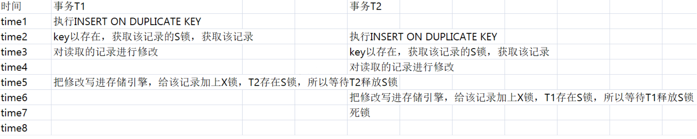

# 主从复制

MySQL 主从复制是指数据可以从一个MySQL数据库服务器主节点复制到一个或多个从节点。MySQL 默认采用异步复制方式，这样从节点不用一直访问主服务器来更新自己的数据，数据的更新可以在远程连接上进行，从节点可以复制主数据库中的所有数据库或者特定的数据库，或者特定的表。

## 作用：
- 读写分离；
- 数据实时备份，当系统中某个节点发生故障时，可以方便的故障切换
- 高可用HA
- 架构扩展
- 
## 原理
MySQL主从复制涉及到三个线程，一个运行在主节点（log dump thread），其余两个(I/O thread, SQL thread)运行在从节点，如下图所示:


- 主节点 binary log dump 线程当从节点连接主节点时，主节点会创建一个log dump 线程，用于发送bin-log的内容。在读取bin-log中的操作时，此线程会对主节点上的bin-log加锁，当读取完成，甚至在发动给从节点之前，锁会被释放。
- 从节点I/O线程当从节点上执行`start slave`命令之后，从节点会创建一个I/O线程用来连接主节点，请求主库中更新的bin-log。I/O线程接收到主节点binlog dump 进程发来的更新之后，保存在本地relay-log中。
- 从节点SQL线程SQL线程负责读取relay log中的内容，解析成具体的操作并执行，最终保证主从数据的一致性。

MySQL 主从复制默认是异步的模式。

异步复制（Asynchronous replication）

MySQL默认的复制即是异步的，主库在执行完客户端提交的事务后会立即将结果返给给客户端，并不关心从库是否已经接收并处理，这样就会有一个问题，主如果crash掉了，此时主上已经提交的事务可能并没有传到从上，如果此时，强行将从提升为主，可能导致新主上的数据不完整。

全同步复制（Fully synchronous replication）

指当主库执行完一个事务，所有的从库都执行了该事务才返回给客户端。因为需要等待所有从库执行完该事务才能返回，所以全同步复制的性能必然会收到严重的影响。

半同步复制（Semisynchronous replication）

介于异步复制和全同步复制之间，主库在执行完客户端提交的事务后不是立刻返回给客户端，而是等待至少一个从库接收到并写到relay log中才返回给客户端。相对于异步复制，半同步复制提高了数据的安全性，同时它也造成了一定程度的延迟，这个延迟最少是一个TCP/IP往返的时间。所以，半同步复制最好在低延时的网络中使用。

## mysql 主从同步延时问题
- 分库，将一个主库拆分为多个主库，每个主库的写并发就减少了几倍，此时主从延迟可以忽略不计。
- 打开 MySQL 支持的并行复制，多个库并行复制。如果说某个库的写入并发就是特别高，单库写并发达到了 2000/s，并行复制还是没意义。
- 重写代码，写代码的同学，要慎重，插入数据时立马查询可能查不到。
- 如果确实是存在必须先插入，立马要求就查询到，然后立马就要反过来执行一些操作，对这个查询设置直连主库。不推荐这种方法，你这么搞导致读写分离的意义就丧失了。

## Insert On duplicate key update 

```sql
INSERT INTO `campaign_infos_copy2` (`created_at`,`updated_at`,`deleted_at`,`create_by`,`update_by`,`campaign_id`,`campaign_name`,`daily_cap`,`target_type`,`promotion_brand`,`geo`,`stdt`,`eddt`,`campaign_status`,`gp_link`,`price_data`,`responsible_am`,`responsible_sales`,`status`) VALUES ("2021-03-05 00:15:00.184","2021-03-05 00:15:00.184",NULL,0,0,"CA00000002184","FarmHeroesSaga_Global_CPI_20210302","59","Purchase","com.king.farmheroessaga","Global","2021-03-02","2025-03-31","Closed","https://play.google.com/store/apps/details?id=com.king.farmheroessaga","https://www.baidu.com","Sean Meng","John Pryor",1),

("2021-03-05 00:15:00.184","2021-03-05 00:15:00.184",NULL,0,0,"CA00000002173","EASYJOY-InstaMoney_IN_CPA_20210126","50","Install_Gaid","com.innofinsolutions.instamoney","IN","2021-01-27","2022-01-27","Launch","https://play.google.com/store/apps/details?id=com.innofinsolutions.instamoney","https://www.baidu.com","Matt Ma","Cynthia Chen",1)

ON DUPLICATE KEY UPDATE 

`updated_at`=VALUES(`updated_at`),

`deleted_at`=VALUES(`deleted_at`),

`create_by`=VALUES(`create_by`),

`update_by`=VALUES(`update_by`),

`campaign_id`=VALUES(`campaign_id`),

`campaign_name`=VALUES(`campaign_name`),

`daily_cap`=VALUES(`daily_cap`),

`target_type`=VALUES(`target_type`),

`promotion_brand`=VALUES(`promotion_brand`),

`geo`=VALUES(`geo`),

`stdt`=VALUES(`stdt`),

`eddt`=VALUES(`eddt`),

`campaign_status`=VALUES(`campaign_status`),

`gp_link`=VALUES(`gp_link`),

`price_data`=VALUES(`price_data`),

`responsible_am`=VALUES(`responsible_am`),

`responsible_sales`=VALUES(`responsible_sales`),

`status`=VALUES(`status`)    
```

- 更新的内容中unique key或者primary key最好保证一个，不然不能保证语句执行正确(有任意一个unique key重复就会走更新,当然如果更新的语句中在表中也有重复校验的字段，那么也不会更新成功而导致报错,只有当该条语句没有任何一个unique key重复才会插入新记录)；尽量不对存在多个唯一键的table使用该语句，避免可能导致数据错乱。
- 在有可能有并发事务执行的insert 语句情况下不使用该语句，可能导致产生death lock。
  
  insert ... on duplicate key 在执行时，innodb引擎会先判断插入的行是否产生重复key错误，如果存在，在对该现有的行加上S（共享锁）锁，如果返回该行数据给mysql,然后mysql执行完duplicate后的update操作，然后对该记录加上X（排他锁），最后进行update写入。

  如果有两个事务并发的执行同样的语句，那么就会产生death lock，如：
  

- 如果数据表id是自动递增的不建议使用该语句；id不连续，如果前面更新的比较多，新增的下一条会相应跳跃的更大。
  [解决办法](https://blog.csdn.net/eleanoryss/article/details/82997899)
- 该语句是mysql独有的语法，如果可能会设计到其他数据库语言跨库要谨慎使用。

# myISAM 和innodb的区别

- 1. InnoDB 支持事务，MyISAM 不支持事务。这是 MySQL 将默认存储引擎从 MyISAM 变成 InnoDB 的重要原因之一；
- 2. InnoDB 支持外键，而 MyISAM 不支持。对一个包含外键的 InnoDB 表转为 MYISAM 会失败；  
- 3. InnoDB 是聚集索引，MyISAM 是非聚集索引。聚簇索引的文件存放在主键索引的叶子节点上，因此 InnoDB 必须要有主键，通过主键索引效率很高。但是辅助索引需要两次查询，先查询到主键，然后再通过主键查询到数据。因此，主键不应该过大，因为主键太大，其他索引也都会很大。而 MyISAM 是非聚集索引，数据文件是分离的，索引保存的是数据文件的指针。主键索引和辅助索引是独立的。 
- 4. InnoDB 不保存表的具体行数，执行 select count(*) from table 时需要全表扫描。而MyISAM 用一个变量保存了整个表的行数，执行上述语句时只需要读出该变量即可，速度很快；    
- 5. InnoDB 最小的锁粒度是行锁，MyISAM 最小的锁粒度是表锁。一个更新语句会锁住整张表，导致其他查询和更新都会被阻塞，因此并发访问受限。这也是 MySQL 将默认存储引擎从 MyISAM 变成 InnoDB 的重要原因之一；

# mysql 索引

# mysql事务

在Mysql中事务的四大特性主要包含：原子性（Atomicity）、一致性（Consistent）、隔离性（Isalotion）、持久性(Durable)，简称为ACID。

1. 原子性（aimicity）
  一个事务必须被视为一个不可分割的最小单元，不可能只执行其中的一部分操作。实现事务的原子性，是基于日志的Redo/Undo机制。
2. 一致性（consistency）
   一致性是指执行事务前后的状态要一致，可以理解为数据一致性。数据库总是从一个一致性的状态转换到另一个一致性的状态。
3. 隔离性（isolation）
 一个事务所做的修改在最终提交以前，对其他事务时不可见的。
4. 持久性（durability）
   一旦事务提交，则其所做的修改就会永久保存到数据库中，即使系统现在崩溃。

事务的隔离性由锁机制实现，原子性、一致性和持久性由事务的redo 日志和undo 日志来保证。

Redo log用来记录某数据块被修改后的值，可以用来恢复未写入 data file 的已成功事务更新的数据；Undo log是用来记录数据更新前的值，保证数据更新失败能够回滚。

## 事务隔离级别
* read uncommitted（未提交读）
称为脏读。事务的修改即使没有提交，对其他事务也是可见的。（很少使用）
* read committed（提交读）
大多数数据库默认的隔离级别（mysql除外）。一个事务开始时，只能看见已经提交的事务所作的修改。称为不可重复读。读提交则解决了脏读的，出现了不可重复读，即在一个事务任意时刻读到的数据可能不一样，（一般指更新，两次读取的数不一样）
* repeatable read（可重复读）
解决了脏读的问题。保证了在同一个事务中多次读取同样的结果是一致的。无法解决幻读的问题。（MySQL默认）。（一般是指插入，第一次读没有，第二次读就有）
* serializable （可串行化）
最高的隔离级别。强制事务串行处理，避免了幻读。在读取的每一行数据上都加锁。（很少用）

mysql查看当前事务隔离级别：`SELECT @@tx_isolation;`

更改隔离级别：`set session transaction isolation level read uncommitted;`

mysql 默认采用了自动提交模式（autocommit），如果不显示的开始一个事务，则每个查询都会当成一个事务执行提交操作。

有一些命令在执行前，会强制执行commit，提交当前的活动事务。比如alter table。

Mysql中的锁可以分为分享锁/读锁（Shared Locks）、排他锁/写锁（Exclusive Locks） 、间隙锁、行锁（Record Locks）、表锁。

共享锁是针对同一份数据，多个读操作可以同时进行，简单来说即读加锁，不能写并且可并行读；排他锁针对写操作，假如当前写操作没有完成，那么它会阻断其它的写锁和读锁，即写加锁，其它读写都阻塞。

行锁和表锁，是从锁的粒度上进行划分的，行锁锁定当前数据行，锁的粒度小，加锁慢，发生锁冲突的概率小，并发度高，行锁也是MyISAM和InnoDB的区别之一，InnoDB支持行锁并且支持事务 。

表锁则锁的粒度大，加锁快，开销小，但是锁冲突的概率大，并发度低。

 在数据库的增、删、改、查中，只有增、删、改才会加上排它锁，而只是查询并不会加锁，只能通过在select语句后显式加lock in share mode或者for update来加共享锁或者排它锁。

## mvcc
