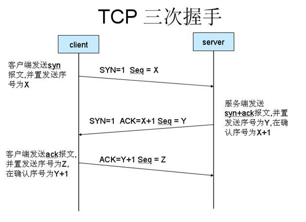
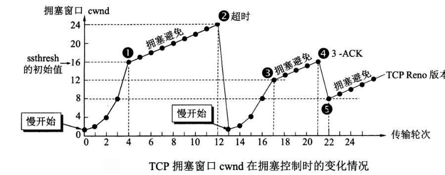

# HTTP 状态码

- 1XX 信息性状态码，1XX系列响应代码仅在与HTTP服务器沟通时使用。
- 2XX 成功状态码
  - 201	Created（已创建）
  - 202	Accepted（已接受）
  - 204	No Content(没有内容)
- 3XX 重定向状态码
  - 301	Moved Permanently（永久移除)
  - 302	Found（已找到）
  - 307	Temporary Redirect（临时重定向
- 4XX客户端错误状态码
  - 400	Bad Request（坏请求）	告诉客户端，它发送了一个错误的请求。
  - 401	Unauthorized（未授权）	需要客户端对自己认证
  - 403	Forbidden（禁止）	请求被服务器拒绝
- 5XX服务器错误状态码
  - 500	Internal Server Error(内部服务器错误)
  - 501	Not Implemented（未实现）
  - 502	Bad Gateway（网关故障）
  - 503	Service Unavailable（未提供此服务）
  - 504	Gateway Timeout（网关超时）
  - 505	HTTP Version Not Supported（不支持的HTTP版本）

# URI和URL的区别

HTTP使用统一资源标识符（Uniform Resource Identifiers, URI）来传输数据和建立连接。

- URI：Uniform Resource Identifier 统一资源标识符
- URL：Uniform Resource Location 统一资源定位符
-

URI 是用来标示 一个具体的资源的，我们可以通过 URI 知道一个资源是什么。

URL 则是用来定位具体的资源的，标示了一个具体的资源位置。互联网上的每个文件都有一个唯一的URL。

# http报文格式


```
POST /index.html HTTP/1.1
HOST: www.XXX.com
User-Agent: Mozilla/5.0(Windows NT 6.1;rv:15.0) Firefox/15.0

Username=admin&password=admin
```

```
HTTP/1.1 200 OK
Content-Encoding: gzip
Content-Type: text/html;charset=utf-8

<!DOCTYPE html>
<html lang="en">
<head>
    <meta charset="UTF-8" />
    <title>Document</title>
</head>
<body>
    <p>this is http response</p>
</body>
</html>
```

# GET POST 区别

GET

“读取“一个资源。比如Get到一个html文件。反复读取不应该对访问的数据有副作用。

POST

在页面里<form> 标签会定义一个表单。点击其中的submit元素会发出一个POST请求让服务器做一件事。这件事往往是有副作用的，不幂等的。

GET请求没有body，只有url，请求数据放在url的querystring中；POST请求的数据在body中“。但这种情况仅限于浏览器发请求的场景。

REST中GET和POST不是随便用的。在REST中, 【GET】 + 【资源定位符】被专用于获取资源或者资源列表。

REST 【POST】+ 【资源定位符】则用于“创建一个资源”

REST POST和REST PUT的区别。有些api是使用PUT作为创建资源的Method。PUT与POST的区别在于，PUT的实际语义是“replace”replace。REST规范里提到PUT的请求体应该是完整的资源，包括id在内。

### 关于安全性

我们常听到GET不如POST安全，因为POST用body传输数据，而GET用url传输，更加容易看到。但是从攻击的角度，无论是GET还是POST都不够安全，因为HTTP本身是明文协议。每个HTTP请求和返回的每个byte都会在网络上明文传播，不管是url，header还是body。这完全不是一个“是否容易在浏览器地址栏上看到“的问题。为了避免传输中数据被窃取，必须做从客户端到服务器的端端加密。业界的通行做法就是https——即用SSL协议协商出的密钥加密明文的http数据。这个加密的协议和HTTP协议本身相互独立。如果是利用HTTP开发公网的站点/App，要保证安全，https是最最基本的要求。

[参考](https://www.zhihu.com/question/28586791)

# HTTPS

http 中存在的问题：

- 请求信息明文传输，容易被窃听截取。
- 数据的完整性未校验，容易被篡改
- 没有验证对方身份，存在冒充危险

HTTPS就是在HTTP（超文本传输协议）的基础上再加一层TLS（传输层安全性协议）或者SSL（安全套接层），说白了就是为了应付HTTP是明文传输的缺点，容易被中间人窃听或者篡改，导致隐私和信息安全出现问题的解决方案。

[参考](https://zhuanlan.zhihu.com/p/158593966)

# 在浏览器*输入* *URL* 回车之后发生了什么

## url格式

```js
scheme://host.domain:port/path/filename
```

* scheme - 定义因特网服务的类型。常见的协议有 http、https、ftp、file，其中最常见的类型是 http，而 https 则是进行加密的网络传输。
* host - 定义域主机（http 的默认主机是 www）
* domain - 定义因特网**域名**，比如[http://w3school.com.cn](http://w3school.com.cn)
* port - 定义主机上的端口号（http 的默认端口号是 80）
* path - 定义服务器上的路径（如果省略，则文档必须位于网站的根目录中）。
* filename - 定义文档/资源的名称


## **域名解析（DNS）**

DNS 协议提供通过域名查找 IP 地址，或逆向从 IP 地址反查域名的服务。DNS 是一个网络服务器

* 浏览器缓存：浏览器会按照一定的频率缓存 DNS 记录。
* 操作系统缓存：如果浏览器缓存中找不到需要的 DNS 记录，那就去操作系统中找。
* 路由缓存：路由器也有 DNS 缓存。
* ISP 的 DNS 服务器：ISP 是互联网服务提供商(Internet Service Provider)的简称，ISP 有专门的 DNS 服务器应对 DNS 查询请求。
* 根服务器：ISP 的 DNS 服务器还找不到的话，它就会向根服务器发出请求，进行递归查询（DNS 服务器先问根域名服务器.com 域名服务器的 IP 地址，然后再问.baidu 域名服务器，依次类推）


## **TCP 三次握手**

## **发送 HTTP 请求**

## **服务器处理请求并返回 HTTP 报文**

## **浏览器解析渲染页面**

## **断开连接，四次挥手**

[ 在浏览器地址栏输入一个URL后回车，背后会进行哪些技术步骤？](https://www.zhihu.com/question/34873227/answer/1657140394)

# 如何理解 HTTP 协议是无状态的

HTTP 协议是无状态的，指的是协议对于事务处理没有记忆能力，服务器不知道客户端是什么状态。也就是说，打开一个服务器上的网页和上一次打开这个服务器上的网页之间没有任何联系。HTTP 是一个无状态的面向连接的协议，无状态不代表 HTTP 不能保持 TCP 连接，更不能代表 HTTP 使用的是 UDP 协议（无连接协议）。

# HTTP 协议与 TCP/IP 协议的关系

HTTP 的长连接和短连接本质上是 TCP 长连接和短连接。HTTP 属于应用层协议，在传输层使用 TCP 协议，在网络层使用 IP 协议。 IP 协议主要解决网络路由和寻址问题，TCP 协议主要解决如何在 IP 层之上可靠地传递数据包，使得网络上接收端收到发送端发出的所有数据包，并且接收顺序与发送顺序一致。TCP 协议是可靠的、面向连接的。

# 什么是长连接、短连接？

在 HTTP/1.0 中默认使用短连接。也就是说，客户端和服务器每进行一次 HTTP 操作，就建立一次连接，任务结束就中断连接。当客户端浏览器访问的某个 HTML 或其他类型的 Web 页中包含有其他的 Web 资源（如JavaScript文件、图像文件、CSS文件等），每遇到这样一个 Web 资源，浏览器就会重新建立一个 HTTP 会话。

而从 HTTP/1.1 起，默认使用长连接，用以保持连接特性。使用长连接的 HTTP 协议，会在响应头加入这行代码：`Connection:keep-alive`

在使用长连接的情况下，当一个网页打开完成后，客户端和服务器之间用于传输 HTTP 数据的 TCP 连接不会关闭，客户端再次访问这个服务器时，会继续使用这一条已经建立的连接。Keep-Alive 不会永久保持连接，它有一个保持时间，可以在不同的服务器软件（如Apache）中设定这个时间。长连接的实现需要客户端和服务端都支持长连接。

HTTP 协议的长连接和短连接，实质上是 TCP 协议的长连接和短连接。

HTTP长连接的请求数量限定是最多连续发送100个请求，超过限定将关闭这条连接。

# tcp 连接
TCP 中的连接是什么：用于保证可靠性和流控制机制的信息，包括 Socket、序列号以及窗口大小叫做连接。
所以，建立 TCP 连接就是通信的双方需要对上述的三种信息达成共识，连接中的一对 Socket 是由互联网地址标志符和端口组成的，窗口大小主要用来做流控制，最后的序列号是用来追踪通信发起方发送的数据包序号，接收方可以通过序列号向发送方确认某个数据包的成功接收。

当网络通信时采用 TCP 协议时，在真正的读写操作之前，客户端与服务器端之间必须建立一个连接，当读写操作完成后，双方不再需要这个连接时可以释放这个连接。连接的建立依靠“三次握手”，所以每个连接的建立都需要消耗时间和资源。

三次握手建立连接：



## 为什么三次？

第三次握手是为了防止失效的连接请求到达服务器，让服务器错误打开连接。

**TCP 短连接**的情况如下：client 向 server 发起连接请求，server 接到请求，然后双方建立连接。client 向 server 发送消息，server 回应 client，然后一次请求就完成了。这时候双方任意都可以发起 close 操作，不过一般都是 client 先发起 close 操作。上述可知，短连接一般只会在 client/server 间传递一次请求操作。

短连接的优点是：管理简单，存在的连接都是有用的连接，不需要额外的控制手段。

**TCP 长连接**的情况如下：client 向 server 发起连接， server 接受 client 连接，双方建立连接，client 与 server 完成一次请求后，它们之间的连接并不会主动关闭，后续的读写操作会继续使用这个连接。

TCP 的保活功能主要为服务器应用提供。如果客户端已经消失而连接未断开，则会使得服务器上保留一个半开放的连接，而服务器又在等待来自客户端的数据，此时服务器将永远等待客户端的数据。保活功能就是试图在服务端器端检测到这种半开放的连接。

如果一个给定的连接在两小时内(默认值)没有任何动作，服务器就向客户发送一个探测报文段(keepalive)，根据客户端主机响应探测客户端状态，客户端状态有如下四种：

- 客户主机依然正常运行，且服务器可达。此时客户的 TCP 响应正常，服务器将保活定时器复位。
- 客户主机已经崩溃，并且关闭或者正在重新启动。上述情况下客户端都不能响应 TCP。服务端将无法收到客户端对探测的响应。服务器总共发送10个这样的探测。若服务器没有收到任何一个响应，它就认为客户端已经关闭并终止连接。
- 客户端崩溃并已经重新启动。服务器将收到一个对其保活探测的响应，这个响应是一个复位，使得服务器终止这个连接。
- 客户机正常运行，但是服务器不可达。这种情况与第二种状态类似。

**长连接和短连接的优点和缺点**

由上可以看出，长连接可以省去较多的 TCP 建立和关闭的操作，减少浪费，节约时间。对于频繁请求资源的客户端适合使用长连接。在长连接的应用场景下，client 端一般不会主动关闭连接，当 client 与 server 之间的连接一直不关闭，随着客户端连接越来越多，server 会保持过多连接。这时候 server 端需要采取一些策略，如关闭一些长时间没有请求发生的连接，这样可以避免一些恶意连接导致 server 端服务受损；如果条件允许则可以限制每个客户端的最大长连接数，这样可以完全避免恶意的客户端拖垮整体后端服务。

短连接对于服务器来说管理较为简单，存在的连接都是有用的连接，不需要额外的控制手段。但如果客户请求频繁，将在 TCP 的建立和关闭操作上浪费较多时间和带宽。

长连接和短连接的产生在于 client 和 server 采取的关闭策略。不同的应用场景适合采用不同的策略。

# tcp 关闭连接

由于TCP连接是全双工的，因此每个方向都必须单独进行关闭。这个原则是当一方完成它的数据发送任务后就能发送一个FIN来终止这个方向的连接。收到一个 FIN只意味着这一方向上没有数据流动，一个TCP连接在收到一个FIN后仍能发送数据。首先进行关闭的一方将执行主动关闭，而另一方执行被动关闭。

TCP的连接的拆除需要发送四个包，因此称为四次挥手(four-way handshake)。客户端或服务器均可主动发起挥手动作，在socket编程中，任何一方执行close()操作即可产生挥手操作。

1) 客户端A发送一个FIN，用来关闭客户A到服务器B的数据传送。
2) 服务器B收到这个FIN，它发回一个ACK，确认序号为收到的序号加1。和SYN一样，一个FIN将占用一个序号。
3) 服务器B关闭与客户端A的连接，发送一个FIN给客户端A。
4) 客户端A发回ACK报文确认，并将确认序号设置为收到序号加1。

这是标准的TCP关闭两个阶段，服务器和客户机都可以发起关闭，完全对称。

[参考](https://zhuanlan.zhihu.com/p/45102654?from_voters_page=true)

## 常见的三种tcp状态

- SYN_RECV
  服务端收到建立连接的SYN没有收到ACK包的时候处在SYN_RECV状态。
- CLOSE_WAIT
  发起TCP连接关闭的一方称为client，被动关闭的一方称为server。被动关闭的server收到FIN后，但未发出ACK的TCP状态是CLOSE_WAIT。出现这种状况一般都是由于server端代码的问题，如果你的服务器上出现大量CLOSE_WAIT，应该要考虑检查代码。
- TIME_WAIT
  根据TCP协议定义的3次握手断开连接规定,发起socket主动关闭的一方 socket将进入TIME_WAIT状态。TIME_WAIT状态将持续2个MSL(Max Segment Lifetime),在Windows下默认为4分钟，即240秒。TIME_WAIT状态下的socket不能被回收使用. 具体现象是对于一个处理大量短连接的服务器,如果是由服务器主动关闭客户端的连接，将导致服务器端存在大量的处于TIME_WAIT状态的socket， 甚至比处于Established状态下的socket多的多,严重影响服务器的处理能力，甚至耗尽可用的socket，停止服务。

## 为什么需要TIME_WAIT？

TIME_WAIT是TCP协议用以保证被重新分配的socket不会受到之前残留的延迟重发报文影响的机制,是必要的逻辑保证。

读通道关闭后，需要等待写通道关闭。

# udp 和tcp的区别

用户数据报协议 UDP（User Datagram Protocol）

是无连接的，尽最大可能交付，没有拥塞控制，面向报文（对于应用程序传下来的报文不合并也不拆分，只是添加 UDP 首部），支持一对一、一对多、多对一和多对多的交互通信。

传输控制协议 TCP（Transmission Control Protocol）

是面向连接的，提供可靠交付，有流量控制，拥塞控制，提供全双工通信，面向字节流（把应用层传下来的报文看成字节流，把字节流组织成大小不等的数据块），每一条 TCP 连接只能是点对点的（一对一）。

# TCP粘包、拆包及解决办法

为什么会发生 TCP 粘包、拆包？

TCP 协议是面向连接的、可靠的、基于字节流的传输层通信协议3，应用层交给 TCP 协议的数据并不会以消息为单位向目的主机传输，这些数据在某些情况下会被组合成一个数据段发送给目标的主机。

Nagle 算法是一种通过减少数据包的方式提高 TCP 传输性能的算法4。因为网络 带宽有限，它不会将小的数据块直接发送到目的主机，而是会在本地缓冲区中等待更多待发送的数据，这种批量发送数据的策略虽然会影响实时性和网络延迟，但是能够降低网络拥堵的可能性并减少额外开销。

- 要发送的数据大于 TCP 发送缓冲区剩余空间大小，将会发生拆包。
- 待发送数据大于 MSS（最大报文长度），TCP 在传输前将进行拆包。
- 要发送的数据小于 TCP 发送缓冲区的大小，TCP 将多次写入缓冲区的数据一次发送出去，将会发生粘包。
- 接收数据端的应用层没有及时读取接收缓冲区中的数据，将发生粘包。

粘包、拆包解决办法

既然 TCP 协议是基于字节流的，这其实就意味着应用层协议要自己划分消息的边界。

根据业界的主流协议的解决方案，归纳如下：

- 消息定长：发送端将每个数据包封装为固定长度（不够的可以通过补 0 填充），这样接收端每次接收缓冲区中读取固定长度的数据就自然而然的把每个数据包拆分开来。
- 设置消息边界：服务端从网络流中按消息边界分离出消息内容。在包尾增加回车换行符进行分割，例如 FTP 协议。
- 将消息分为消息头和消息体：消息头中包含表示消息总长度（或者消息体长度）的字段。更复杂的应用层协议比如 Netty 中实现的一些协议都对粘包、拆包做了很好的处理。
  例如http:

```
HTTP/1.1 200 OK
Content-Type: text/html; charset=UTF-8
Content-Length: 138
...
Connection: close

<html>
  <head>
    <title>An Example Page</title>
  </head>
  <body>
    <p>Hello World, this is a very simple HTML document.</p>
  </body>
</html>
```

在上述 HTTP 消息中，我们使用 Content-Length 头表示 HTTP 消息的负载大小，当应用层协议解析到足够的字节数后，就能从中分离出完整的 HTTP 消息，无论发送方如何处理对应的数据包，我们都可以遵循这一规则完成 HTTP 消息的重组

[参考](https://draveness.me/whys-the-design-tcp-message-frame/)

# UDP会不会产生粘包问题呢？

TCP为了保证可靠传输并减少额外的开销（每次发包都要验证），采用了基于流的传输，基于流的传输不认为消息是一条一条的，是无保护消息边界的（保护消息边界：指传输协议把数据当做一条独立的消息在网上传输，接收端一次只能接受一条独立的消息）。

UDP则是面向消息传输的，是有保护消息边界的，接收方一次只接受一条独立的信息，所以不存在粘包问题。

# tcp可靠传输

TCP 使用超时重传来实现可靠传输：如果一个已经发送的报文段在超时时间内没有收到确认，那么就重传这个报文段。
TCP通过在发送时设置一个定时器来解决这种问题。如果当定时器溢出时还没有收到确认，它就重传该数据。
一个报文段从发送再到接收到确认所经过的时间称为往返时间 RTT

# TCP 流量控制

流量控制是为了控制发送方发送速率，保证接收方来得及接收。接收方发送的确认报文中的窗口字段可以用来控制发送方窗口大小，从而影响发送方的发送速率。将窗口字段设置为 0，则发送方不能发送数据。

# TCP 滑动窗口

TODO

实际上，为了避免此问题的产生，发送端主机会时不时的发送一个叫做窗口探测的数据段，此数据段仅包含一个字节来获取最新的窗口大小信息。

# TCP 拥塞控制

如果网络出现拥塞，分组将会丢失，此时发送方会继续重传，从而导致网络拥塞程度更高。因此当出现拥塞时，应当控制发送方的速率。这一点和流量控制很像，但是出发点不同。流量控制是为了让接收方能来得及接收，而拥塞控制是为了降低整个网络的拥塞程度。

TCP 主要通过四个算法来进行拥塞控制：
**慢开始、拥塞避免、快重传、快恢复。**
## 拥塞窗口
发送方需要维护一个叫做拥塞窗口（cwnd）的状态变量，注意拥塞窗口与发送方窗口的区别：拥塞窗口只是一个状态变量，实际决定发送方能发送多少数据的是发送方窗口。

其作用主要有两个：
- 防止发送方向接收方发送了太多数据，导致接收方无法处理；
- 防止 TCP 连接的任意一方向网络中发送大量数据，导致网络拥塞崩溃；
客户端能够同时传输的最大数据段的数量是接收窗口大小和拥塞窗口大小的最小值，即 min(rwnd, cwnd)。TCP 连接的初始拥塞窗口大小是一个比较小的值。

TCP 协议使用慢启动阈值（Slow start threshold, ssthresh）来决定使用慢启动或者拥塞避免算法：
- 当拥塞窗口大小小于慢启动阈值时，使用慢启动；
- 当拥塞窗口大小大于慢启动阈值时，使用拥塞避免算法；
- 当拥塞窗口大小等于慢启动阈值时，使用慢启动或者拥塞避免算法；
## 慢开始与拥塞避免


发送的最初执行慢开始，令 cwnd = 1，发送方只能发送 1 个报文段；当收到确认后，将 cwnd 加倍，因此之后发送方能够发送的报文段数量为：2、4、8 ...

注意到慢开始每个轮次都将 cwnd 加倍，这样会让 cwnd 增长速度非常快，从而使得发送方发送的速度增长速度过快，网络拥塞的可能性也就更高。设置一个慢开始门限 ssthresh，当 cwnd >= ssthresh 时，进入拥塞避免，每个轮次只将 cwnd 加 1。

如果出现了超时，则令 ssthresh = cwnd / 2，然后重新执行慢开始。

## 快重传与快恢复

在接收方，要求每次接收到报文段都应该对最后一个已收到的有序报文段进行确认。例如已经接收到 M1 和 M2，此时收到 M4，应当发送对 M2 的确认。

在发送方，如果收到三个重复确认，那么可以知道下一个报文段丢失，此时执行快重传，立即重传下一个报文段。例如收到三个 M2，则 M3 丢失，立即重传 M3。

在这种情况下，只是丢失个别报文段，而不是网络拥塞。因此执行快恢复，令 ssthresh = cwnd / 2 ，cwnd = ssthresh，注意到此时直接进入拥塞避免。

慢开始和快恢复的快慢指的是 cwnd 的设定值，而不是 cwnd 的增长速率。慢开始 cwnd 设定为 1，而快恢复 cwnd 设定为 ssthresh。


[参考](https://zhuanlan.zhihu.com/p/108822858)

# linux 网络模型

五种IO的模型：阻塞IO、非阻塞IO、多路复用IO、信号驱动IO和异步IO；前四种都是同步IO，在内核数据copy到用户空间时都是阻塞的。

## io多路复用

IO多路复用是一种同步IO模型，实现一个线程可以监视多个文件句柄；一旦某个文件句柄就绪，就能够通知应用程序进行相应的读写操作；没有文件句柄就绪时会阻塞应用程序，交出cpu。多路是指网络连接，复用指的是同一个线程。

文件描述符在形式上是一个非负整数。实际上，它是一个索引值，指向内核为每一个进程所维护的该进程打开文件的记录表。

当创建进程时,通常默认会有3个文件描述符(0,1,2),0代表标准输入，1代表标准输出，2代表标准错误，它们统称为标准IO，所以如果进程通过open打开一个文件的时候，文件描述符会从3开始，fd的值其实就是进程中打开文件列表的下标索引

由于文件描述符在一个进程中是特有的,因此不能在多个进程中间实现共享,而唯一的例外是在父/子进程之间,当一个进程调用fork时,调用fork时打开的所有文件在子进程和父进程中仍然是打开的,而且子进程写入文件描述符会影响到父进程的同一文件描述符,反之亦然

### epoll

```c
int epoll_create(int size);
int epoll_ctl(int epfd, int op, int fd, struct epoll_event *event);
int epoll_wait(int epfd, struct epoll_event *events, int maxevents, int timeout);
```

- 用 epoll_create 创建 epoll 的描述符;
  内核会产生一个epoll 实例数据结构并返回一个文件描述符，这个特殊的描述符就是epoll实例的句柄，后面的两个接口都以它为中心。
- 用 epoll_ctl 将一个个需要监听的描述符以及监听的事件类型用 epoll_ctl 注册在 epoll 描述符上；
  将被监听的描述符添加到红黑树或从红黑树中删除或者对监听事件进行修改。
- 执行 epoll_wait 等着被监听的描述符 Ready，epoll_wait 返回后遍历 Ready 的描述符，根据 Ready 的事件类型处理事件；
  处于ready状态的那些文件描述符会被复制进ready list中，epoll_wait用于向用户进程返回ready list。
- 如果某个被监听的描述符不再需要了，需要用 epoll_ctl 将它与 epoll 的描述符解绑
- 当 epoll 描述符不再需要时需要主动 close，像关闭一个文件一样释放资源

Epoll 有两种触发模式，一种叫 Eage Trigger 简称 ET，一种叫 Level Trigger 简称 LT。每一个使用 epoll_ctl 注册在 epoll 描述符上的被监听的描述符都能单独配置自己的触发模式。

对于这两种触发模式的区别从使用的角度上来说，ET 模式下当一个 FD (文件描述符) Ready 后，需要以 Non-Blocking 方式一直操作这个 FD 直到操作返回 EAGAIN 错误为止，期间 Ready 这个事件只会触发 epoll_wait 一次返回。而如果是 LT 模式，如果 FD 上的事件一直处在 Ready 状态没处理完，则每次调用 epoll_wait 都会立即返回。

每一个epoll对象都有一个独立的eventpoll结构体，用于存放通过epoll_ctl方法向epoll对象中添加进来的事件。这些事件都会挂载在红黑树中，如此，重复添加的事件就可以通过红黑树而高效的识别出来(红黑树的插入时间效率是lgn，其中n为树的高度)。

而所有添加到epoll中的事件都会与设备(网卡)驱动程序建立回调关系，也就是说，当相应的事件发生时会调用这个回调方法。这个回调方法在内核中叫ep_poll_callback,它会将发生的事件添加到rdlist双链表中。

在epoll中，对于每一个事件，都会建立一个epitem结构体，当调用epoll_wait检查是否有事件发生时，只需要检查eventpoll对象中的rdlist双链表中是否有epitem元素即可。如果rdlist不为空，则把发生的事件复制到用户态，同时将事件数量返回给用户。

[参考](https://zhuanlan.zhihu.com/p/127148459)

## reactor模式

Reactor模式首先是事件驱动的，有一个或多个并发输入源，有一个Service Handler，有多个Request Handlers；Service Handler会对输入的请求（Event）进行多路复用，并同步地将它们分发给相应的Request Handler。

Reactor实现相对简单，对于链接多，但耗时短的处理场景高效；

- 操作系统可以在多个事件源上等待，并且避免了线程切换的性能开销和编程复杂性；
- 事件的串行化对应用是透明的，可以顺序的同步执行而不需要加锁；
- 事务分离：将与应用无关的多路复用、分配机制和与应用相关的回调函数分离开来。

# grpc负载均衡

https://segmentfault.com/a/1190000008672912
