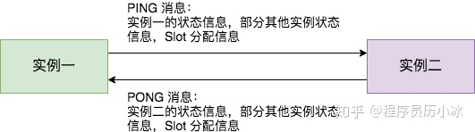
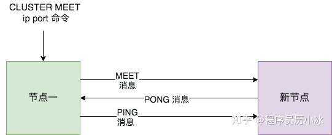

# redis为什么快
- C 语言实现，虽然 C 对 Redis 的性能有助力，但语言并不是最核心因素。
- 纯内存 I/O，相较于其他基于磁盘的 DB，Redis 的纯内存操作有着天然的性能优势。
- I/O 多路复用，基于 epoll/select/kqueue 等 I/O 多路复用技术，实现高吞吐的网络 I/O。
- 单线程模型，单线程无法利用多核，但是从另一个层面来说则避免了多线程频繁上下文切换，以及同步机制如锁带来的开销。


# Redis 为何选择单线程？
CPU 通常不会是瓶颈，因为大多数请求不会是 CPU 密集型的，而是 I/O 密集型。具体到 Redis 的话，如果不考虑 RDB/AOF 等持久化方案，Redis 是完全的纯内存操作，执行速度是非常快的，因此这部分操作通常不会是性能瓶颈，Redis 真正的性能瓶颈在于网络 I/O，也就是客户端和服务端之间的网络传输延迟，因此 Redis 选择了单线程的 I/O 多路复用来实现它的核心网络模型。

使用单线程模型能带来更好的可维护性，方便开发和调试；

# Redis 真的是单线程？
当我们讨论 Redis 的多线程之时，有必要对 Redis 的版本划出两个重要的节点：

- Redis v4.0（引入多线程处理异步任务）
  选择引入多线程来实现这一类非阻塞的命令，如 UNLINK、FLUSHALL ASYNC、FLUSHDB ASYNC。

  UNLINK 命令其实就是 DEL 的异步版本，它不会同步删除数据，而只是把 key 从 keyspace 中暂时移除掉，然后将任务添加到一个异步队列，最后由后台线程去删除

- Redis v6.0（正式在网络模型中实现 I/O 多线程）

# redis单线程网络模型
Redis 服务采用 Reactor 的方式来实现文件事件处理器（每一个网络连接其实都对应一个文件描述符）

Redis 内部实现了一个高性能的事件库 --- AE，基于 epoll/select/kqueue/evport 四种事件驱动技术，实现 Linux/MacOS/FreeBSD/Solaris 多平台的高性能事件循环模型。Redis 的核心网络模型正式构筑在 AE 之上，包括 I/O 多路复用、各类处理器的注册绑定，都是基于此才得以运行。

文件事件处理器使用 I/O 多路复用模块同时监听多个 FD，当 accept、read、write 和 close 文件事件产生时，文件事件处理器就会回调 FD 绑定的事件处理器。

虽然整个文件事件处理器是在单线程上运行的，但是通过 I/O 多路复用模块的引入，实现了同时对多个 FD 读写的监控，提高了网络通信模型的性能，同时也可以保证整个 Redis 服务实现的简单。

文件事件处理器的结构包含 4 个部分：
- 多个 socket
- IO 多路复用程序
- 文件事件分派器
- 事件处理器（连接应答处理器、命令请求处理器、命令回复处理器）

多个 socket 可能会并发产生不同的操作，每个操作对应不同的文件事件，但是 IO 多路复用程序会监听多个 socket，会将 socket 产生的事件放入队列中排队，事件分派器每次从队列中取出一个事件，把该事件交给对应的事件处理器进行处理。

# Redis 多线程网络模型

CPU 通常不会成为性能瓶颈，瓶颈往往是内存和网络，因此单线程足够了。那么为什么现在 Redis 又要引入多线程呢？很简单，就是 Redis 的网络 I/O 瓶颈已经越来越明显了。

单 Reactor 模式，引入多线程之后会进化为 Multi-Reactors 模式。

区别于单 Reactor 模式，这种模式不再是单线程的事件循环，而是有多个线程（Sub Reactors）各自维护一个独立的事件循环，由 Main Reactor 负责接收新连接并分发给 Sub Reactors 去独立处理，最后 Sub Reactors 回写响应给客户端。

大部分逻辑和之前的单线程模型是一致的，变动的地方仅仅是把读取客户端请求命令和回写响应数据的逻辑异步化了，交给 I/O 线程去完成，这里需要特别注意的一点是：I/O 线程仅仅是读取和解析客户端命令而不会真正去执行命令，客户端命令的执行最终还是要在主线程上完成。

Redis 的多线程网络模型实际上并不是一个标准的 Multi-Reactors/Master-Workers 模型，和其他主流的开源网络服务器的模式有所区别，最大的不同就是在标准的 Multi-Reactors/Master-Workers 模式下，Sub Reactors/Workers 会完成 网络读 -> 数据解析 -> 命令执行 -> 网络写 整套流程，Main Reactor/Master 只负责分派任务，而在 Redis 的多线程方案中，I/O 线程任务仅仅是通过 socket 读取客户端请求命令并解析，却没有真正去执行命令，所有客户端命令最后还需要回到主线程去执行，因此对多核的利用率并不算高，而且每次主线程都必须在分配完任务之后忙轮询等待所有 I/O 线程完成任务之后才能继续执行其他逻辑。

[参考](https://zhuanlan.zhihu.com/p/356059845)

# redis 集群模式
## 主从同步
主数据库不用配置，从redis的conf文件中可以加载从数据库的信息，也可以在启动时，使用 redis-server --port 6380 --slaveof 127.0.0.1 6379

当从节点刚刚加入到集群时，它必须先要进行一次快照同步，同步完成后再继续进行增量同步。

**全量同步**
Redis全量复制一般发生在Slave初始化阶段，这时Slave需要将Master上的所有数据都复制一份。具体步骤如下： 
-  从服务器连接主服务器，发送SYNC命令； 
-  主服务器接收到SYNC命名后，开始执行BGSAVE命令生成RDB文件并使用缓冲区记录此后执行的所有写命令； 
-  主服务器BGSAVE执行完后，向所有从服务器发送快照文件，并在发送期间继续记录被执行的写命令； 
-  从服务器收到快照文件后丢弃所有旧数据，载入收到的快照； 
-  主服务器快照发送完毕后开始向从服务器发送缓冲区中的写命令； 
-  从服务器完成对快照的载入，开始接收命令请求，并执行来自主服务器缓冲区的写命令；

**增量同步**
Redis 同步的是指令流，主节点会将那些对自己的状态产生修改性影响的指令记录在本地的内存 buffer 中，然后异步将 buffer 中的指令同步到从节点，从节点一边执行同步的指令流来达到和主节点一样的状态，一遍向主节点反馈自己同步到哪里了 (偏移量)。

从节点在接收主节点发送的rdb文件的期间，主节点会正常响应业务请求，这期间的命令写入会保存在复制客户端缓冲区内，当从节点完成rdb文件加载后，主节点再把缓冲区数据发送给从节点，从而保证双方数据一致。

Redis 的复制是异步进行的，wait 指令可以让异步复制变身同步复制，确保系统的强一致性 (不严格)。
## sentinel
我们可以将 Redis Sentinel 集群看成是一个 ZooKeeper 集群，它是集群高可用的心脏，它一般是由 3～5 个节点组成，这样挂了个别节点集群还可以正常运转。

它负责持续监控主从节点的健康，当主节点挂掉时，自动选择一个最优的从节点切换为主节点。客户端来连接集群时，会首先连接 sentinel，通过 sentinel 来查询主节点的地址，然后再去连接主节点进行数据交互。当主节点发生故障时，客户端会重新向 sentinel 要地址，sentinel 会将最新的主节点地址告诉客户端。如此应用程序将无需重启即可自动完成节点切换。

Redis 主从采用异步复制，意味着当主节点挂掉时，从节点可能没有收到全部的同步消息，这部分未同步的消息就丢失了。

它有两个选项可以限制主从延迟过大。
```
min-slaves-to-write 1
min-slaves-max-lag 10
```
第一个参数表示主节点必须至少有一个从节点在进行正常复制，否则就停止对外写服务，丧失可用性。
何为正常复制，何为异常复制？这个就是由第二个参数控制的，它的单位是秒，表示如果 10s 没有收到从节点的反馈，就意味着从节点同步不正常，要么网络断开了，要么一直没有给反馈。

redis 主地址只有一个，从地址可以有多个。
连接池建立新连接时，会去查询主库地址，然后跟内存中的主库地址进行比对，如果变更了，就断开所有连接，重新使用新地址建立新连接。如果是旧的主库挂掉了，那么所有正在使用的连接都会被关闭，然后在重连时就会用上新地址。
## cluster
集群往往需要维护一定的元数据，比如实例的ip地址，缓存分片的 slots 信息等，所以需要一套分布式机制来维护元数据的一致性。这类机制一般有两个模式：分散式和集中式分散式机制将元数据存储在部分或者所有节点上，不同节点之间进行不断的通信来维护元数据的变更和一致性。Redis Cluster，Consul 等都是该模式。

而集中式是将集群元数据集中存储在外部节点或者中间件上，比如 zookeeper。旧版本的 kafka 和 storm 等都是使用该模式。

分散式的元数据模式有多种可选的算法进行元数据的同步，比如说 Paxos、Raft 和 Gossip。Paxos 和 Raft 等都需要全部节点或者大多数节点(超过一半)正常运行，整个集群才能稳定运行，而 Gossip 则不需要半数以上的节点运行。
**redis分片机制**
Redis 集群没有使用一致性hash, 而是引入了哈希槽的概念。
Redis Cluster 采用虚拟哈希槽分区，所有的键根据哈希函数映射到 0 ~ 16383 整数槽内，每个key通过CRC16校验后对16384取模来决定放置哪个槽(Slot)，每一个节点负责维护一部分槽以及槽所映射的键值数据。
计算公式：slot = CRC16(key) & 16383。
当 Redis Cluster 的客户端来连接集群时，它也会得到一份集群的槽位配置信息。这样当客户端要查找某个 key 时，可以直接定位到目标节点。

Cluster 默认会对 key 值使用 crc32 算法进行 hash 得到一个整数值，然后用这个整数值对 16384 进行取模来得到具体槽位。

Redis 虚拟槽分区的特点
- 解耦数据和节点之间的关系，简化了节点扩容和收缩难度。
- 节点自身维护槽的映射关系，不需要客户端或者代理服务维护槽分区元数据
- 支持节点、槽和键之间的映射查询，用于数据路由，在线集群伸缩等场景。

当客户端向一个错误的节点发出了指令，该节点会发现指令的 key 所在的槽位并不归自己管理，这时它会向客户端发送一个特殊的跳转指令携带目标操作的节点地址，告诉客户端去连这个节点去获取数据。
```
GET x
-MOVED 3999 127.0.0.1:6381
```
Redis Cluster 可以为每个主节点设置若干个从节点，单主节点故障时，集群会自动将其中某个从节点提升为主节点。如果某个主节点没有从节点，那么当它发生故障时，集群将完全处于不可用状态。不过 Redis 也提供了一个参数 cluster-require-full-coverage 可以允许部分节点故障，其它节点还可以继续提供对外访问。
**分布式协议**
Redis 集群节点采用 Gossip 协议来广播自己的状态以及自己对整个集群认知的改变。比如一个节点发现某个节点失联了 (PFail)，它会将这条信息向整个集群广播，其它节点也就可以收到这点失联信息。如果一个节点收到了某个节点失联的数量 (PFail Count) 已经达到了集群的大多数，就可以标记该节点为确定下线状态 (Fail)，然后向整个集群广播，强迫其它节点也接收该节点已经下线的事实，并立即对该失联节点进行主从切换。

Gossip方法论：
> 在一个处于有界网络的集群里，如果每个节点都随机与其他节点交换特定信息，经过足够长的时间后，集群各个节点对该份信息的认知终将收敛到一致。

Gossip 协议的最大的好处是，即使集群节点的数量增加，每个节点的负载也不会增加很多，几乎是恒定的。这就允许 Redis Cluster 或者 Consul 集群管理的节点规模能横向扩展到数千个。

Redis Cluster 中的每个节点都维护一份自己视角下的当前整个集群的状态，主要包括：

- 当前集群状态
- 集群中各节点所负责的 slots信息，及其migrate状态
- 集群中各节点的master-slave状态
- 集群中各节点的存活状态及怀疑Fail状态

**定时 PING/PONG 消息**
Redis Cluster 中的节点都会定时地向其他节点发送 PING 消息，来交换各个节点状态信息，检查各个节点状态，包括在线状态、疑似下线状态 PFAIL 和已下线状态 FAIL。



**新节点上线**

节点一在执行 CLUSTER MEET 命令时会首先为新节点创建一个 clusterNode 数据，并将其添加到自己维护的 clusterState 的 nodes 字典中。

然后节点一会根据据 CLUSTER MEET 命令中的 IP 地址和端口号，向新节点发送一条 MEET 消息。新节点接收到节点一发送的MEET消息后，新节点也会为节点一创建一个 clusterNode 结构，并将该结构添加到自己维护的 clusterState 的 nodes 字典中。

[参考](https://zhuanlan.zhihu.com/p/328728595)

## 扩展：一致性哈希
哈希表的每次扩展和收缩都会导致所有条目分布的重新计算，这个特性在某些场景下是不可接受的。比如分布式的存储系统，每个桶就相当于一个机器，文件分布在哪台机器由哈希算法来决定，这个系统想要加一台机器时就需要停下来等所有文件重新分布一次才能对外提供服务，而当一台机器掉线的时候尽管只掉了一部分数据，但所有数据访问路由都会出问题。这样整个服务就无法平滑的扩缩容，成为了有状态的服务。

一致性哈希的核心思想就是将每个服务节点与一个HASH值区间关联起来。然后一致性哈希会将每个请求对象通过同样的HASH将其映射到某个HASH值区间上，从而关联到对应的服务节点。当添加或删除节点时，变动的只有对应节点HASH值区间的对象需要变动，即只有$K/n$个key需要进行重新映射(K是总key的个数，n是节点个数)。

一致性HASH的四个重要特性如下：

- Balance：平衡性，hash函数对于输入items能够均匀的映射到每个bucket。(由虚拟节点保证)
- Monotonicity：单调性，某个item映射到bucket A1，此时如果新加入了一个bucket A3，那么此item的映射关系可能从bucket A映射到bucket A3，但绝不会映射到旧的bucket A2中。
- Spread：分散性，分布式的系统中，每个终端可能看到的bucket集群是不一致的，所以最终会导致相同的items被映射到不同的bucket中。这种情况是要避免，分散性要越低越好。
- Load：负载，和Spread概念相似，只不过是用来描述bucket中被不同的用户映射为不同的item。负载也是越低越好。

一种简单实现：采用的HASH函数将string的输入映射到一个数字区间[0, M]，可以把该区间认为是一个单位圆，然后将所有服务节点都映射到圆上的某个点，然后将每个请求通过同样的HASH映射到该圆上的某个点，该请求item映射到圆上的点，以顺时针找到与之最近的服务节点。


[论文](http://david.choffnes.com/classes/cs4700sp14/papers/akamai.pdf)

# redis持久化
## RDB
Redis 使用操作系统的多进程 COW(Copy On Write) 机制来实现快照持久化。
Redis 客户端还同时提供两个命令来生成 RDB 存储文件，也就是 SAVE（阻塞） 和 BGSAVE（background save)

当我们使用 BGSAVE 命令时，Redis 会立刻 fork 出一个子进程，子进程会执行『将内存中的数据以 RDB 格式保存到磁盘中』这一过程，而 Redis 服务在 BGSAVE 工作期间仍然可以处理来自客户端的请求。

fork 后的父子进程会运行在不同的内存空间中，当 fork 发生时两者的内存空间有着完全相同的内容，对内存的写入和修改、文件的映射都是独立的，两个进程不会相互影响。

写时拷贝的主要作用就是将拷贝推迟到写操作真正发生时，这也就避免了大量无意义的拷贝操作。

在 fork 函数调用时，父进程和子进程会被 Kernel 分配到不同的虚拟内存空间中，所以在两个进程看来它们访问的是不同的内存：

- 在真正访问虚拟内存空间时，Kernel 会将虚拟内存映射到物理内存上，所以父子进程共享了物理上的内存空间；
- 当父进程或者子进程对共享的内存进行修改时，共享的内存才会以页为单位进行拷贝，父进程会保留原有的物理空间，而子进程会使用拷贝后的新物理空间；

在 Redis 服务中，子进程只会读取共享内存中的数据，它并不会执行任何写操作，只有父进程会在写入时才会触发这一机制（所以子进程看到的内存即使fork完成时刻的快照），而对于大多数的 Redis 服务或者数据库，写请求往往都是远小于读请求的，所以使用 fork 加上写时拷贝这一机制能够带来非常好的性能，也让 BGSAVE 这一操作的实现变得非常简单。

## AOF
AOF 日志存储的是 Redis 服务器的顺序指令序列，AOF 日志只记录对内存进行修改的指令记录。

Redis 会在收到客户端修改指令后，先进行参数校验，如果没问题，就立即将该指令文本存储到 AOF 日志中，也就是先存到磁盘，然后再执行指令。

Redis 提供了 bgrewriteaof 指令用于对 AOF 日志进行瘦身。其原理就是开辟一个子进程对内存进行遍历转换成一系列 Redis 的操作指令，序列化到一个新的 AOF 日志文件中。

## 混合持久化
重启 Redis 时，我们很少使用 rdb 来恢复内存状态，因为会丢失大量数据。我们通常使用 AOF 日志重放，但是重放 AOF 日志性能相对 rdb 来说要慢很多，这样在 Redis 实例很大的情况下，启动需要花费很长的时间。

Redis 4.0 为了解决这个问题，带来了一个新的持久化选项——混合持久化。将 rdb 文件的内容和增量的 AOF 日志文件存在一起。这里的 AOF 日志不再是全量的日志，而是自持久化开始到持久化结束的这段时间发生的增量 AOF 日志，通常这部分 AOF 日志很小。
