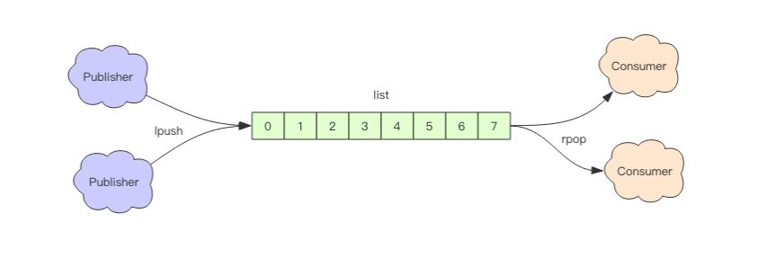

# Redis 5 种基础数据结构
分别为：string (字符串)、list (列表)、set (集合)、hash (哈希) 和 zset (有序集合)。
## 简单动态字符串(simple dynamic string，SDS)
C 语言使用长度为 N+1 的字符数组来表示长度为 N 的字符串， 并且字符数组的最后一个元素总是空字符 '\0' 。
数据结构：
```c
struct __attribute__ ((__packed__)) sdshdr5 {
    unsigned char flags; /* 3 lsb of type, and 5 msb of string length */
    char buf[];
};
struct __attribute__ ((__packed__)) sdshdr8 {
    uint8_t len; /* used */
    uint8_t alloc; /* excluding the header and null terminator */
    unsigned char flags; /* 3 lsb of type, 5 unused bits */
    char buf[];
};
struct __attribute__ ((__packed__)) sdshdr16 {
    uint16_t len; /* used */
    uint16_t alloc; /* excluding the header and null terminator */
    unsigned char flags; /* 3 lsb of type, 5 unused bits */
    char buf[];
};
struct __attribute__ ((__packed__)) sdshdr32 {
    uint32_t len; /* used */
    uint32_t alloc; /* excluding the header and null terminator */
    unsigned char flags; /* 3 lsb of type, 5 unused bits */
    char buf[];
};
struct __attribute__ ((__packed__)) sdshdr64 {
    uint64_t len; /* used */
    uint64_t alloc; /* excluding the header and null terminator */
    unsigned char flags; /* 3 lsb of type, 5 unused bits */
    char buf[];
};
```
```c
// 返回sds头部的起始地址
#define SDS_HDR(T,s) ((struct sdshdr##T *)((s)-(sizeof(struct sdshdr##T))))
//##运算符用于在预处理期粘连两个标识符
```
SDS 与 C 字符串的区别
- 常数复杂度获取字符串长度
  
  SDS 在 len 属性中记录了 SDS 本身的长度， 所以获取一个 SDS 长度的复杂度仅为 O(1) 。
- 杜绝缓冲区溢出
  
  sdscat 函数， 它可以将一个 C 字符串拼接到给定 SDS 所保存的字符串的后面， 但是在执行拼接操作之前， sdscat 会先检查给定 SDS 的空间是否足够， 如果不够的话， sdscat 就会先扩展 SDS 的空间， 然后才执行拼接操作。
- 减少修改字符串时带来的内存重分配次数
  
  SDS 通过未使用空间解除了字符串长度和底层数组长度之间的关联.
  如果对 SDS 进行修改之后， SDS 的长度（也即是 len 属性的值）将小于 1 MB ， 那么程序分配和 len 属性同样大小的未使用空间， 这时 SDS len 属性的值将和 free 属性的值相同。 举个例子， 如果进行修改之后， SDS 的 len 将变成 13 字节， 那么程序也会分配 13 字节的未使用空间， SDS 的 buf 数组的实际长度将变成 13 + 13 + 1 = 27 字节（额外的一字节用于保存空字符）。
  如果对 SDS 进行修改之后， SDS 的长度将大于等于 1 MB ， 那么程序会分配 1 MB 的未使用空间。 举个例子， 如果进行修改之后， SDS 的 len 将变成 30 MB ， 那么程序会分配 1 MB 的未使用空间， SDS 的 buf 数组的实际长度将为 30 MB + 1 MB + 1 byte 。

  惰性空间释放用于优化 SDS 的字符串缩短操作： 当 SDS 的 API 需要缩短 SDS 保存的字符串时， 程序并不立即使用内存重分配来回收缩短后多出来的字节.

  通过惰性空间释放策略， SDS 避免了缩短字符串时所需的内存重分配操作， 并为将来可能有的增长操作提供了优化.

  与此同时， SDS 也提供了相应的 API ， 让我们可以在有需要时， 真正地释放 SDS 里面的未使用空间， 所以不用担心惰性空间释放策略会造成内存浪费。
- 二进制安全
  
  C 字符串中的字符必须符合某种编码（比如 ASCII）， 并且除了字符串的末尾之外， 字符串里面不能包含空字符， 否则最先被程序读入的空字符将被误认为是字符串结尾 —— 这些限制使得 C 字符串只能保存文本数据， 而不能保存像图片、音频、视频、压缩文件这样的二进制数据。

  所有 SDS API 都会以处理二进制的方式来处理 SDS 存放在 buf 数组里的数据， 程序不会对其中的数据做任何限制、过滤、或者假设 —— 数据在写入时是什么样的， 它被读取时就是什么样。


## 链表
每个链表节点使用一个 adlist.h/listNode 结构来表示：
```c
typedef struct listNode {
    struct listNode *prev;
    struct listNode *next;
    void *value;
} listNode;

typedef struct list {
    listNode *head;
    listNode *tail;
    //节点复制函数
    void *(*dup)(void *ptr);
    //节点释放
    void (*free)(void *ptr);
    //节点比较
    int (*match)(void *ptr, void *key);
    unsigned long len;
} list;
```
Redis 的列表结构常用来做异步队列使用。将需要延后处理的任务结构体序列化成字符串塞进 Redis 的列表，另一个线程从这个列表中轮询数据进行处理。

**右边进左边出：队列**
```
> rpush books python java golang
(integer) 3
> llen books
(integer) 3
> lpop books
"python"
> lpop books
"java"
> lpop books
"golang"
> lpop books
(nil) 
```
**右边进右边出：栈**
```
> rpush books python java golang
(integer) 3
> rpop books
"golang"
> rpop books
"java"
> rpop books
"python"
> rpop books 
```

```shell
> rpush books python java golang
(integer) 3
> lindex books 1 # O(n) 慎用
"java"
> lrange books 0 -1 # 获取所有元素，O(n) 慎用
1) "python"
2) "java"
3) "golang"
> ltrim books 1 -1 # O(n) 慎用
OK
> lrange books 0 -1
1) "java"
2) "golang"
# ltrim 跟的两个参数 start_index 和 end_index 定义了一个区间，在这个区间内的值，ltrim 要保留，区间之外统统砍掉。
> ltrim books 1 0 # 这其实是清空了整个列表，因为区间范围长度为负
OK
> llen books
(integer) 0

```

## map(字典)
哈希表结构：
```c
typedef struct dictht {

    // 哈希表数组
    dictEntry **table;

    // 哈希表大小
    unsigned long size;

    // 哈希表大小掩码，用于计算索引值
    // 总是等于 size - 1
    unsigned long sizemask;

    // 该哈希表已有节点的数量
    unsigned long used;

} dictht;

typedef struct dictEntry {
    void *key;
    union {
        void *val;
        uint64_t u64;
        int64_t s64;
        double d;
    } v;
    //next 属性是指向另一个哈希表节点的指针， 这个指针可以将多个哈希值相同的键值对连接在一次， 以此来解决键冲突（collision）的问题。
    struct dictEntry *next;
} dictEntry;
```
table 属性是一个数组， 数组中的每个元素都是一个指向 dict.h/dictEntry 结构的指针， 每个 dictEntry 结构保存着一个键值对。

size 属性记录了哈希表的大小， 也即是 table 数组的大小， 而 used 属性则记录了哈希表目前已有节点（键值对）的数量。

sizemask 属性的值总是等于 size - 1 ， 这个属性和哈希值一起决定一个键应该被放到 table 数组的哪个索引上面。

字典结构：
```c
typedef struct dict {

    // 类型特定函数
    dictType *type;

    // 私有数据
    void *privdata;

    // 哈希表
    dictht ht[2];

    // rehash 索引
    // 当 rehash 不在进行时，值为 -1
    int rehashidx; /* rehashing not in progress if rehashidx == -1 */

} dict;

typedef struct dictType {

    // 计算哈希值的函数
    unsigned int (*hashFunction)(const void *key);

    // 复制键的函数
    void *(*keyDup)(void *privdata, const void *key);

    // 复制值的函数
    void *(*valDup)(void *privdata, const void *obj);

    // 对比键的函数
    int (*keyCompare)(void *privdata, const void *key1, const void *key2);

    // 销毁键的函数
    void (*keyDestructor)(void *privdata, void *key);

    // 销毁值的函数
    void (*valDestructor)(void *privdata, void *obj);

} dictType;
```
当要将一个新的键值对添加到字典里面时， 程序需要先根据键值对的键计算出哈希值和索引值， 然后再根据索引值， 将包含新键值对的哈希表节点放到哈希表数组的指定索引上面。

```c
//使用字典设置的哈希函数，计算键 key 的哈希值
hash = dict->type->hashFunction(key);

//使用哈希表的 sizemask 属性和哈希值，计算出索引值
//根据情况不同， ht[x] 可以是 ht[0] 或者 ht[1]
index = hash & dict->ht[x].sizemask;
```
Redis 使用 MurmurHash2 算法来计算键的哈希值。

**rehash** 随着操作的不断执行， 哈希表保存的键值对会逐渐地增多或者减少， 为了让哈希表的负载因子（load factor）维持在一个合理的范围之内， 当哈希表保存的键值对数量太多或者太少时， 程序需要对哈希表的大小进行相应的扩展或者收缩。

1) 为字典的 ht[1] 哈希表分配空间， 这个哈希表的空间大小取决于要执行的操作， 以及 ht[0] 当前包含的键值对数量 （也即是 ht[0].used 属性的值）：
   - 如果执行的是扩展操作， 那么 ht[1] 的大小为第一个大于等于 ht[0].used * 2 的 2^n （2 的 n 次方幂）；
   - 如果执行的是收缩操作， 那么 ht[1] 的大小为第一个大于等于 ht[0].used 的 2^n 。
2) 将保存在 ht[0] 中的所有键值对 rehash 到 ht[1] 上面： rehash 指的是重新计算键的哈希值和索引值， 然后将键值对放置到 ht[1] 哈希表的指定位置上。
3) 当 ht[0] 包含的所有键值对都迁移到了 ht[1] 之后 （ht[0] 变为空表）， 释放 ht[0] ， 将 ht[1] 设置为 ht[0] ， 并在 ht[1] 新创建一个空白哈希表， 为下一次 rehash 做准备。

当以下条件中的任意一个被满足时， 程序会自动开始对哈希表执行扩展操作：

1) 服务器目前没有在执行 BGSAVE 命令或者 BGREWRITEAOF 命令， 并且哈希表的负载因子大于等于 1 ；
2) 服务器目前正在执行 BGSAVE 命令或者 BGREWRITEAOF 命令， 并且哈希表的负载因子大于等于 5 ；

根据 BGSAVE 命令或 BGREWRITEAOF 命令是否正在执行， 服务器执行扩展操作所需的负载因子并不相同， 这是因为在执行 BGSAVE 命令或 BGREWRITEAOF 命令的过程中， Redis 需要创建当前服务器进程的子进程， 而大多数操作系统都采用写时复制（copy-on-write）技术来优化子进程的使用效率， 所以在子进程存在期间， 服务器会提高执行扩展操作所需的负载因子， 从而尽可能地避免在子进程存在期间进行哈希表扩展操作， 这可以避免不必要的内存写入操作， 最大限度地节约内存。

另一方面， 当哈希表的负载因子小于 0.1 时， 程序自动开始对哈希表执行收缩操作。

为了避免 rehash 对服务器性能造成影响， 服务器不是一次性将 ht[0] 里面的所有键值对全部 rehash 到 ht[1] ， 而是分多次、渐进式地将 ht[0] 里面的键值对慢慢地 rehash 到 ht[1] 。

以下是哈希表渐进式 rehash 的详细步骤：

1) 为 ht[1] 分配空间， 让字典同时持有 ht[0] 和 ht[1] 两个哈希表。
2) 在字典中维持一个索引计数器变量 rehashidx ， 并将它的值设置为 0 ， 表示 rehash 工作正式开始。
3) 在 rehash 进行期间， 每次对字典执行添加、删除、查找或者更新操作时， 程序除了执行指定的操作以外， 还会顺带将 ht[0] 哈希表在 rehashidx 索引上的所有键值对 rehash 到 ht[1] ， 当 rehash 工作完成之后， 程序将 rehashidx 属性的值增一。
4) 随着字典操作的不断执行， 最终在某个时间点上， ht[0] 的所有键值对都会被 rehash 至 ht[1] ， 这时程序将 rehashidx 属性的值设为 -1 ， 表示 rehash 操作已完成。

在渐进式 rehash 执行期间， 新添加到字典的键值对一律会被保存到 ht[1] 里面， 而 ht[0] 则不再进行任何添加操作： 这一措施保证了 ht[0] 包含的键值对数量会只减不增， 并随着 rehash 操作的执行而最终变成空表。

## skiplsit

```c
typedef struct zskiplistNode {
    //存储对象
    sds ele;
    // score 分值，跳表是排序链表，使用score排序。
    double score;
    //后退指针
    struct zskiplistNode *backward;
    //层,
    struct zskiplistLevel {
        //前进指针
        struct zskiplistNode *forward;
        //跨度，用来计算元素排名的，在查找的过程中，将沿途访问过的所有层的跨度累积起来，就可以得到目标节点在跳表中的排位
        unsigned long span;
    } level[];
} zskiplistNode;

typedef struct zskiplist {
    struct zskiplistNode *header, *tail;
    unsigned long length;
    int level;
} zskiplist

//有序集合结构体
typedef struct zset {
    /*
     * Redis 会将跳跃表中所有的元素和分值组成 
     * key-value 的形式保存在字典中
     * todo：注意：该字典并不是 Redis DB 中的字典，只属于有序集合
     */
    dict *dict;
    /*
     * 底层指向的跳跃表的指针
     */
    zskiplist *zsl;
} zset;
```


初始化
```c
// t_zset.c
zskiplistNode *zslCreateNode(int level, double score, sds ele) {
    zskiplistNode *zn =
        zmalloc(sizeof(*zn)+level*sizeof(struct zskiplistLevel));
    zn->score = score;
    zn->ele = ele;
    return zn;
}

/* Create a new skiplist. */
zskiplist *zslCreate(void) {
    int j;
    zskiplist *zsl;
    //分配内存空间
    zsl = zmalloc(sizeof(*zsl));
    //默认只有一层索引
    zsl->level = 1;
    //0 个节点
    zsl->length = 0;
    //1、创建一个 node 节点，这是个哨兵节点
    //2、为 level 数组分配 ZSKIPLIST_MAXLEVEL=32 内存大小
    //3、也即 redis 中支持索引最大 32 层
    zsl->header = zslCreateNode(ZSKIPLIST_MAXLEVEL,0,NULL);
    //为哨兵节点的 level 初始化
    for (j = 0; j < ZSKIPLIST_MAXLEVEL; j++) {
        zsl->header->level[j].forward = NULL;
        zsl->header->level[j].span = 0;
    }
    zsl->header->backward = NULL;
    zsl->tail = NULL;
    return zsl;
}
```
插入
```c

// span:与下一个节点直接的跨度（之间有多少个节点）
//rank: 等于新节点再最底层链表的排名，就是它前面有多少个节点
zskiplistNode *zslInsert(zskiplist *zsl, double score, sds ele) {
    //update数组将用于记录新节点在每一层索引的目标插入位置
    zskiplistNode *update[ZSKIPLIST_MAXLEVEL], *x;//32
    //rank数组记录目标节点每一层的排名
    unsigned int rank[ZSKIPLIST_MAXLEVEL];
    int i, level;

    serverAssert(!isnan(score));
    //指向哨兵节点
    x = zsl->header;
    //这一段就是遍历每一层索引，找到最后一个小于当前给定score值的节点
    //从高层索引向底层索引遍历
    for (i = zsl->level-1; i >= 0; i--) {
        //rank记录的是节点的排名，正常情况下给它初始值等于上一层目标节点的排名
        //如果当前正在遍历最高层索引，那么这个初始值暂时给0
        rank[i] = i == (zsl->level-1) ? 0 : rank[i+1];
        while (x->level[i].forward &&
                (x->level[i].forward->score < score ||
                    (x->level[i].forward->score == score &&
                    sdscmp(x->level[i].forward->ele,ele) < 0)))
        {
            //我们说过level结构中，span表示的是与后面一个节点的跨度
            //rank[i]最终会得到我们要找的目标节点的排名，也就是它前面有多少个节点
            rank[i] += x->level[i].span;
            //挪动指针
            x = x->level[i].forward;
        }
        update[i] = x;
    }
    //至此，update数组中已经记录好，每一层最后一个小于给定score值的节点
    //我们的新节点只需要插在他们后即可
    
    //random算法获取一个平衡跳表的level值，标志着我们的新节点将要在哪些索引出现
    //具体算法这里不做分析，你也可以私下找我讨论
    level = zslRandomLevel();
    //如果产生值大于当前跳表最高索引
    if (level > zsl->level) {
        //为高出来的索引层赋初始值，update[i]指向哨兵节点
        for (i = zsl->level; i < level; i++) {
            rank[i] = 0;
            update[i] = zsl->header;
            update[i]->level[i].span = zsl->length;
        }
        zsl->level = level;
    }
    //根据score和ele创建节点
    x = zslCreateNode(level,score,ele);
    //每一索引层得进行新节点插入，建议对照我之前给出的跳表示意图
    for (i = 0; i < level; i++) {
        //断开指针，插入新节点
        x->level[i].forward = update[i]->level[i].forward;
        update[i]->level[i].forward = x;

        //rank[0]等于新节点再最底层链表的排名，就是它前面有多少个节点
        //update[i]->level[i].span记录的是目标节点与后一个索引节点之间的跨度，即跨越了多少个节点
        //得到新插入节点与后一个索引节点之间的跨度
        x->level[i].span = update[i]->level[i].span - (rank[0] - rank[i]);
        //修改目标节点的span值
        update[i]->level[i].span = (rank[0] - rank[i]) + 1;
    }

    //如果上面产生的平衡level大于跳表最高使用索引，我们上面说会为高出部分做初始化
    //这里是自增他们的span值，因为新插入了一个节点，跨度自然要增加
    for (i = level; i < zsl->level; i++) {
        update[i]->level[i].span++;
    }

    //修改 backward 指针与 tail 指针
    x->backward = (update[0] == zsl->header) ? NULL : update[0];
    if (x->level[0].forward)
        x->level[0].forward->backward = x;
    else
        zsl->tail = x;
    zsl->length++;
    return x;
}
```
## set(集合)

Redis 的集合相当于 Java 语言里面的 HashSet，它内部的键值对是无序的唯一的。

当集合中最后一个元素移除之后，数据结构自动删除，内存被回收。 set 结构可以用来
存储活动中奖的用户 ID，因为有去重功能，可以保证同一个用户不会中奖两次。

```shell
> sadd books python
(integer) 1
> sadd bookspython # 重复
(integer) 0
> sadd books java golang
(integer) 2
> smembers books # 注意顺序，和插入的并不一致，因为 set 是无序的
1) "java"
2) "python"
3) "golang"
> sismember books java # 查询某个 value 是否存在，相当于 contains(o)
(integer) 1
> sismember books rust
(integer) 0
> scard books # 获取长度相当于 count()
(integer) 3
> spop books # 弹出一个
"java" 
```
## zset

一方面它是一个 set，保证了内部value 的唯一性，另一方面它可以给每个 value 赋予一个 score，代表这个 value 的排序权重。它的内部实现用的是一种叫着「跳跃列表」的数据结构。

zset 可以用来存粉丝列表，value 值是粉丝的用户 ID，score 是关注时间。我们可以对粉丝列表按关注时间进行排序。

```bash
> zadd books 9.0 "think in java"
(integer) 1
> zadd books 8.9 "java concurrency"
(integer) 1
> zadd books 8.6 "java cookbook"
(integer) 1
> zrange books 0 -1 # 按 score 排序列出，参数区间为排名范围
1) "java cookbook"
2) "java concurrency"
3) "think in java"
> zrevrange books 0 -1 # 按 score 逆序列出，参数区间为排名范围
1) "think in java"
2) "java concurrency"
3) "java cookbook"
> zcard books # 相当于 count()
(integer) 3
> zscore books "java concurrency" # 获取指定 value 的 score
"8.9000000000000004" # 内部 score 使用 double 类型进行存储，所以存在小数点精度问题
> zrank books "java concurrency" # 排名
(integer) 1
> zrangebyscore books 0 8.91 # 根据分值区间遍历 zset
1) "java cookbook"
2) "java concurrency"
> zrangebyscore books -inf 8.91 withscores # 根据分值区间 (-∞, 8.91] 遍历 zset，同时返
回分值。inf 代表 infinite，无穷大的意思。
1) "java cookbook"
2) "8.5999999999999996"
3) "java concurrency"
4) "8.9000000000000004"
> zrem books "java concurrency" # 删除 value
(integer) 1
> zrange books 0 -1
1) "java cookbook"
2) "think in java" 
```
## 分布式锁

` set lock:codehole true ex 5 nx`

Redis 的分布式锁不能解决超时问题，如果在加锁和释放锁之间的逻辑执行的太长，以至于超出了锁的超时限制，就会出现问题。因为这时候锁过期了，第二个线程重新持有了这把锁，但是紧接着第一个线程执行完了业务逻辑，就把锁给释放了，第三个线程就会在第二个线程逻辑执行完之间拿到了锁。

为了避免这个问题，Redis 分布式锁不要用于较长时间的任务.

有一个更加安全的方案是为 set 指令的 value 参数设置为一个随机数，释放锁时先匹配随机数是否一致，然后再删除 key。但是匹配 value 和删除 key 不是一个原子操作，Redis 也没有提供类似于 delifequals 这样的指令，这就需要使用 Lua 脚本来处理了，因为 Lua 脚本可以保证连续多个指令的原子性执行。
```lua
# delifequals
if redis.call("get",KEYS[1]) == ARGV[1] then
return redis.call("del",KEYS[1])
else
 return 0
end
```

## 消息队列

Redis 的 list(列表) 数据结构常用来作为异步消息队列使用，使用rpush/lpush操作入队列，使用 lpop 和 rpop 来出队列。

客户端是通过队列的 pop 操作来获取消息，然后进行处理。处理完了再接着获取消息，再进行处理。如此循环往复，这便是作为队列消费者的客户端的生命周期。

可是如果队列空了，客户端就会陷入 pop 的死循环，不停地 pop，没有数据，接着再 pop，又没有数据。这就是浪费生命的空轮询。空轮询不但拉高了客户端的 CPU，redis 的 QPS 也会被拉高，如果这样空轮询的客户端有几十来个，Redis 的慢查询可能会显著增多。

解决办法，使用阻塞读：blpop/brpop。(实现：redis在blpop命令处理过程时，首先会去查找key对应的list，如果存在，则pop出数据响应给客户端。否则将对应的key push到blocking_keys数据结构当中，对应的value是被阻塞的client。当下次push命令发出时，服务器检查blocking_keys当中是否存在对应的key，如果存在，则将key添加到ready_keys链表当中，同时将value插入链表当中并响应客户端。)
阻塞读在队列没有数据的时候，会立即进入休眠状态，一旦数据到来，则立刻醒过来。消息的延迟几乎为零。用 blpop/brpop 替代前面的 lpop/rpop，就完美解决了上面的问题。
```redis
BLPOP LIST1 LIST2 .. LISTN TIMEOUT
```


如果线程一直阻塞在哪里，Redis 的客户端连接就成了闲置连接，闲置过久，服务器一般会主动断开连接，减少闲置资源占用。这个时候 blpop/brpop 会抛出异常来。所以编写客户端消费者的时候要小心，注意捕获异常，还要重试。

延时队列可以通过 Redis 的 zset(有序列表) 来实现。我们将消息序列化成一个字符串作为 zset 的 value，这个消息到期处理时间作为 score，然后用多个线程轮询 zset 获取到期的任务进行处理，多个线程是为了保障可用性，万一挂了一个线程还有其它线程可以继续处理。因为有多个线程，所以需要考虑并发争抢任务，确保任务不能被多次执行。

## HyperLogLog

Redis 提供了 HyperLogLog 数据结构就是用来解决这种统计问题的。HyperLogLog 提供不精确的去重计数方案，虽然不精确但是也不是非常不精确，标准误差是 0.81%，这样的精确度已经可以满足上面的 UV 统计需求了。

HyperLogLog 提供了两个指令 pfadd 和 pfcount，根据字面意义很好理解，一个是增加计数，一个是获取计数。pfadd 用法和 set 集合的 sadd 是一样的，来一个用户 ID，就将用户 ID 塞进去就是。pfcount 和 scard 用法是一样的，直接获取计数值。

## 布隆过滤器

布隆过滤器可以理解为一个不怎么精确的 set 结构，当你使用它的 contains 方法判断某个对象是否存在时，它可能会误判。但是布隆过滤器也不是特别不精确，只要参数设置的合理，它的精确度可以控制的相对足够精确，只会有小小的误判概率。

布隆过滤器有二个基本指令，bf.add 添加元素，bf.exists 查询元素是否存在，它的用法和 set 集合的 sadd 和 sismember 差不多。注意 bf.add 只能一次添加一个元素，如果想要一次添加多个，就需要用到 bf.madd 指令。同样如果需要一次查询多个元素是否存在，就需要用到 bf.mexists 指令。

每个布隆过滤器对应到 Redis 的数据结构里面就是一个大型的位数组和几个不一样的无偏 hash 函数。所谓无偏就是能够把元素的 hash 值算得比较均匀。

向布隆过滤器中添加 key 时，会使用多个 hash 函数对 key 进行 hash 算得一个整数索引值然后对位数组长度进行取模运算得到一个位置，每个 hash 函数都会算得一个不同的位置。再把位数组的这几个位置都置为 1 就完成了 add 操作。

向布隆过滤器询问 key 是否存在时，跟 add 一样，也会把 hash 的几个位置都算出来，看看位数组中这几个位置是否都位 1，只要有一个位为 0，那么说明布隆过滤器中这个key 不存在。如果都是 1，这并不能说明这个 key 就一定存在，只是极有可能存在，因为这些位被置为 1 可能是因为其它的 key 存在所致。如果这个位数组比较稀疏，这个概率就会
很大，如果这个位数组比较拥挤，这个概率就会降低。

布隆过滤器在 NoSQL 数据库领域使用非常广泛，我们平时用到的 HBase、Cassandra还有 LevelDB、RocksDB 内部都有布隆过滤器结构，布隆过滤器可以显著降低数据库的 IO请求数量。当用户来查询某个 row 时，可以先通过内存中的布隆过滤器过滤掉大量不存在的row 请求，然后再去磁盘进行查询。

## 限流

看一个常见 的简单的限流策略。系统要限定用户的某个行为在指定的时间里只能允许发生 N 次。

用一个 zset 结构记录用户的行为历史，每一个行为都会作为 zset 中的一个key 保存下来。**同一个用户同一种行为用一个 zset 记录。**

```python
# coding: utf8
import time
import redis
client = redis.StrictRedis()
def is_action_allowed(user_id, action_key, period, max_count):
 key = 'hist:%s:%s' % (user_id, action_key)
 now_ts = int(time.time() * 1000) # 毫秒时间戳
 with client.pipeline() as pipe: # client 是 StrictRedis 实例
 # 记录行为
 pipe.zadd(key, now_ts, now_ts) # value 和 score 都使用毫秒时间戳
 # 移除时间窗口之前的行为记录，剩下的都是时间窗口内的
 pipe.zremrangebyscore(key, 0, now_ts - period * 1000)
 # 获取窗口内的行为数量
 pipe.zcard(key)

 # 设置 zset 过期时间，避免冷用户持续占用内存
 # 过期时间应该等于时间窗口的长度，再多宽限 1s
 pipe.expire(key, period + 1)
 # 批量执行
 _, _, current_count, _ = pipe.execute()
 # 比较数量是否超标
 return current_count <= max_count
for i in range(20):
print is_action_allowed("laoqian", "reply", 60, 5)
```
每一个行为到来时，都维护一次时间窗口。将时间窗口外的记录全部清理掉，只保留窗口内的记录。

因为这几个连续的 Redis 操作都是针对同一个 key 的，使用 pipeline 可以显著提升Redis 存取效率。但这种方案也有缺点，因为它要记录时间窗口内所有的行为记录，如果这个量很大，比如限定 60s 内操作不得超过 100w 次这样的参数，它是不适合做这样的限流的，因为会消耗大量的存储空间。

## 漏斗限流

漏斗限流是最常用的限流方法之一。

在计数器算法中我们看到,当使用了所有的访问量后,接口会完全处于不可用状态.有些系统不喜欢这样的处理方式,可以选择漏斗算法进行限流. 漏斗算法的原理就像名字,是一个漏斗,访问量从漏斗的大口进入,从漏斗的小口进入系统.这样不管是多大的访问量进入漏斗,最后进入系统的访问量都是固定的.漏斗的好处就是,大批量访问进入时,漏斗有容量,不超过容量(容量的设计=固定处理的访问量*可接受等待时长)的数据都可以排队等待处理,超过的才会丢弃.

## scan

scan 参数提供了三个参数，第一个是 cursor 整数值，第二个是 key 的正则模式，第三个是遍历的 limit hint（是限定服务器单次遍历的字典槽位数量(约等于)）。

第一次遍历时，cursor 值为 0，然后将返回结果中第一个整数值作为下一次遍历的 cursor。一直遍历到返回的 cursor 值为 0 时结束。


