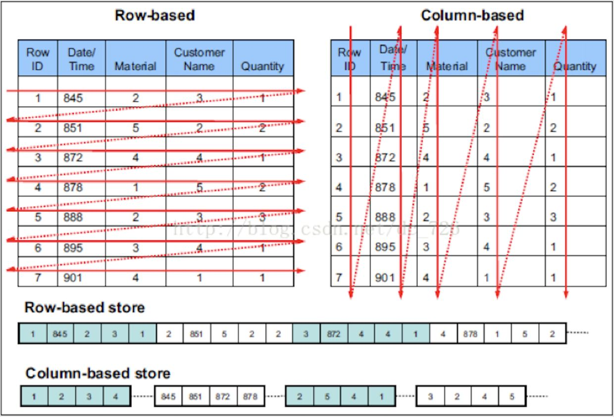

# clickhouse

ClickHouse是一个开源的列式数据库（DBMS），主要用于在线分析处理查询（OLAP）。

ClickHouse  作为一个高性能 OLAP 数据库，虽然OLAP能力逆天但也不应该把它用于任何OLTP事务性操作的场景，相比OLTP：不支持事务、不擅长根据主键按行粒度的查询、不擅长按行删除数据，目前市场上的其他同类高性能 OLAP 数据库同样也不擅长这些方面。因为对于一款OLAP数据库而言，OLTP 能力并不是重点。

ClickHouse从OLAP场景需求出发，定制开发了一套全新的高效列式存储引擎，并且实现了数据有序存储、主键索引、稀疏索引、数据Sharding、数据Partitioning、TTL、主备复制等丰富功能。这些功能共同为ClickHouse极速的分析性能奠定了基础。

ClickHouse适合流式或批次入库的时序数据。ClickHouse不应该被用作通用数据库，而是作为超高性能的海量数据快速查询的分布式实时处理平台，在数据汇总查询方面(如GROUP BY)，ClickHouse的查询速度非常快。

# OLTP：
是传统的关系型数据库，主要操作增删改查，强调事务一致性，比如银行系统、电商系统。

# OLAP：
是仓库型数据库，主要是读取数据，做复杂数据分析，侧重技术决策支持，提供直观简单的结果。

# 列式存储


对于 OLAP 场景，一个典型的查询需要遍历整个表，进行分组、排序、聚合等操作，这样一来按行存储的优势就不复存在了。更糟糕的是，分析型 SQL 常常不会用到所有的列，而仅仅对其中某些感兴趣的列做运算，那一行中那些无关的列也不得不参与扫描。

列式存储就是为这样的需求设计的。如下图所示，同一列的数据被一个接一个紧挨着存放在一起，表的每列构成一个长数组。

显然，列式存储对于 OLTP 不友好，一行数据的写入需要同时修改多个列。但对 OLAP 场景有着很大的优势：

- 当查询语句只涉及部分列时，只需要扫描相关的列
- 每一列的数据都是相同类型的，彼此间相关性更大，对列数据压缩的效率较高

## 在数据写入上的对比
1）行存储的写入是一次完成。如果这种写入建立在操作系统的文件系统上，可以保证写入过程的成功或者失败，数据的完整性因此可以确定。

2）列存储由于需要把一行记录拆分成单列保存，写入次数明显比行存储多（意味着磁头调度次数多，而磁头调度是需要时间的，一般在1ms~10ms)，再加上磁头需要在盘片上移动和定位花费的时间，实际时间消耗会更大。所以，行存储在写入上占有很大的优势。

3）还有数据修改,这实际也是一次写入过程。不同的是，数据修改是对磁盘上的记录做删除标记。行存储是在指定位置写入一次，列存储是将磁盘定位到多个列上分别写入，这个过程仍是行存储的列数倍。所以，数据修改也是以行存储占优。

## 在数据读取上的对比
1）数据读取时，行存储通常将一行数据完全读出，如果只需要其中几列数据的情况，就会存在冗余列，出于缩短处理时间的考量，消除冗余列的过程通常是在内存中进行的。

2）列存储每次读取的数据是集合的一段或者全部，不存在冗余性问题。

3） 两种存储的数据分布。由于列存储的每一列数据类型是同质的，不存在二义性问题。比如说某列数据类型为整型(int)，那么它的数据集合一定是整型数据。这种情况使数据解析变得十分容易。相比之下，行存储则要复杂得多，因为在一行记录中保存了多种类型的数据，数据解析需要在多种数据类型之间频繁转换，这个操作很消耗CPU，增加了解析的时间。所以，列存储的解析过程更有利于分析大数据。


# ClickHouse的优点
1) 真正的面向列的DBMS（ClickHouse是一个DBMS,而不是一个单一的数据库。它允许在运行时创建表和数据库、加载数据和运行查询，而无需重新配置和重新启动服务器）
2) 数据压缩（一些面向列的DBMS（INFINIDB CE 和 MonetDB）不使用数据压缩。但是，数据压缩确实是提高了性能）
3) 磁盘存储的数据（许多面向列的DBMS(SPA HANA和GooglePowerDrill)）只能在内存中工作。但即使在数千台服务器上，内存也太小了。）
4) 多核并行处理(多核多节点并行化大型查询)
在多个服务器上分布式处理(在clickhouse中，数据可以驻留在不同的分片上。每个分片都可以用于容错的一组副本，查询会在所有分片上并行处理)
5) SQL支持(ClickHouse sql 跟真正的sql有不一样的函数名称。不过语法基本跟SQL语法兼容，支持JOIN/FROM/IN 和JOIN子句及标量子查询支持子查询)
6) 向量化引擎(数据不仅按列式存储，而且由矢量-列的部分进行处理，这使得开发者能够实现高CPU性能)
7) 实时数据更新(ClickHouse支持主键表。为了快速执行对主键范围的查询，数据使用合并树(MergeTree)进行递增排序。由于这个原因，数据可以不断地添加到表中)
8) 支持近似计算(统计全国到底有多少人?143456754 14.3E)
9) 数据复制和对数据完整性的支持(ClickHouse使用异步多主复制。写入任何可用的复本后，数据将分发到所有剩余的副本。系统在不同的副本上保持相同的数据。数据在失败后自动恢复)

# ClickHouse的缺点

ClickHouse 作为一个被设计用来在实时分析的 OLAP 组件，只是在高效率的分析方面性能发挥到极致，那必然就会在其他方面做出取舍：

1) 没有完整的事务支持，不支持Transaction想快就别Transaction
3) 缺少完整Update/Delete操作，缺少高频率、低延迟的修改或删除已存在数据的能力，仅用于批量删除或修改数据。
4) 聚合结果必须小于一台机器的内存大小
5) 支持有限操作系统，正在慢慢完善
6) 不适合Key-value存储，不支持Blob等文档型数据库

# ClickHouse 为什么快？
- 只需要读取要计算的列数据，而非行式的整行数据读取，降低 IO cost。

- 同列同类型，有十倍压缩提升，进一步降低 IO。

- Clickhouse 根据不同存储场景，做个性化搜索算法。

# 拉起docker服务
```sh
docker run -it --rm --link clickhouse-server:clickhouse-server yandex/clickhouse-client --host c
lickhouse-server
```

```sh
docker run -d --name clickhouse-server --ulimit nofile=262144:262144 yandex/clickhouse-server
```

# 命令行

登录
```sh
clickhouse-client --host=... --port=... --user=... --password=...
```
多行查询
```sh
clickhouse-client -m
```
以批处理模式运行查询:

```sh
clickhouse-client --query='SELECT 1'
echo 'SELECT 1' | clickhouse-client
clickhouse-client <<< 'SELECT 1'
```
从指定格式的文件中插入数据:
```sh
clickhouse-client --query='INSERT INTO table VALUES' --max_insert_block_size=100000 < data.txt
clickhouse-client --query='INSERT INTO table FORMAT TabSeparated' < data.tsv
clickhouse-client -h 127.0.0.1 --database="db" --query="insert into db.test_table FORMAT CSV" < ./test.csv
```

添加索引
```sql
ALTER TABLE [db].name ADD INDEX name expression TYPE type GRANULARITY value AFTER name [AFTER name2] - Adds index description to tables metadata.

alter table ads_dmp_test.dws_adping_sum_hour add index camp_channel (adping_camp_id, second_channel_id) type minmax GRANULARITY 4
```