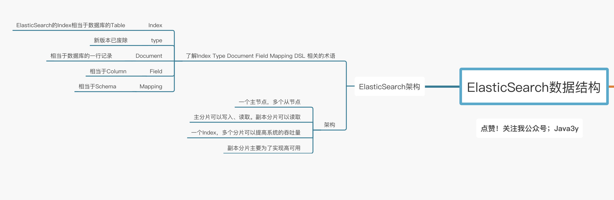
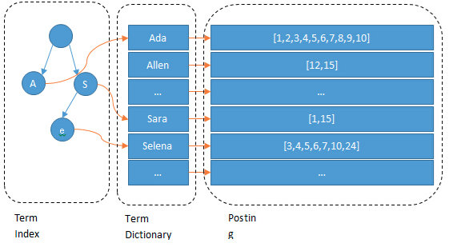
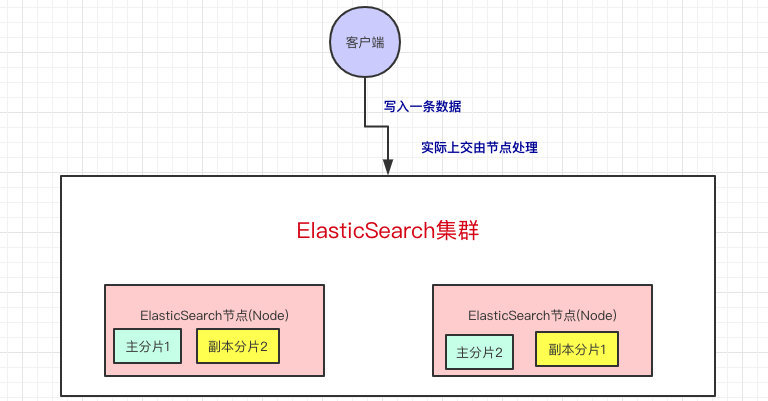

Elasticsearch （以下简称 Elastic）是目前全文搜索引擎的首选, Elastic 的底层是开源库 Lucene。但是，你没法直接用 Lucene，必须自己写代码去调用它的接口。Elastic 是 Lucene 的封装，提供了 REST API 的操作接口，开箱即用。

Elasticsearch 是一个实时的分布式存储、搜索、分析的引擎。

Elastic 本质上是一个分布式数据库，允许多台服务器协同工作，每台服务器可以运行多个 Elastic 实例。
在众多的节点中，其中会有一个Master Node，它主要负责维护索引元数据、负责切换主分片和副本分片身份等工作。
如果主节点挂了，会选举出一个新的主节点。



### 为什么要分片：
- 如果一个Index的数据量太大，只有一个分片，那只会在一个节点上存储，随着数据量的增长，一个节点未必能把一个Index存储下来。
- 多个分片，在写入或查询的时候就可以并行操作（从各个节点中读写数据，提高吞吐量）

如果某个节点挂了，那部分数据就丢了吗？显然Elasticsearch也会想到这个问题，所以分片会有主分片和副本分片之分（为了实现高可用）

数据写入的时候是写到主分片，副本分片会复制主分片的数据，读取的时候主分片和副本分片都可以读。

## es结构：

**相对于数据库，Elasticsearch的强大之处就是可以模糊查询。**

为什么Elasticsearch为什么可以实现快速的“模糊匹配”/“相关性查询”，实际上是你写入数据到Elasticsearch的时候会进行分词(通过分词器），并建立倒排索引。

es数据结构：



输入一段文字，Elasticsearch会根据分词器对我们的那段文字进行分词（也就是图上所看到的Ada/Allen/Sara..)，这些分词汇总起来我们叫做`Term Dictionary`，而我们需要通过分词找到对应的记录，这些文档ID保存在`PostingList`

在Term Dictionary中的词由于是非常非常多的，所以我们会为其进行排序，等要查找的时候就可以通过二分来查，不需要遍历整个Term Dictionary

由于Term Dictionary的词实在太多了，不可能把Term Dictionary所有的词都放在内存中，于是Elasticsearch还抽了一层叫做Term Index，这层只存储 部分 词的前缀，Term Index会存在内存中（检索会特别快）

Term Index在内存中是以FST（Finite State Transducers）的形式保存的，其特点是非常节省内存

## es写入流程
 
集群上的每个节点都是coordinating node（协调节点），协调节点表明这个节点可以做路由。比如节点1接收到了请求，但发现这个请求的数据应该是由节点2处理（因为主分片在节点2上），所以会把请求转发到节点2上。

shard = hash(document_id) % (num_of_primary_shards)

路由到对应的节点以及对应的主分片时，会做以下的事：
- 将数据写到内存缓存区
- 然后将数据写到translog缓存区
- 每隔1s数据从buffer中refresh到FileSystemCache中，生成segment文件，一旦生成segment文件，就能通过索引查询到了
- refresh完，memory buffer就清空了。
- 每隔5s中，translog 从buffer flush到磁盘中
- 定期/定量从FileSystemCache中,结合translog内容flush index到磁盘中。


## index
Elastic 会索引所有字段，经过处理后写入一个反向索引（Inverted Index）。查找数据的时候，直接查找该索引。

所以，Elastic 数据管理的顶层单位就叫做 Index（索引）。它是单个数据库的同义词。每个 Index （即数据库）的名字必须是小写。

获取所有索引
```
GET _cat/indices?v
```
## type
Document 可以分组，比如weather这个 Index 里面，可以按城市分组（北京和上海），也可以按气候分组（晴天和雨天）。这种分组就叫做 Type，它是虚拟的逻辑分组，用来过滤 Document。

不同的 Type 应该有相似的结构（schema），举例来说，id字段不能在这个组是字符串，在另一个组是数值。这是与关系型数据库的表的一个区别。性质完全不同的数据（比如products和logs）应该存成两个 Index，而不是一个 Index 里面的两个 Type（虽然可以做到）。


## document
Index 里面单条的记录称为 Document（文档）。许多条 Document 构成了一个 Index。

Document 使用 JSON 格式表示.

同一个 Index 里面的 Document，不要求有相同的结构（scheme），但是最好保持相同，这样有利于提高搜索效率。

## 使用

列出每个 Index 所包含的 Type：
```
GET _mapping?pretty=true
```
新建索引：
```
PUT /weather
```
新建一个名称为accounts的 Index，里面有一个名称为person的 Type。person有三个字段:
Elastic 的分词器称为 analyzer。我们对每个字段指定分词器.
```sh
$ curl -X PUT 'localhost:9200/accounts' -d '
{
  "mappings": {
    "person": {
      "properties": {
        "user": {
          "type": "text",
          "analyzer": "ik_max_word",
          "search_analyzer": "ik_max_word"
        },
        "title": {
          "type": "text",
          "analyzer": "ik_max_word",
          "search_analyzer": "ik_max_word"
        },
        "desc": {
          "type": "text",
          "analyzer": "ik_max_word",
          "search_analyzer": "ik_max_word"
        }
      }
    }
  }
}'
```
返回索引下的所有记录
```
GET /ads_adcs_cold_cpi_2021-03-03/_search
```
查询
```
GET /ads_adcs_cold_cpi_2021-03-03/_search
{
  "query" : { "match":{"message.pos_id":"ad:layer_p_mldrp1 xxxxx"}},//多个默认是or
  "from": 1,//偏移量
  "size": 1 //结果个数
}
```
[布尔查询](https://www.elastic.co/guide/en/elasticsearch/reference/5.5/query-dsl-bool-query.html)

