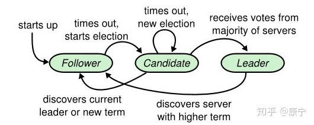
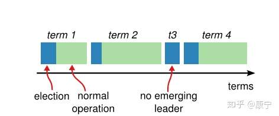
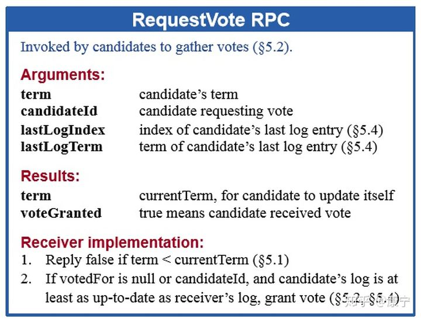
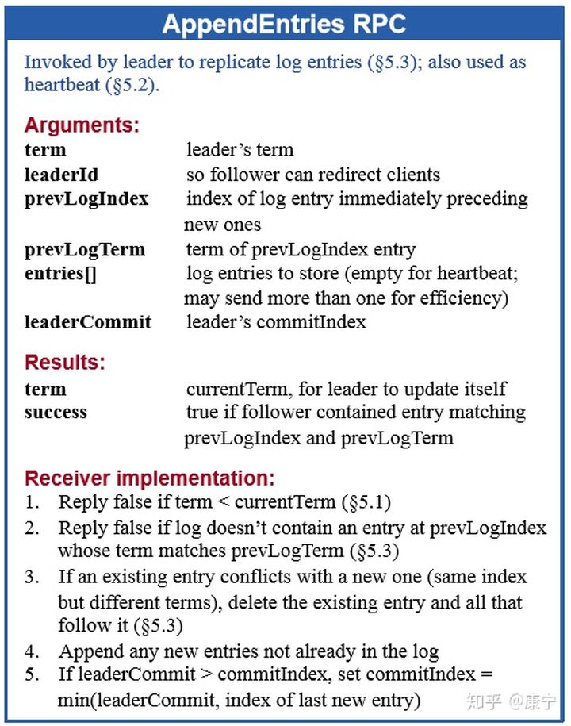
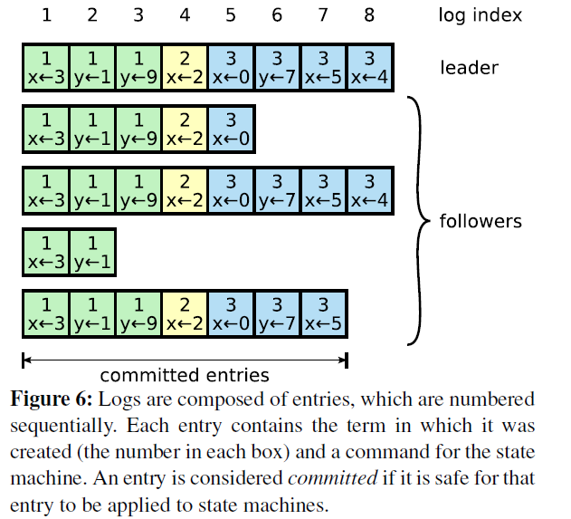
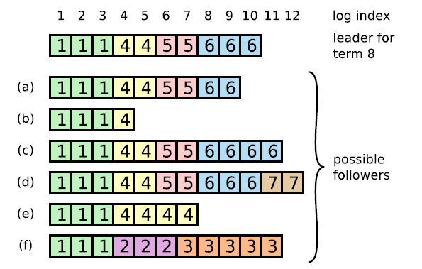

# dokcer 拉起etcd

```
export ETCDCTL_API=3
export NODE1=172.27.122.2
export DATA_DIR="etcd-data"

docker run \
  -p 2379:2379 \
  -p 2380:2380 \
  --volume=${DATA_DIR}:/etcd-data \
  --name etcd quay.io/coreos/etcd:latest \
  /usr/local/bin/etcd \
  --data-dir=/etcd-data --name node1 \
  --initial-advertise-peer-urls http://${NODE1}:2380 --listen-peer-urls http://${NODE1}:2380 \
  --advertise-client-urls http://${NODE1}:2379 --listen-client-urls http://${NODE1}:2379 \
  --initial-cluster node1=http://${NODE1}:23800

etcdctl --endpoints=http://${NODE1}:2379 member list
```
ui for etcdV3
```
docker run -d -p 8088:8080 jim3ma/etcdkeeper3:latest
```

# 命令：

获取前缀的所有key
```
etcdctl --endpoints=http://127.0.0.1:23790 get /test/servers/ --prefix --keys-only
```
watch 前缀的所有key
```
etcdctl --endpoints=http://127.0.0.1:23790 watch /ttt --prefix
```
租约
```
etcdctl --endpoints=http://127.0.0.1:23790 lease grant 120
etcdctl --endpoints=http://127.0.0.1:23790 put name alice --lease="0cc777d2eae99aa8"

```

# Raft 协议

## 复制状态机
一致性协议通常基于replicated state machines，即所有结点都从同一个state出发，都经过同样的一些操作序列（log），最后到达同样的state。

Raft协议可以使得一个集群的服务器组成复制状态机。

**相同的初识状态 + 相同的输入 = 相同的结束状态**

什么是复制状态机。一个分布式的复制状态机系统由多个复制单元组成，每个复制单元均是一个状态机，它的状态保存在一组状态变量中，状态机的变量只能通过外部命令来改变。简单理解的话，可以想象成是一组服务器，每个服务器是一个状态机，服务器的运行状态只能通过一行行的命令来改变。每一个状态机存储一个包含一系列指令的日志，严格按照顺序逐条执行日志中的指令，如果所有的状态机都能按照相同的日志执行指令，那么它们最终将达到相同的状态。因此，在复制状态机模型下，只要保证了操作日志的一致性，我们就能保证该分布式系统状态的一致性。

为了让一致性协议变得简单可理解，Raft协议主要使用了两种策略。一是将复杂问题进行分解，在Raft协议中，一致性问题被分解为：leader election、log replication、safety三个简单问题；二是减少状态空间中的状态数目。

## Raft一致性算法

在Raft体系中，有一个强leader，由它全权负责接收客户端的请求命令，并将命令作为日志条目复制给其他服务器，在确认安全的时候，将日志命令提交执行。当leader故障时，会选举产生一个新的leader。在强leader的帮助下，Raft将一致性问题分解为了三个子问题：

1) leader选举：当已有的leader故障时必须选出一个新的leader。
2) 日志复制：leader接受来自客户端的命令，记录为日志，并复制给集群中的其他服务器，并强制其他节点的日志与leader保持一致。
3) 安全safety措施：通过一些措施确保系统的安全性，如确保所有状态机按照相同顺序执行相同命令的措施。

一个Raft集群拥有多个服务器，典型值是5，这样可以容忍两台服务器出现故障。服务器可能会处于如下三种角色：leader、candidate、follower，正常运行的情况下，会有一个leader，其他全为follower，follower只会响应leader和candidate的请求，而客户端的请求则全部由leader处理，即使有客户端请求了一个follower也会将请求重定向到leader。candidate代表候选人，出现在选举leader阶段，选举成功后candidate将会成为新的leader。可能出现的状态转换关系如下图：



从状态转换关系图中可以看出，集群刚启动时，所有节点都是follower，之后在election timeout信号(150ms到300ms之间，这个等待时间是随机的，随机是为了尽量避免产生多个candidate，给选主过程制造麻烦认)的驱使下，follower会转变成candidate去拉取选票，获得大多数选票后就会成为leader，这时候如果其他候选人发现了新的leader已经诞生，就会自动转变为follower；而如果另一个time out信号发出时，还没有选举出leader，将会重新开始一次新的选举。可见，time out信号是促使角色转换得关键因素，类似于操作系统中得中断信号。

哪个节点做leader是大家投票选举出来的，每个leader工作一段时间，然后选出新的leader继续负责。这根民主社会的选举很像，每一届新的履职期称之为一届任期，在raft协议中，也是这样的，对应的术语叫term。



每一个term都从新的选举开始，candidate们会努力争取称为leader。一旦获胜，它就会在剩余的term时间内保持leader状态，在某些情况下(如term3, split vote)选票可能被多个candidate瓜分，形不成多数派，因此term可能直至结束都没有leader，下一个term很快就会到来重新发起选举。

term也起到了系统中逻辑时钟的作用，每一个server都存储了当前term编号，在server之间进行交流的时候就会带有该编号，如果一个server的编号小于另一个的，那么它会将自己的编号更新为较大的那一个；如果leader或者candidate发现自己的编号不是最新的了，就会自动转变为follower；如果接收到的请求的term编号小于自己的当前term将会拒绝执行。

server之间的交流是通过RPC进行的。只需要实现两种RPC就能构建一个基本的Raft集群：

- RequestVote RPC：它由选举过程中的candidate发起，用于拉取选票
- AppendEntries RPC：它由leader发起，用于复制日志或者发送心跳信号。



## leader选举过程
Raft通过心跳机制发起leader选举。节点都是从follower状态开始的，如果收到了来自leader或candidate的RPC，那它就保持follower状态，避免争抢成为candidate。Leader会发送空的AppendEntries RPC作为心跳信号来确立自己的地位，

如果follower在election timeout内没有收到来自leader的心跳，（也许此时还没有选出leader，大家都在等；也许leader挂了；也许只是leader与该follower之间网络故障），则会主动发起选举。

选举发起后，一个follower会增加自己的当前term编号并转变为candidate。它会首先投自己一票，然后向其他所有节点并行发起RequestVote RPC，之后candidate状态将可能发生如下三种变化:

- **赢得选举,成为leader:** 如果它在一个term内收到了大多数的选票，将会在接下的剩余term时间内称为leader，然后就可以通过发送心跳确立自己的地位。(每一个server在一个term内只能投一张选票，并且按照先到先得的原则投出)
  
- **其他server成为leader**：在等待投票时，可能会收到其他server发出AppendEntries RPC心跳信号，说明其他leader已经产生了。这时通过比较自己的term编号和RPC过来的term编号，如果比对方大，说明leader的term过期了，就会拒绝该RPC,并继续保持候选人身份; 如果对方编号不比自己小,则承认对方的地位,转为follower.
  
- **选票被瓜分,选举失败**: 如果没有candidate获取大多数选票, 则没有leader产生, candidate们等待超时后发起另一轮选举. 为了防止下一次选票还被瓜分,必须采取一些额外的措施, raft采用随机election timeout的机制防止选票被持续瓜分。通过将timeout随机设为一段区间上的某个值, 因此很大概率会有某个candidate率先超时然后赢得大部分选票.

投票者如何决定是否给一个选举请求投票呢，有以下约束：

- 在任一任期内，单个节点最多只能投一票
- 候选人知道的信息不能比自己的少（log replication和safety的时候会详细介绍）
- first-come-first-served 先来先得

## 日志复制过程

一旦leader被选举成功，就可以对客户端提供服务了。客户端提交每一条命令都会被按顺序记录到leader的日志中，每一条命令都包含term编号和顺序索引，然后向其他节点并行发送AppendEntries RPC用以复制命令(如果命令丢失会不断重发)，当复制成功也就是大多数节点成功复制后，leader就会提交命令，即执行该命令并且将执行结果返回客户端，raft保证已经提交的命令最终也会被其他节点成功执行。

leader会保存有当前已经提交的最高日志编号。顺序性确保了相同日志索引处的命令是相同的，而且之前的命令也是相同的。当发送AppendEntries RPC时，会包含leader上一条刚处理过的命令，接收节点如果发现上一条命令不匹配，就会拒绝执行。

当系统（leader）收到一个来自客户端的写请求，到返回给客户端，整个过程从leader的视角来看会经历以下步骤：

- leader append log entry
- leader issue AppendEntries RPC in parallel
- leader wait for majority response
- leader apply entry to state machine
- leader reply to client
- leader notify follower apply log



不难看到，logs由顺序编号的log entry组成 ，每个log entry除了包含command，还包含产生该log entry时的leader term。从上图可以看到，五个节点的日志并不完全一致，raft算法为了保证高可用，并不是强一致性，而是最终一致性，leader会不断尝试给follower发log entries，直到所有节点的log entries都相同。

## safety

### Election safety

选举安全性，即任一任期内最多一个leader被选出。这一点非常重要，在一个复制集中任何时刻只能有一个leader。系统中同时有多余一个leader，被称之为脑裂（brain split），这是非常严重的问题，会导致数据的覆盖丢失。在raft中，两点保证了这个属性：

- 一个节点某一任期内最多只能投一票；
- 只有获得majority投票的节点才会成为leader。
  
因此，某一任期内一定只有一个leader。

### log matching
log匹配特性， 就是说如果两个节点上的某个log entry的log index相同且term相同，那么在该index之前的所有log entry应该都是相同的。如何做到的？依赖于以下两点:

- If two entries in different logs have the same index and term, then they store the same command.
- If two entries in different logs have the same index and term, then the logs are identical in all preceding entries.
  
首先，leader在某一term的任一位置只会创建一个log entry，且log entry是append-only。其次，consistency check。leader在AppendEntries中包含最新log entry之前的一个log 的term和index，如果follower在对应的term index找不到日志，那么就会告知leader不一致。



上图的a-f不是6个follower，而是某个follower可能存在的六个状态

leader、follower都可能crash，那么follower维护的日志与leader相比可能出现以下情况

- 比leader日志少，如上图中的ab
- 比leader日志多，如上图中的cd
- 某些位置比leader多，某些日志比leader少，如ef（多少是针对某一任期而言）

当出现了leader与follower不一致的情况，leader强制follower复制自己的log

在Raft中，leader通过强制follower复制自己的日志来解决上述日志不一致的情形，那么冲突的日志将会被重写。为了让日志一致，先找到最新的一致的那条日志(如f中索引为3的日志条目)，然后把follower之后的日志全部删除，leader再把自己在那之后的日志一股脑推送给follower，这样就实现了一致。而寻找该条日志，可以通过AppendEntries RPC，该RPC中包含着下一次要执行的命令索引，如果能和follower的当前索引对上，那就执行，否则拒绝，然后leader将会逐次递减索引，直到找到相同的那条日志。
```
s1 leader 初始化nextIndex[x]为 leader最后一个log index + 1

s2 AppendEntries里prevLogTerm prevLogIndex来自 logs[nextIndex[x] - 1]

s3 如果follower判断prevLogIndex位置的log term不等于prevLogTerm，那么返回 False，否则返回True

s4 leader收到follower的回复，如果返回值是False，则nextIndex[x] -= 1, 跳转到s2. 否则

s5 同步nextIndex[x]后的所有log entries
```

Raft通过为选举过程添加一个限制条件，解决了上面提出的问题，该限制确保leader包含之前term已经提交过的所有命令。Raft通过投票过程确保只有拥有全部已提交日志的candidate能成为leader。由于candidate为了拉选票需要通过RequestVote RPC联系其他节点，而之前提交的命令至少会存在于其中某一个节点上,因此只要candidate的日志至少和其他大部分节点的一样新就可以了, follower如果收到了不如自己新的candidate的RPC,就会将其丢弃.

这个保证是在RequestVoteRPC阶段做的，candidate在发送RequestVoteRPC时，会带上自己的最后一条日志记录的term_id和index，其他节点收到消息时，如果发现自己的日志比RPC请求中携带的更新，拒绝投票。日志比较的原则是，如果本地的最后一条log entry的term id更大，则更新，如果term id一样大，则日志更多的更大(index更大)。

如果命令已经被复制到了大部分节点上,但是还没来的及提交就崩溃了,这样后来的leader应该完成之前term未完成的提交. Raft通过让leader统计当前term内还未提交的命令已经被复制的数量是否半数以上, 然后进行提交.

raft与其他协议（Viewstamped Replication、mongodb）不同，raft始终保证leade包含最新的已提交的日志，因此leader不会从follower catchup日志，这也大大简化了系统的复杂度。
## 脑裂
在任何有主从之分的系统中，都可能会发生此问题。

Follower不能区分是Leader挂掉了还是Leader与Follower的网络出现了问题（哨兵中也可能存在这种情况），可能会发生Leader没挂，Follower连接不上Leader，并再选出一个Leader，导致同时存在两个Leader。

Raft要求多数同意才能达成共识，所以旧Leader撑死会提供读服务，并提供了旧的数据，但是始终不会提供写服务，导致数据不一致。

对于client向旧Leader不断请求这件事。可以让client隔一段时间就去请求一遍所有节点，对比term，挑选出term最大的Leader。
[go raft](https://github.com/LLHFWT/rache)


## 参考
[1](https://zhuanlan.zhihu.com/p/91288179)

[2](https://www.cnblogs.com/xybaby/p/10124083.html)

[3](https://zhuanlan.zhihu.com/p/125573685)
